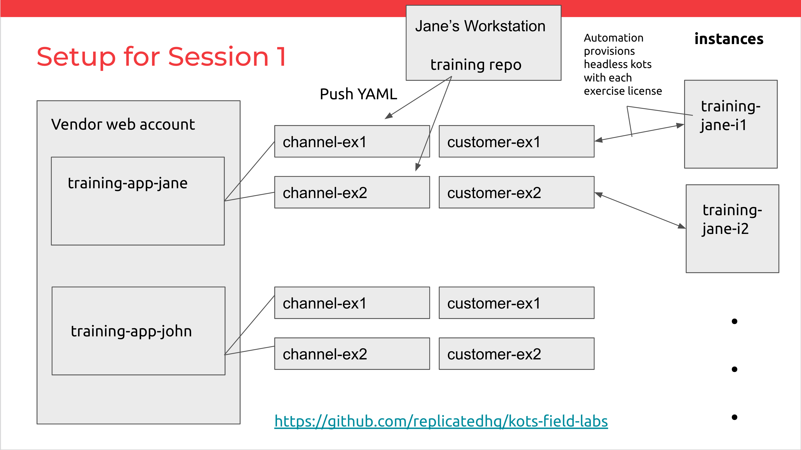

### High level Overview

The main goal of the lab tools is to 

* Enable lab authors to quickly add new exercises with minimal overhead
* Enable students to learn core concepts quickly without spending time setting up instances or KOTS servers


The structure is to create, for each student:

* an invite to the vendor console
* an application in vendor.replicated.com

For each student, for each lab, we'll create:
* A channel in vendor.replicated.com
* A release + installer on that channel
* A customer in vendor.replicated.com



The current lab set focuses only on embedded cluster / kURL installations.

### Project Components

* [setup](../setup) - a Golang package that provisions apps, users, channels, customers, and releases in https://vendor.replicated.com. The main binary is [setup/cmd/kots-field-labs](../setup/cmd/kots-field-labs)
* `provisioner_pairs.json` - a JSON file that tracks the instances to create. This is created/updated by the `setup` code, and consumed by `terraform`
* [terraform](../terraform)


#### Setup tools

The code in `setup` consumes two primary inputs, and a number of ancillary [parameters](../setup/cmd/kots-field-labs/param.go).

* A list of Environments to provision. An environment represent a single user or student in the lab and includes information
  like name, email, and SSH public key
* A list of Labs to provision. A lab is a single exercise that will be provisioned for each environment, and includes details
  about the channels, customers, and release YAML to provision. Labs generally point to YAML in the [labs directory](../labs).
  (example: [just_lab0.json](../just_lab0.json) and [labs_all.json](../labs_all.json))
  
The setup tools script can be run with

```shell
make apps env_json=... labs_json=...
```

It also accepts an alternative `env_csv` parameter for using exports from google forms/sheets.

A `prefix` should always be passed, to help ensure unique app names/slugs and avoid slug deduplication via suffixing.

A to-be-better-documented `invite_users` flag is also available, which will invite users to the chosen vendor.replicated.com 
account based on user emails in the Environment list.

#### Provisioner Pairs JSON

Provisioner Pairs json contains a map of **instance name** => [Instance to Make](../setup/pkg/fieldlabs/environment_create.go#L73). 
This list will be iterated over by Terraform to generate GCP instances for the lab.
Most of the key logic will be templated into a `provision_sh` bash script that will be run on the instance. This script includes logic for:

* Adding the SSH public key to `authorized_keys`
* Adding the license file to the box
* Optionally running a kURL install and a headless KOTS install
* Any custom pre- and post- install hooks in the

An example entry in this map might look like

```json
{
  "rp415-dex-lab0-hello-world": {
    "name": "rp415-dex-lab00-hello-world",
    "provision_sh": "\n#!/bin/bash \n\nset -euo pipefail\n\n\n\ncat # ... rest of provisioner script",
    "machine_type": "n1-standard-4",
    "boot_disk_gb": "200",
    "public_ips": {
      "_": null
    }
  }
}
```

For airgap/proxy labs, where the primary instance doesn't have a public IP address, we'd expect to see an empty `public_ips` for the main instance, plus a jump box for indirect access:

```json
{
  "dppt-aj-lab5-airgap": {
    "name": "dppt-aj-lab05-airgap",
    "provision_sh": "\n#!/bin/bash \n\nset -euo pipefail\n\n\n\n",
    "machine_type": "n1-standard-4",
    "boot_disk_gb": "200",
    "public_ips": {}
  },
  "dppt-aj-lab5-airgap-jump": {
    "name": "jump-dppt-aj-lab05-airgap",
    "provision_sh": "\n#!/bin/bash \n\nset -euo pipefail\n\n\n\n",
    "machine_type": "n1-standard-1",
    "boot_disk_gb": "10",
    "public_ips": {
      "_": null
    }
  }
}
```

**NOTE** Neither provisioner_pairs.json or the terraform state are version controlled. As a lab session instructor, you'll own keeping these files so you can tear down apps and instances after a training session.

#### Terraform

Terraform will read through the instance list in `provisioner_pairs.json` and create

* a `google_compute_instance.kots-field-labs` for each public-ip instance
* a `google_compute_instance.airgapped-instance` for each non-public-ip instance
* a single instance `kots-field-labs-squid-proxy` instance to be shared by all labs/environments
* a local IP<->instance name mapping file (suitable for copying to `/etc/hosts`) for each environment
  (in lieu of dynamic DNS, although that would be great to have someday)
  

For example, an etc hosts mapping for two public instances might look something like:

```text
$ cat terraform/etchosts/aj
# copy the below and add it to your hosts file with
#
#     echo '
#     <PASTE>
#     ' | sudo tee -a /etc/hosts

34.121.47.43	lab5-airgap-jump	# dppt-aj-lab5-airgap-jump
104.198.254.92	lab6-proxy-jump	# dppt-aj-lab6-proxy-jump
```


  


