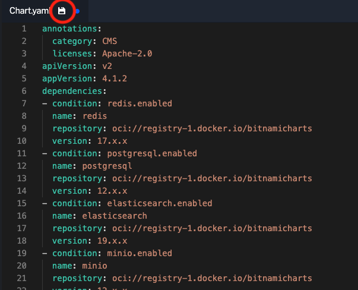

Now that we've got our environment set up, let's incorporate the
SDK into our application. We make it easy for you to do this by
providing a Helm chart you can drop into your chart as a
dependency. When you deliver your Helm chart from the Replicated
regisry, we'll embed your customer's license into the final 
chart.

This injection serves a few purposes:

1. The licese is available to your application logic through a
   call to an in-cluster SDK
2. Accesss to your container images and other registry
   assets is secured using customer-specific credentials
3. The in-cluster service can connect securely to the Replicated
   vendor portal for telemetry, upgrade checks, etc.

Adding the Dependency
======================

Go to the the "Code Editor" tab and edit the file `Chart.yaml` in
the source directory `mastodon`. You're going to make two changes to
this file. 

First, you're going to add a dependency on the Replicated SDK Helm
chart.

```
- name: replicated
  repository: oci://registry.replicated.com/library
  version: 0.0.1-alpha.11
```

You should also bump the version number of your chart. Adding 
telemetry and preparing to distribute with Replicated feels like
a fairly large change. It's not a breaking change, though, so
let's just bump the minor version number.

After making the changes, make sure you save them using the save 
icon in the editor tab. It's easy to miss, so check the image 
below if you can't find it.



After saving, drop back in to the "Shell" tab and update your
dependencies.

```shell
cd mastodon
helm dependncy update
```

Repackging Your Chart
=====================

After updating dependencies, you should repackage your Helm
chart into a new tarball including the changes.

```
helm package --destination ../release
```

You should now have a tarball in directory `release` in your
home directoy.

```
ls ~/release
```
