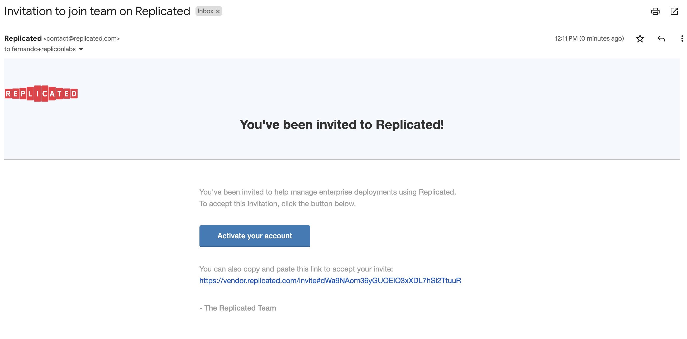
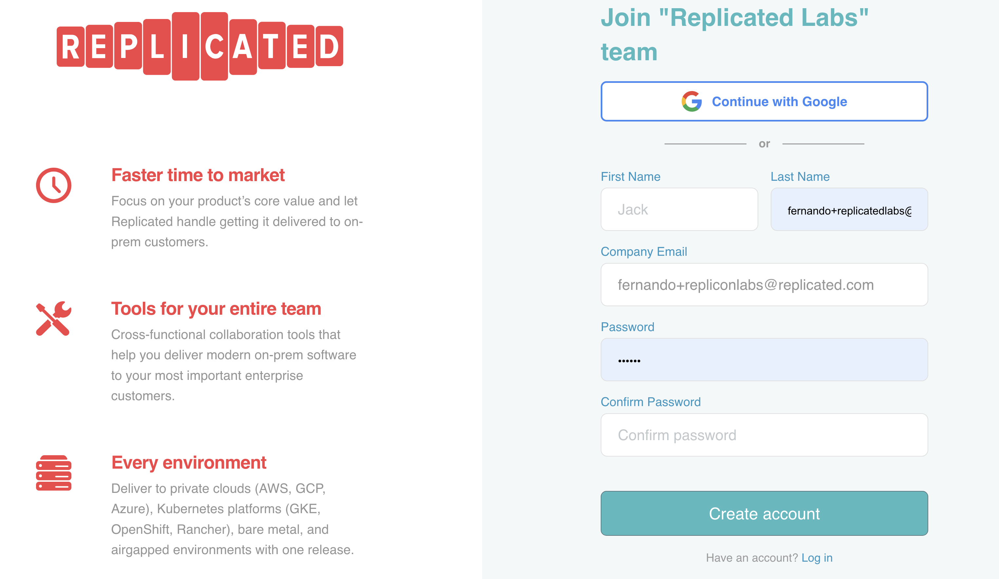
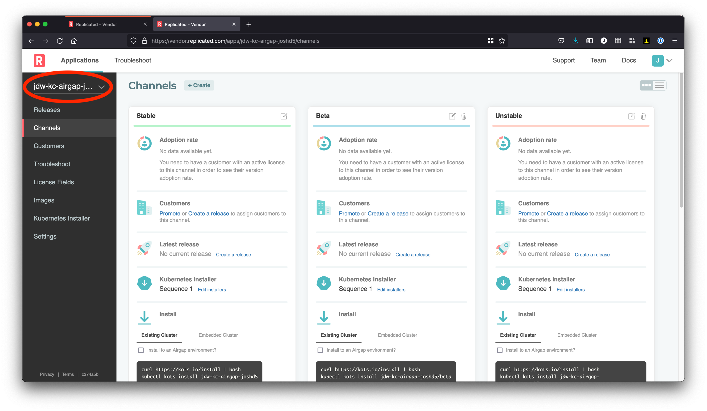

👋 Introduction
===============

In this exercise you will learn how to perform installations in Air Gap environments, and
how to collect support bundles in Air Gap environments.

* **What you will do**:
    * Access and verify a single-node Air Gap setup via a bastion server
    * Learn to use KOTS to install in an Air Gap environment
    * Create an SSH tunnel to configure an Air Gap instance
    * Perform an upgrade of an application in an Air Gap environment
    * Use the `kubectl support-bundle` CLI in an Air Gap environment
* **Who this is for**: This lab is for anyone who builds/maintains KOTS applications (see note below)
    * Full Stack / DevOps / Product Engineers
* **Outcomes**:
    * You will be ready to deliver a KOTS application into an Air Gap environment
    * You will build confidence in performing upgrades and troubleshooting in Air Gap environments

🔒 Airgap Workflow Overview
===========================

First, we'll push a release -- in the background, Replicated's Air Gap builder will prepare an Air Gap bundle.


Next, we'll collect a license file, a download link, and a public kURL bundle.


From there, we'll move all three artifacts into the datacenter via a jump box.


The above diagram shows a three node cluster, but we'll use only a single node.
While the KOTS bundle will be moved onto the server via SCP as in the diagram,
the app bundle and license file will be uploaded via a browser UI through an SSH tunnel.


🚀 Let's start
==============

### 1. Check Your Email!

If you previously already done any tracks and accepted the invite for the Vendor Portal, you can skip this and go to section 2.

You should have received an invite via email to log into https://vendor.replicated.com -- you'll want to accept this invite and set your password.

**Important Note:** It is important to logout of any existing session in the Replicated vendor portal so that when clicking on the Labs Account invitation email link it takes you to a specific new registration page where you enter your name and password details.  If you get a login screen then this is probably the issue.

The email should look like this:

<p align="center"></img></p>

Once you click on the button, it should open a browser to a page similar to this:

<p align="center"></img></p>

Fill in the rest of the form and click on the **Create Account** button to get started.

Once you have created your account you should land on the Channels. Channels allow you to manage who has access to which releases of your application.


### 2. Configure environment

Once registered, your application will be automatically selected:

<p></p>

Now, you'll need to set up environment variables to interact with vendor.replicated.com and instance.

`REPLICATED_APP` should be set to the app slug from the Settings page.

<p align="center"></img></p>

Next, create a `read/write` User API token from your [Account Settings](https://vendor.replicated.com/account-settings) page:
> Note: Ensure the token has "Write" access or you'll be unable create new releases.

<p align="center"></img></p>

Once you have the values,
set them in your environment.

```
export REPLICATED_APP=...
export REPLICATED_API_TOKEN=...
```

You can ensure this is working with

```
replicated release ls
```
