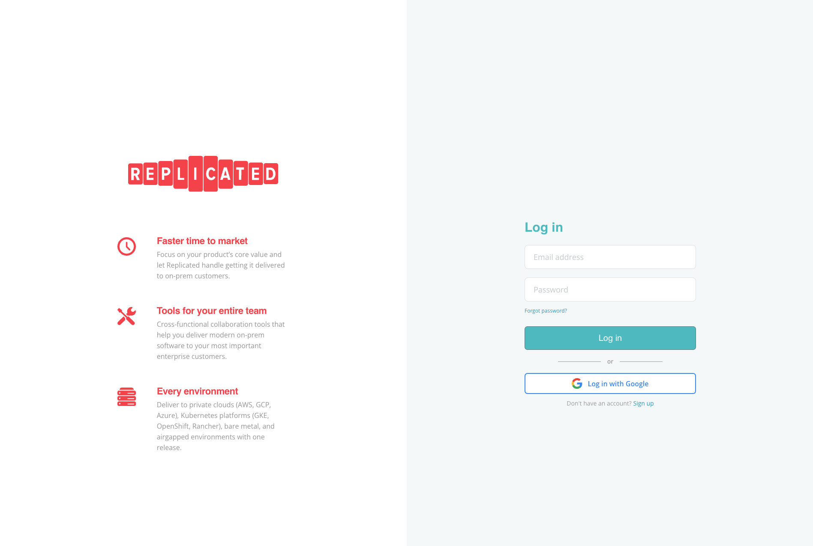
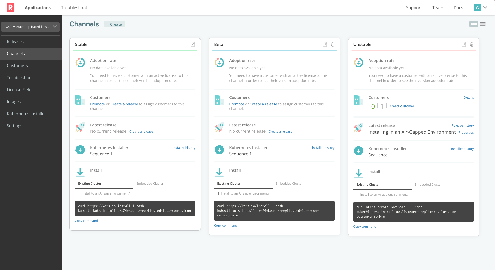
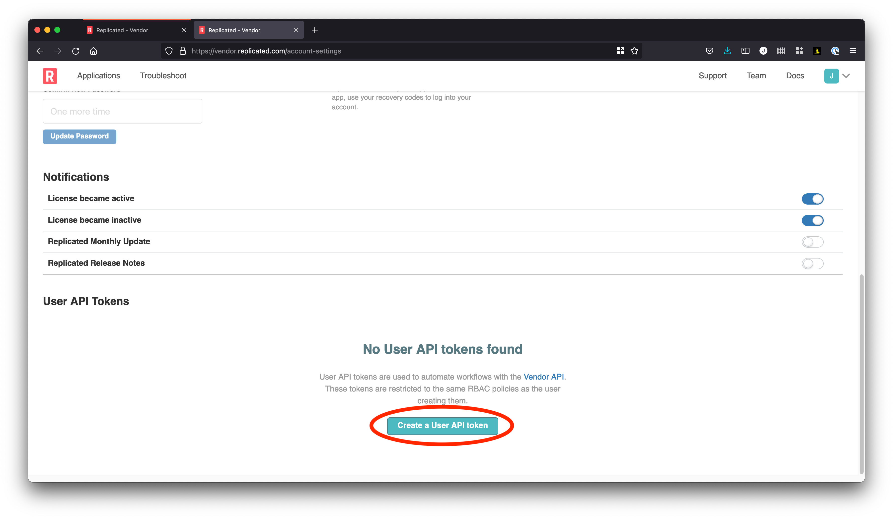

🚀 Let's start
==============

## Connecting to the Replicated Vendor Portal

Log into the Replicated Vendor Portal in the "Vendor Portal" tab using the username
and password printed to your screen in the "Shell" tab.

```
username: [PARTICIPANT_ID]@replicated-labs.com
password: [PARTICIPANT_ID]
```

Once you have the credentials, you can login into the Vendor tab and you should land on the Channels tab.



After logging in, you're going to identify your application and create an API token to use with the
Replicated command-line, then set up some environment variables in your shell to store them.

### Configure environment

When you log in, you'll be on our release channels page.



Go from the channels page to the settings page to see the application slug. The slug is how the
Replicated CLI and API uniquely identify applications. We'll need to know the slug to use the
CLI later in the lab.


When you go back to the "Shell" tab you'll set the variable `REPLICATED_APP` to the app slug. This tells
the `replicated` command which application you are working on without you having to passing it as
an argument to every command.

Next, create a `read/write` User API token from your [Account Settings](https://vendor.replicated.com/account-settings)
page:



Note: Ensure the token has "Write" access or you'll be unable create new releases.

Once you have the values, go back to the "Shell" tab and set them in your environment.

```
export REPLICATED_APP=...
export REPLICATED_API_TOKEN=...
```

You can ensure this is working with

```
replicated release ls
```
