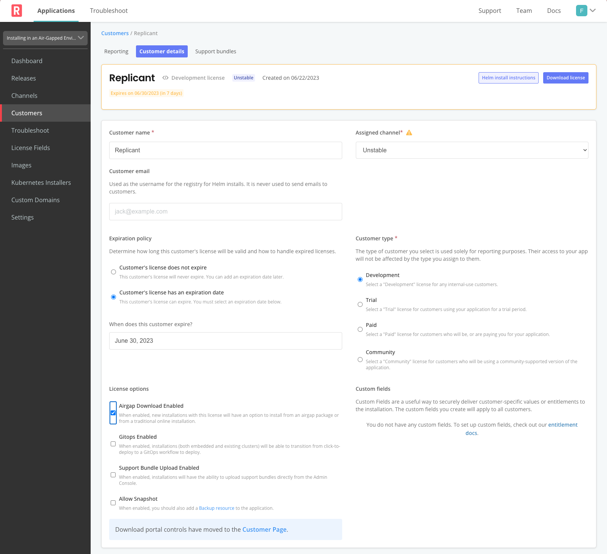
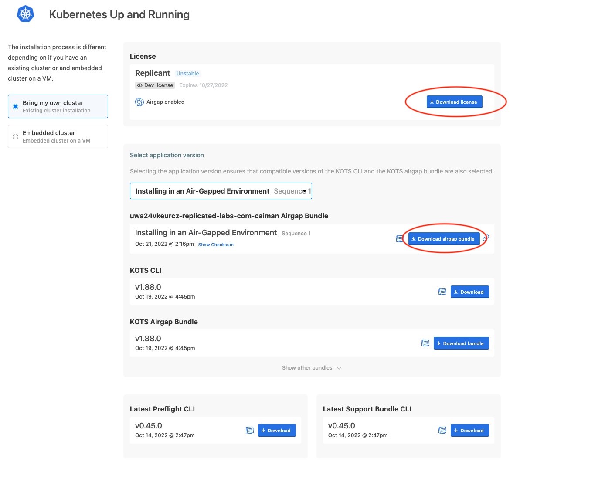

#### Building an Airgap Release

While the kURL download continues, let's build the air-gap bundle for
our current application release. You can see your download status in
the "Jumpbox" tab. We'll mostly be working in the "Vendor Portal" for
this lab.

Since air-gapped bundles can be quite large, not all release channels
build them automatically. Two of the default channels, `Stable` and
`Beta` are are configured to do it. Other channels can be set to auto
build, or you can manually build a bundle when needed.

You can build air-gap bundles for any of your releases by looking at
the release history page for a channel. If you have a channel that 
you'll want regular airgap bundles on, you'll likely want to edit
that channel to enable auto builds.

Let's go through setting that up for our `development` channel we're 
using for this lab. Start by editing the channel info

then enable auto-builds by flipping the toggle labeled "Automatically
create airgap builds for newly promoted release in this channel"

Now you should see all the bundles building or built on the release 
history page. If you do not see "Airgap Built" for the release, click **Build**.

#### Enabling Airgap for a customer

Customers are automatically enabled for air gap deployment. This 
gives you flexibility in terms of product packaging and deployment.
Let's enable air-gap downloads for the example customer we're using 
for the lab. Go to "Customers" in the Vendor portal and select the
"Replicant" customer to enable the airgap.

Click the checkbox next to "Airgap Download Enabled" and make sure
you "Save Changes" with the bottom on the bottom right.

#### Download Airgap Assets

After saving the customer, scroll to the bottom of the page to the 
`Download Portal` section.

Generate a new password and save it somewhere in your notes. Next, 
click the link to open the download portal. This is a link you would 
usually send to your customer. The rest of the lab we'll be back on
our Jumpbox and working wearing our "end user" hat.

Navigate to the "embedded cluster" option and review the three 
downloadable assets.

This is where your customer downloads the assets they neeed for an
air gap install: the kURL bundle, their license file, and the airgap 
bundle for your application. They will usually download all three at
once for the initial install.

We're only going to download the license file right now. We started
downloading the kURL bundle in the previous step, and we'll use the
command-line to download the application bundle in the next step.
