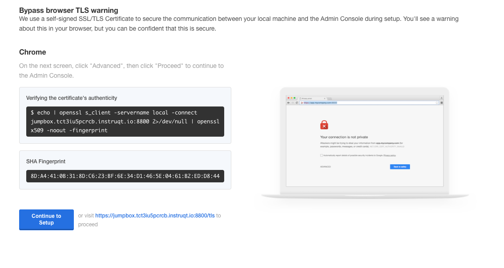
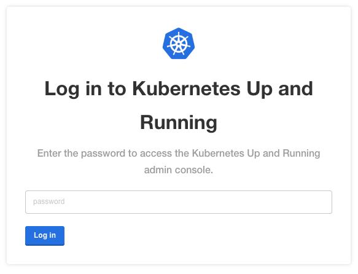
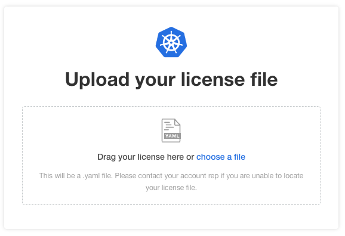
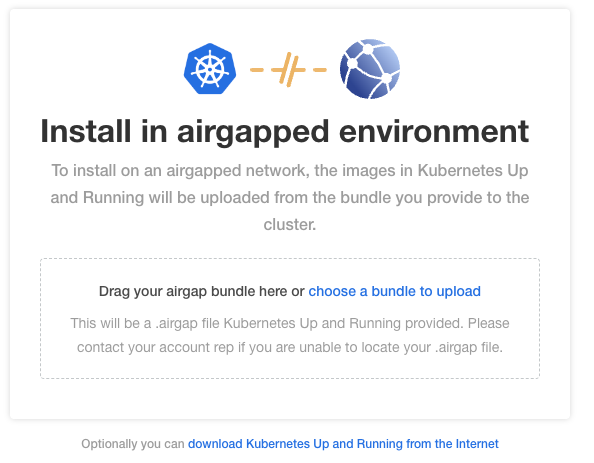
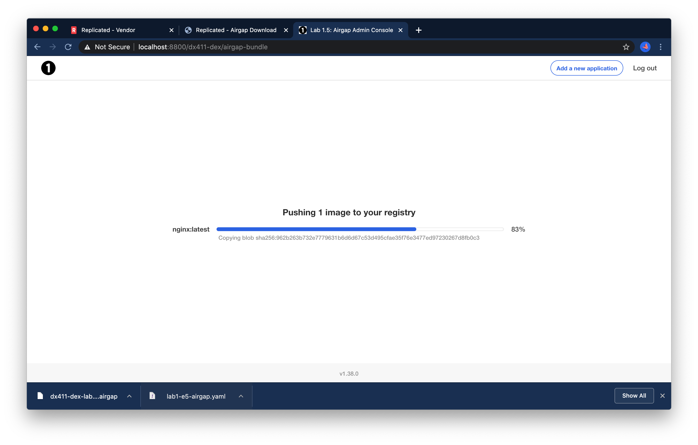
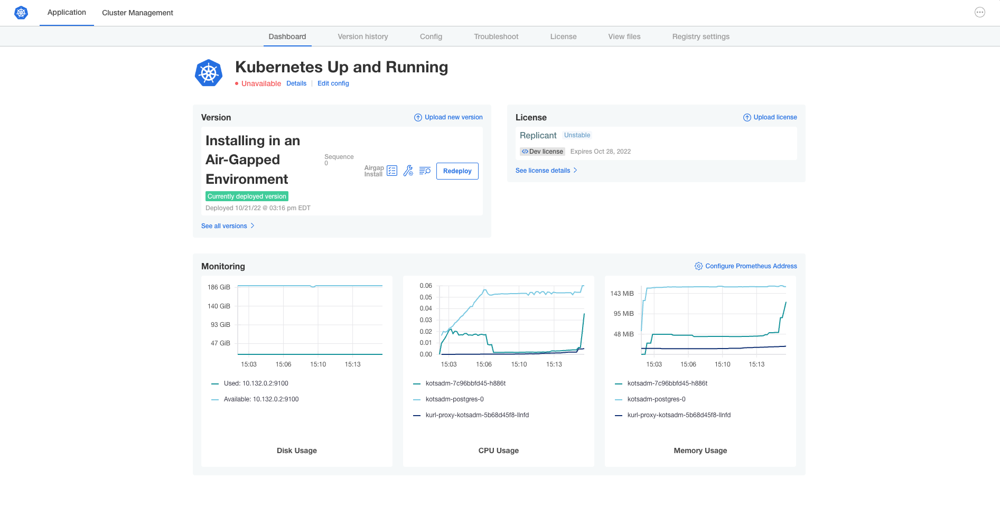

Forwarding Traffic to the Installer
===================================

We're going to use the browser to configure and install your application.
The installer is running on your air-gapped instance, which can only be
accessed from your Jumpbox, and only over SSH. We'll use SSH to forward
a port on the Jumpbox to the Application installer running on your
cluster.

```
ssh -NTfL 0.0.0.0:8800:cluster:8800 cluster
```

The SSH command will run in the background, and you won't see any
output.

Running the Installer
=====================

The "Application Installer" tab is configured to point to accces the
port you forwarded. Switch to that tab to begin the installation. The
first thing you'll see is a warning about the TLS certificate. In a real
world install we **strongly** recommend you replace the certificate,
which is self-signed and thus not signed by a trusted authority.



For the Lab, we're going to leave the self-signed certificate in place.
Click the "Skip and continue" to accept the self-signed certificate.


At the login screen paste in the password noted previously on the
`Installation Complete` screen. The password is shown in the output from
the installation script.



Until this point, this server is just running Kubernetes and the Admin
Console. The next step begins the install for your application.

The next step is to upload a license file so KOTS can validate which
application is authorized to be deployed. Use the license file we
downloaded earlier.

Click the Upload button and select the `Replicant.yaml` file to continue,
or drag and drop the license file from a file browser.



After you upload your license, you'll be greeted with an Airgap Upload
screen. Select "Choose a bundle to upload" and use the application bundle
that you downloaded to your workstation using the customer portal here.
Click "Upload Air Gap bundle" to continue the upload process.



You'll see the bundle uploaded and images being pushed to kURL's internal
registry. This will take a few minutes to complete.



Once uploaded `Preflight Checks` will run. These are designed to ensure
this server has the minimum system and software requirements to run the
application. Depending on your YAML in `preflight.yaml`, you may see some
of the example preflight checks fail or offer a warning. If you have
failing checks, you can click continue -- the UI will show a warning that
will need to be dismissed before you can continue.


Your application is now installed and ready.


