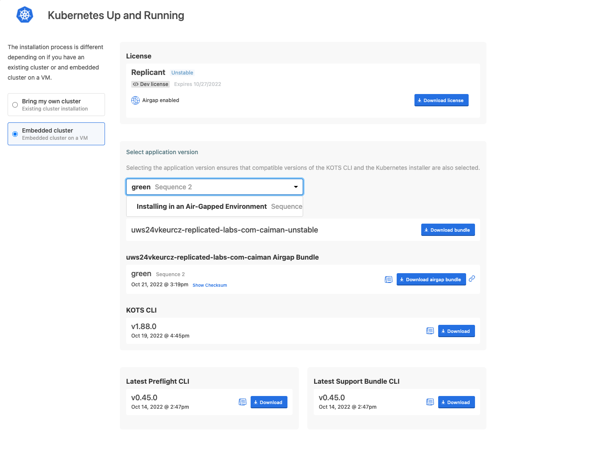
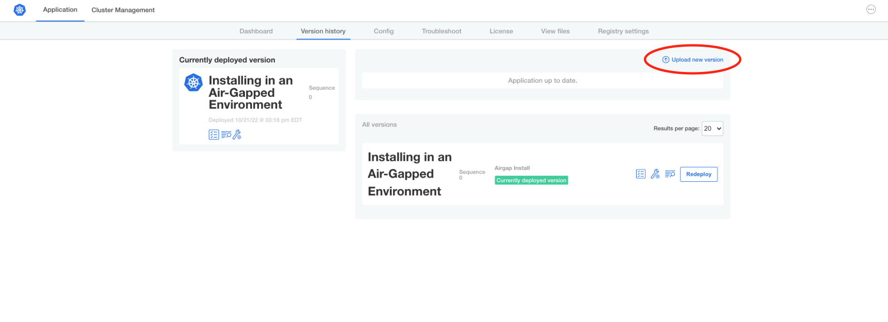

Now that we've installed into the airgapped environment, let's explore
what your customer will do when you release a new version of your
application. The KUARD application has multiple versions published, so
we're going to change our configuration to deploy the `green` version
rather than the `blue` version we just installed.

Updating and Releasing
======================

Go to the the "Code Editor" tab and edit the file `deployment.yaml` in
the directory application `manifests`. Where is references the `blue` image for
the application, switch it instead to read `green`.


After making the change, pop back over to the "Jumpbox" tab and create a
new Replicated release.

```shell
replicated release create --promote development --version green --yaml-dir manifests
```

Downloading the Updated Bundle
==============================

Once the release is made, you should be able to navigate back to the
customer download portal and download the new bundle. Go to the vendor
portal tab, select "Customers" and then the customer "Replicant" and
visit their download portal. If you've forgotten the password from before,
you can easily reset it with the "Generate new password" button.


Your new release should be at the top, but sometimes an airgap bundle can
take some time to build. If your release isn't available, refresh your browser
until you see it, then click 'Download airgap bundle".

If you have to wait, you can explore the different versions of KOTS and your
application that are vailable. Clicking "Show other bundles" will show
historical versions of the KOTS Airgap Bundle that are available. Don't
worry if you see different versions, we've likely release a lot more
since I took this screenshot.


You can also select older versions of your application bundle. You will
probably see fewer versions in your list, since I've created a few extras
while building this lab.



These can be helpful for your customers to align new servers with the version
they're running in production or to help you discover regressions.

Installing the Update
=====================

Once you've downloaded the new version, in the KOTS Admin Console
select "Version History", then click "Upload a new version" and
select your bundle.



You'll see the bundle upload as before and you'll have the option to deploy
it once the preflight checks complete. Click "Deploy" to perform the
upgrade.

Switch back to the "Dashboard" tab in the Admin Console and confirm that
your new version is installed and ready.


Almost There...
===============

Congratulations! You've deployed your first application in an air-gapped
environment using the Replicated Admin Console. We're going to take a
look at one more thing before we finish learning about the airgap
workflow.
