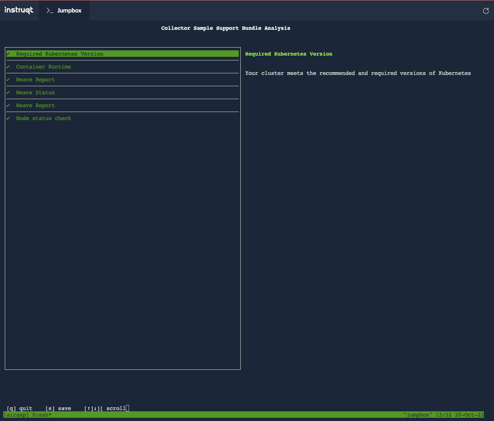

If your application is at least partially installed in the customer
enviornmnet, they can use the support bundle you defined to troubelshoot
application failures. But what happens if it fails before that?


The Admin Console Support Bundle
================================

In a connected network, there is an easy way to connect a support
bundle from a failing Admin Console

```shell
kubectl support-bundle https://kots.io
```

Let's connect to the air-gapped cluster and give this a try:

```shell
ssh cluster
```

After you connect, run the command

```shell
kubectl support-bundle https://kots.io
```

After a short bit of time you'll see it's timed out, as we
expected since we can't get ot the Internet from the air-gapped
network.

```shell
Error: failed to load support bundle spec: failed to get spec from URL: execute request: Get "https://kots.io": dial tcp 104.21.18.220:443: i/o timeout
```

Moving the KOTS Support Bundle Spec
===================================

If you haven't already, disconnect from the cluster node by
typing "control-D".

We're going to pull the spec from the KOTS project, then move
it onto the cluster node. The steps will vary depending on how your
airgap is configured.

In our case, we can grab it from GitHub onto our Jumpbox, then
move the file up onto the air-gapped instance and use it from
there.

```
curl -o support-bundle.yaml https://raw.githubusercontent.com/replicatedhq/kots/main/pkg/supportbundle/defaultspec/spec.yaml
scp support-bundle.yaml cluster:
```

Collecting the Support Bundle
=============================

Now we can connect to our cluster node and collect the support
bundle.

```shell
ssh cluster
```

Now we specify the support bundle manifest we moved onto air-gapped
node when we run command.

```shell
kubectl support-bundle ./support-bundle.yaml
```

You may see a couple of errors collecting data because of
components that are not installed in our kURL cluster, this is
expected. Once the bundle has been collected, you'll get a quick
review of the analysis.



You can now move this support bundle off the air-gapped network
for analysis, or analyze it from a workstation running on the
air-gapped network.

There's an in depth post with some other options at [How Can I Generate a Support Bundle If
I Cannot Access the Admin Console?](https://help.replicated.com/community/t/kots-how-can-i-generate-a-support-bundle-if-i-cannot-access-the-admin-console/455).

🏁 Finish
=========

Congratulations! You've now explored the air-gapped workflow
for applications deployed with Replicated.
