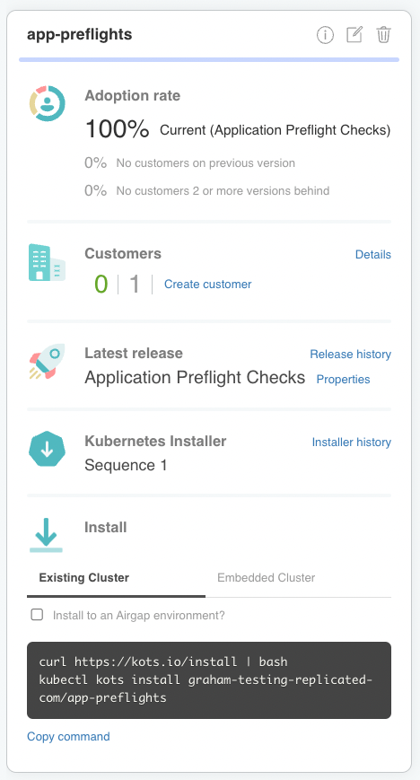
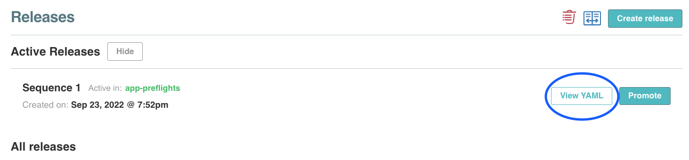
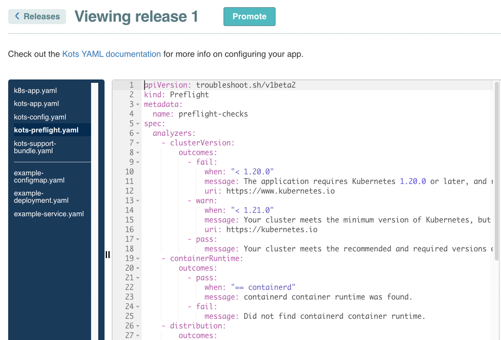
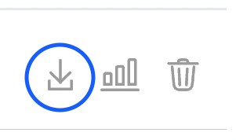

👋 Review Application PreFlights in Vendor Portal
=================================================

* **In this exercise you will:**

 * Access vendor portal and view preflights and download license
 * Use vendor portal invite email to register and set password for temporary account
 * Grab the kots install command from the app-preflights channel Existing cluster


### 1. Vendor Portal login

To access the Vendor Portal, you will need your participant id. If you go to the Shell tab, it will show you the username and password to be used for the Vendor tab. It will be of the following format:
```
username: [PARTICIPANT_ID]@replicated-labs.com
password: [PARTICIPANT_ID]
```

Once you have the credentials, you can login into the Vendor tab and you should land on the Channels. Channels allow you to manage who has access to which releases of your application.


### 2. Replicated Vendor portal

The vendor portal has been pre-configured for this lab with a sample application and the release has been promoted to the Stable Channel.




### 3. View the application pre-flight details

Navigate to the Releases tab and click on the latest active releases **View YAML**



The UI code editor has the file list down the left hand side, there is a line separating the kots feature config and the application itself.
The file that contains the application preflights in this example is called **kots-preflights**, select this file and note the header type:

```yaml
apiVersion: troubleshoot.sh/v1beta2
kind: Preflight
```



Application pre-flight checks are defined as collectors and analyzers. Note the various analyzer outcomes with messages, links.
The outcomes can have resultant actions; pass, warning and fail.  Fail will halt the installation process before it starts, this is desireable as continuing would most likely have failed and leave the application parially deployed.

The analyze phase can only use the output of the collect phase to perform analysis and provide results, however a large set of collectors are included automatically.

For more information on application pre-flight checks see the Replicated docs:
* <font color="LightBlue">[Configuring Preflight Checks](https://docs.replicated.com/vendor/preflight-support-bundle-creating)</font>
* <font color="LightBlue">[Preflight Checks Reference docs](https://docs.replicated.com/reference/custom-resource-preflight#preflight)</font>


### 5. Download Application License

A sample end customer has been pre-created and associated with the Stable release channel where the test application release has been promoted to.  View this customer by navigating to the Customers tab on the left hand side of the UI, the customer name is *Hola Preflight Customer*.

Click on the download license icon on the right of the customer entry as you'll use that in the next challenge.




To complete this challenge, press **Check**.

