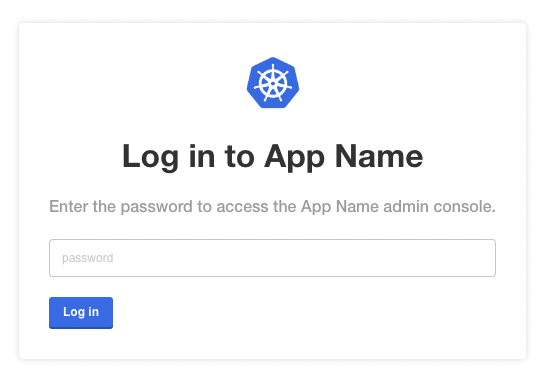
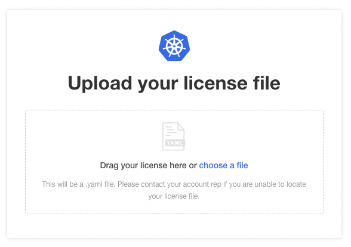
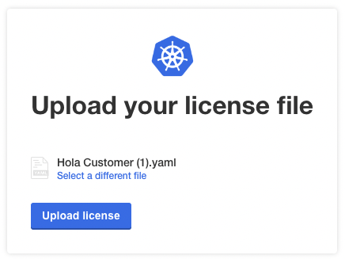
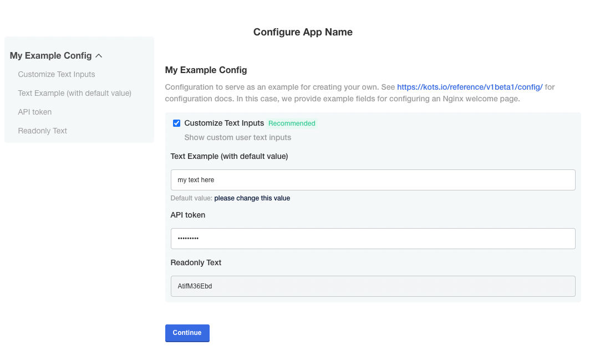
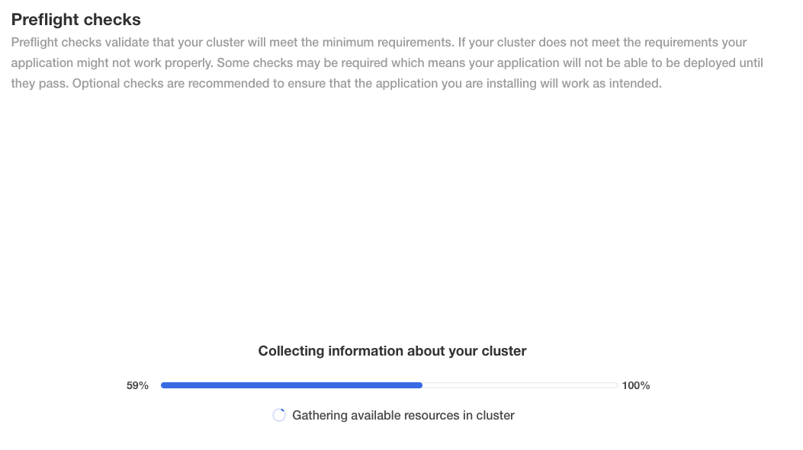
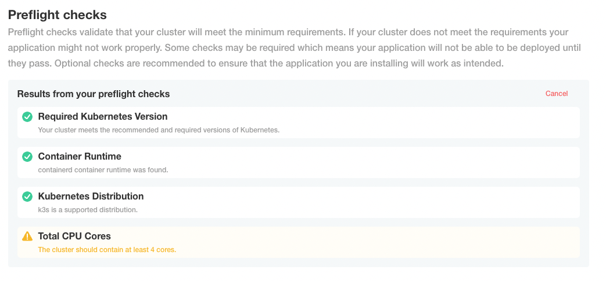
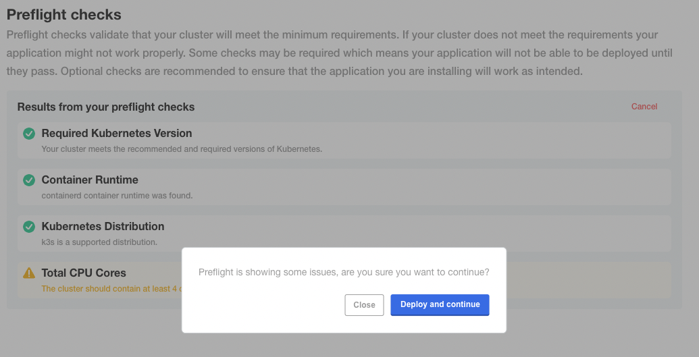
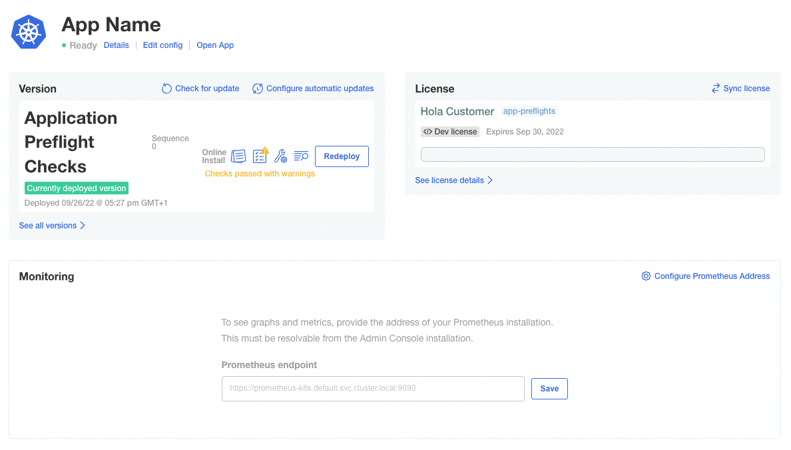
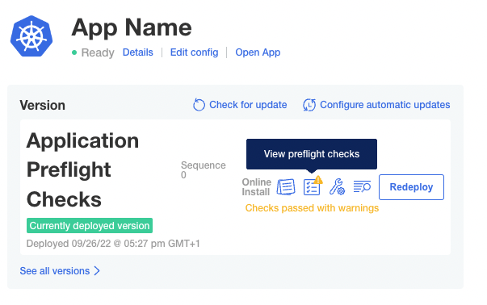
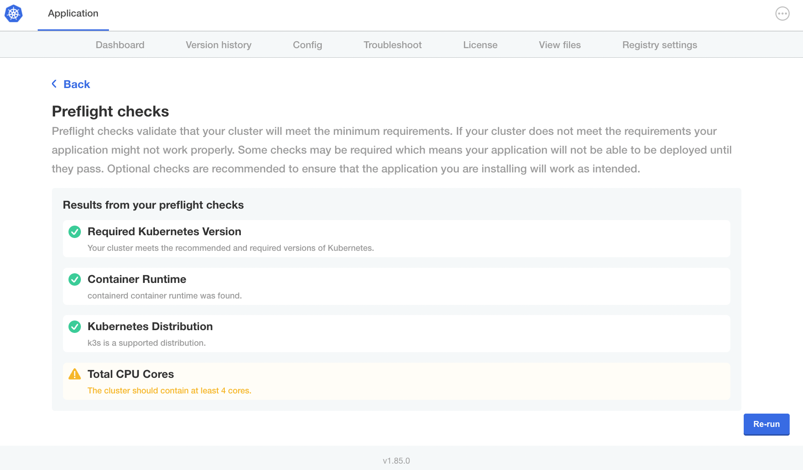

👋 Kotsadm UI
=============

**In this exercise you will:**

 * Access kotsadm ui, login and upload license
 * View the initial run of the preflights
 * After the app is running view the preflight log for current deployment


### 1. Finish App Install

In the previous challenge the kots services were installed for the application on the existing kubernetes cluster.

In this challenge the installation is completed and as part of that the application install pre-flight checks will be run.

Launch the kotsadm console UI using the **Open external window** launch button in the KotsAdm tab


### 2. KotsAdm web UI authentication and License upload



Login to the kotsadm UI using the password you set in the previous challenge.  
After authenticating you will be prompted to upload an application license file, select the file that you downloaded earlier for the **Hola Customer**.





### 3. Application Configuration Values

Once the license is uploaded you will be presented with the application configuration set in (kots-config.yaml), this data entry is made before the application is deployed for the first time.



You can add values for the config as you like, or accept details and click **Continue**


### 4. Pre-Flight Checks!!

Next the Application Pre-Flights checks will be run for the first time:




Notice that the Total CPU Cores check hit the **warn** outcome

Extract from kots-preflights.yaml in the Vendor portal:
```    - nodeResources:
        checkName: Total CPU Cores
        outcomes:
          - fail:
              when: "sum(cpuCapacity) < 2"
              message: The cluster must contain at least 2 cores, and should contain at least 4 cores.
          - warn:
              when: "sum(cpuCapacity) < 4"
              message: The cluster should contain at least 4 cores.
          - pass:
              message: There are at least 4 cores in the cluster.
```


### 5. Application Deployment

When satisfied with the Preflight Check results, click **Continue** to carry on with the deployment.



Click **Deploy and continue** and the application resource status informer will turn to <font color="Green">Green</font> after a few moments





### 6. View PreFlights post deployment

The Application Preflight results can be viewed post application deployment by selecting the PreFlights icon




Note that the preflights can be run at any time from this screen


### Congratulations you have finished the Applications Pre-Flights Lab!!


🏁 Finish
=========

To complete this challenge, press **Check**.
