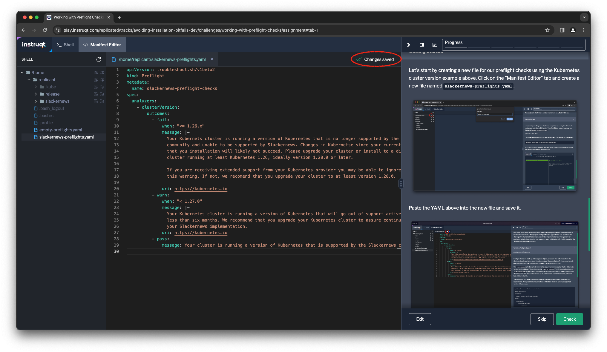

👋 Introduction
===============

One of the areas teams worry about most when distributing software
to customer clusters is whether those clusters will be properly
configured for the application to run. To address this challenge,
the Replicated Platform provides for the implementation and
management of preflight checks that can describe your expectations
and validate them. Preflights are part of the
[Troubleshoot](https://troubleshoot.sh) open source project.

What is a Preflight Check?
===========================

Preflight checks analyze your customer's cluster as a client without
installing anything into it. This allows customers to run Preflight
checks at any time before installing your software, and keep the
cluster unchanged. They codify the pre-requisites you would catalog
in your documentation and make them executable.

You define your checks in a YAML file that follows the same format
as a Kubernetes object. The simplest preflight object looks like this,
and it's in the file `empty-preflights.yaml`:

```
apiVersion: troubleshoot.sh/v1beta2
kind: Preflight
metadata:
  name: empty-preflight-checks
spec:
  analyzers: []
```

As the name `empty-preflight-checks` suggests, this is an empty set
of checks and will not execute. Let's try it out.

```
kubectl preflight ./empty-preflights.yaml
```

You'll get a warning/error, since there needs to be at least one analyzer
defined in order to check the cluster.

```
Warning: No analyzers found
```

Analyzers and Collectors
========================

Preflight checks are made up of two types of objects, _collectors_
that collect data from the cluster, and _analyzers_ that analyze
the collected data. Many preflight definitions do not specify any
collectors, since two collectors are included in all preflights
by default.

The `clusterInfo` collector collects information about the running
cluster, like the Kubernetes version and other info you'd see when
running `kubectl version`. The other default collector is
`clusterResources`, which collects information about resources of
several known types across all namespaces that the user has
access to. You can also add custom collectors, which we'll look
at later in the lab.

The majority of your work on preflight checks will be with
analyzers that validate your requirements. A very common analyzer
is to check that the cluster is running a supported version of
Kubernetes.

```
apiVersion: troubleshoot.sh/v1beta2
kind: Preflight
metadata:
  name: slackernews-preflight-checks
spec:
  analyzers:
    - clusterVersion:
        outcomes:
          - fail:
              when: "<= 1.26.x"
              message: |-
                Your Kubernets cluster is running a version of Kubernetes that is no longer supported by the Kubernetes
                community and unable to be supported by Slackernews. Changes in Kubernetse since your current version mean
                that you installation will likely not succeed. Please upgrade your cluster or install to a different
                cluster running at least Kubernetes 1.26, ideally version 1.28.0 or later.

                If you are receiving extended support from your Kubernetes provider you may be able to ignore
                this warning. If not, we recomend that you upgrade your cluster to at least version 1.28.0.

              uri: https://kubernetes.io
          - warn:
              when: "< 1.27.0"
              message: |-
                Your Kubernetes cluster is running a version of Kubernetes that will go out of support active support in
                less than six months. We recommend that you upgrade your Kubernetes cluster to assure continued success with
                your Slackernews implementation.
              uri: https://kubernetes.io
          - pass:
              message: Your cluster is running a version of Kubernetes that is supported by Slackernews.
```

This analyzer is the first of a handful of analyzers we will add in this lab.

Getting Started
===============

Let's start by creating a new file for a simple set of  preflight checks in our
home directory. using the Kubernetes cluster version example above. Click on
the "Manifest Editor" tab and create a new file named
`slackernews-preflights.yaml`.


Paste the YAML above into the new file and the editor will automatically save it.



Now let's run our preflight checks.

```
kubectl preflight ./slackernews-preflights.yaml
```

You'll see that your check has been run and it should report
that it has passed with a supported version of Kubernetes.


