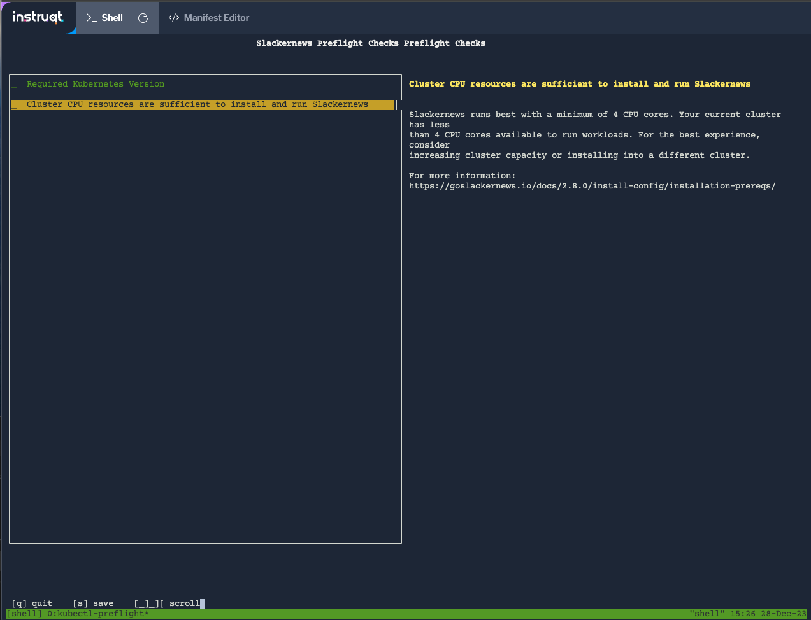
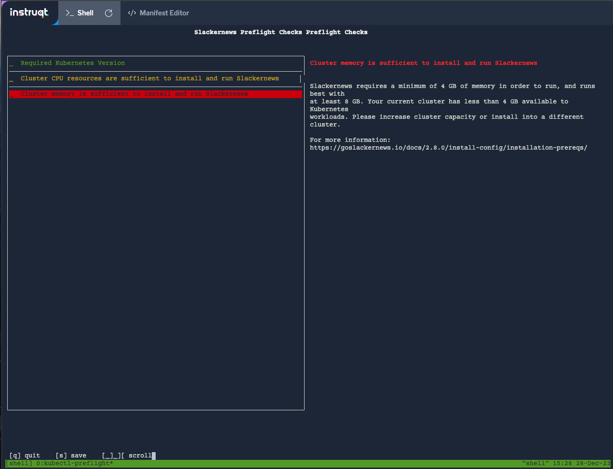

Now that we know we're installing to a supported version of
Kubernetes, let's see if that cluster has the resources to
support running Slackernews.

Cluster Resources
=================

The default `clusterResources` collector collects information
about all of the nodes in the cluster. This allows us to
write analyzers that check whether the cluster has sufficient
resources to run our application: most often we write checks to
determine whether CPU, memory, and storage meet the base
requirements of the application.

When analyzing resources in the cluster, we can write expressions
based on whether the node has the
[capacity required and whether that capacity is allocatable](https://kubernetes.io/docs/concepts/architecture/nodes/#capacity).
Allocatable has a very specific meaning in Kubernetes, and is not
the same as "free" or "available". It means only that the capacity
is not being reserved by Kubernetes or the underlying system. This
distinction often trips up developers who are new to Kubernetes.

Verify Resource Requirements
============================

The best way to define your preflight checks for cluster resources
is to make sure they align with your documentation for the minimum
and recommended values. The preflight check makes those prerequisites
executable and lets your customer know whether their install will
succeed. Let's look at [Slackernews's documentation](https://goslackernews.io/docs/2.8.0/install-config/installation-prereqs/)
for guidance on our preflights.

<table>
<thead>
<tr>
<th>Resource</th>
<th>Minimum</th>
<th>Recommended</th>
</tr>
</thead>
<tbody>
<tr>
<td>CPU</td>
<td>2 CPU</td>
<td>4 CPU</td>
</tr>
<tr>
<td>Mem</td>
<td>4 GB</td>
<td>8 GB</td>
</tr>
</tbody>
</table>

Since we have both recommended and minimum values, we have thresholds
for both warning and failure. Let's add the CPU check into our
`slackernews-preflights.yaml` manifest. Open up the "Manifest Editor" tab
and paste this new analyzer after the one checking the Kubernetes version.

```
    - nodeResources:
        checkName: Cluster CPU resources are sufficient to install and run Slackernews
        outcomes:
          - fail:
              when: "sum(cpuAllocatable) < 2"
              message: |-
                Slackernews requires a minimum of 2 CPU cores in order to run, and runs best with
                at least 4 cores. Your current cluster has less than 2 CPU cores available to Kubernetes
                workloads. Please increase cluster capacity or install into a different cluster.
              uri: https://goslackernews.io/docs/2.8.0/install-config/installation-prereqs/
          - warn:
              when: "sum(cpuAllocatable) < 4"
              message: |-
                Slackernews runs best with a minimum of 4 CPU cores. Your current cluster has less
                than 4 CPU cores available to run workloads. For the best experience, consider
                increasing cluster capacity or installing into a different cluster.
              uri: https://goslackernews.io/docs/2.8.0/install-config/installation-prereqs/
          - pass:
              message: Your cluster has sufficient CPU resources available to run Slackernews
```

After saving your changes run the preflight checks command to see the outcome.

```
kubectl preflight ./slackernews-preflights.yaml
```

You'll see that our cluster generates a warning since it has only two CPU
cores available. This should be fine for our lab environment, so we can
ignore the warning for now.



To round out the resource checks, add a similar check for memory. It should
also show a warning which is fine for the lab environment.

```
    - nodeResources:
        checkName: Cluster memory is sufficient to install and run Slackernews
        outcomes:
          - fail:
              when: "sum(memoryAllocatable) < 4G"
              message: |-
                Slackernews requires a minimum of 4 GB of memory in order to run, and runs best with
                at least 8 GB. Your current cluster has less than 4 GB available to Kubernetes
                workloads. Please increase cluster capacity or install into a different cluster.
              uri: https://goslackernews.io/docs/2.8.0/install-config/installation-prereqs/
          - warn:
              when: "sum(memoryAllocatable) < 8Gi"
              message: |-
                Slackernews runs best with a minimum of 8 GB of memory. Your current cluster has less
                than 8 GB of memory available to run workloads. For the best experience, consider
                increasing cluster capacity or installing into a different cluster.
              uri: https://goslackernews.io/docs/2.8.0/install-config/installation-prereqs/
          - pass:
              message: Your cluster has sufficient memory available to run Slackernews
```

Running the Revised Preflights
==============================

Now that we have a thorough set of preflights for cluster resources, let's run
them:

```
kubectl preflight ./slackernews-preflights.yaml
```

You'll see that all three preflights are run, and that the memory
preflight has warned you. This is an expected failure, since we have
single node cluster that has a small memory footprint.



If you completed the [Distributing Your Application with
Replicated](https://play.instruqt.com/replicated/tracks/distributing-your-application-with-replicated)
lab, you may be surprised at this failure. In that lab, we deployed Slackernews
and it came up successfully.  

Catching those types of surprises _before_ they become issues is a big reason
to use preflight checks. By detecting latent failures, they help your customers
make adjustments ahead of time. Slackernews could exhaust the memory 
available in this cluster even though it started successfully.
