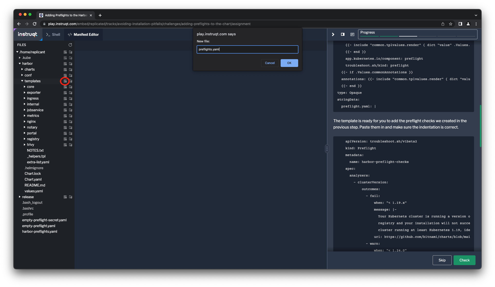
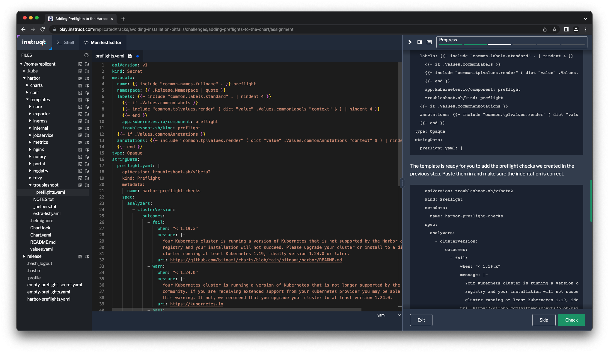

There are many more preflight checks we could define for
Slackernews, but let's stop here and shift to how we can
deliver these checks as part of the application. To do this,
we're going to incorporate them into our Helm chart and
release a new version using the Replicated Platform.

Making Preflights Available with Your Application
=================================================

We defined our preflight checks in a manifest that looks a lot like a
Kubernetes resource. It's useful to think of it as one, since it's an important
part of successfully distributing and supporting an application. But it's
different in one important way: it's not processed by the Kubernetes API but
instead by the open source [Troubleshoot tooling](https://troubleshoot.sh).

To accommodate this distinction, but still make it available
as part of our Helm chart, we are going to store it in a
Kubernetes secret that our chart creates. This helps us in
two ways:

1. We won't try to create a resource the cluster doesn't
   know about.
2. It's available in the cluster as part of the application
   for the customer to run at any time.

We identify this secret with a label that we add to the
secret when we incorporate it into our chart.

```
troubleshoot.sh/kind: preflight
```

If we consider the "simplest possible" preflight spec from
the first step in the lab, it would become a secret that
looks like this:

```
apiVersion: v1
kind: Secret
type: Opaque
metadata:
  name: empty-preflights
  labels:
    troubleshoot.sh/kind: preflight
stringData:
  preflight.yaml: |-
    apiVersion: troubleshoot.sh/v1beta2
    kind: Preflight
    metadata:
      name: empty-preflight-checks
    spec:
      analyzers: []
```

To run it, we can use the `preflight` plugin to `kubectl`
like we did before

```
kubectl preflight ./empty-preflight-secret.yaml
```

Remember that this preflight check won't run successfully
since we haven't defined any analyzers to check anything.

```
Error: no results
```

_Note: The preflight check can also be stored as a `ConfigMap`
with the same annotation._

Adding Preflight Checks into the Slackernews Helm Chart
==================================================

Now that you know how to include your preflight checks into a
Helm chart, let's add them to the Slackernews Helm chart. To make
the secret fit in with Bitnami's naming, labeling, and annotation
conventions, there's a little bit of boiler plate required. You'll
likely need to do something similar to follow your team's
conventions when working with your own chart.

Similarly, we're going to follow the conventions for the Slackernews chart where
different components are in their own directories and create a directory to
store our preflight chart in. We're going to call the directory `troubleshoot`
since preflight checks are one of two types troubleshooting resources provided
by the Replicated Platform. Create the directory from the shell.

```
mkdir slackernews/templates/troubleshoot
```

Open the manifest editor and create a new file named `preflights.yaml` in the
directory `slackernews/templates/troubleshoot`. This will be the template that
creates the preflight secret when the Helm chart is installed.



After creating the file, click on the filename
to make sure it is opened.

Add the following to the file. As noted above, there's a lot of
templating to make sure naming, labels, and annotations are
consistent. If you look beyond that, we're really just creating a
secret that will have some string data at the key `preflight.yaml`.
Also note the label `troubleshoot.sh/kind: preflight` which
identifies the secret for the `preflight` command.

```
apiVersion: v1
kind: Secret
metadata:
  name: {{ include "slackernews.name" . }}-preflight
  namespace: {{ .Release.Namespace | quote }}
  labels: {{- include "slackernews.labels" . | nindent 4 }}
    app.kubernetes.io/component: preflight
    troubleshoot.sh/kind: preflight
type: Opaque
stringData:
  preflight.yaml: |
```

The template is ready for you to add the preflight checks we
created in the previous step. Paste them in and make sure
the indentation is correct.

```
    apiVersion: troubleshoot.sh/v1beta2
    kind: Preflight
    metadata:
      name: slackernews-preflight-checks
    spec:
      analyzers:
        - clusterVersion:
            outcomes:
              - fail:
                  when: "<= 1.26.x"
                  message: |-
                    Your Kubernets cluster is running a version of Kubernetes that is no longer supported by the Kubernetes
                    community and unable to be supported by Slackernews. Changes in Kubernetse since your current version mean
                    that you installation will likely not succeed. Please upgrade your cluster or install to a different
                    cluster running at least Kubernetes 1.26, ideally version 1.28.0 or later.

                    If you are receiving extended support from your Kubernetes provider you may be able to ignore
                    this warning. If not, we recomend that you upgrade your cluster to at least version 1.28.0.

                  uri: https://kubernetes.io
              - warn:
                  when: "< 1.27.0"
                  message: |-
                    Your Kubernetes cluster is running a version of Kubernetes that will go out of support active support in
                    less than six months. We recommend that you upgrade your Kubernetes cluster to assure continued success with
                    your Slackernews implementation.
                  uri: https://kubernetes.io
              - pass:
                  message: Your cluster is running a version of Kubernetes that is supported by Slackernews.
        - nodeResources:
            checkName: Cluster CPU resources are sufficient to install and run Slackernews
            outcomes:
              - fail:
                  when: "sum(cpuAllocatable) < 2"
                  message: |-
                    Slackernews requires a minimum of 2 CPU cores in order to run, and runs best with
                    at least 4 cores. Your current cluster has less than 2 CPU cores available to Kubernetes
                    workloads. Please increase cluster capacity or install into a different cluster.
              - warn:
                  when: "sum(cpuAllocatable) < 4"
                  message: |-
                    Slackernews runs best with a minimum of 4 CPU cores. Your current cluster has less
                    than 4 CPU cores available to run workloads. For the best experience, consider
                    increasing cluster capacity or installing into a different cluster.
              - pass:
                  message: Your cluster has sufficient CPU resources available to run Slackernews
        - nodeResources:
            checkName: Cluster memory is sufficient to install and run Slackernews
            outcomes:
              - fail:
                  when: "sum(memoryAllocatable) < 4G"
                  message: |-
                    Slackernews requires a minimum of 4 GB of memory in order to run, and runs best with
                    at least 8 GB. Your current cluster has less than 4 GB available to Kubernetes
                    workloads. Please increase cluster capacity or install into a different cluster.
              - warn:
                  when: "sum(memoryAllocatable) < 8Gi"
                  message: |-
                    Slackernews runs best with a minimum of 8 GB of memory. Your current cluster has less
                    than 8 GB of memory available to run workloads. For the best experience, consider
                    increasing cluster capacity or installing into a different cluster.
              - pass:
                  message: Your cluster has sufficient memory available to run Slackernews
```

After you make your changes, the editor will auto-save.



Testing and Repackaging Your Chart
==================================

You can test out your changes by templating out your Helm chart and
piping the results to `kubectl preflight`. This is how your customers
will run the checks from your released chart as well.

```
helm template slackernews | kubectl preflight -
```

If you're satisfied with the tests, bump the version of your Helm chart in the file
`slackernews/Chart.yaml` from `0.2.0` to `0.3.0`, then repackage it. You can edit
the version in the Manifest Editor or run the following command to do it from
the shell:

```
yq -i '.version = "0.3.0"' slackernews/Chart.yaml
```

Then run the `helm package` command to package the updated version:

```
helm package slackernews --destination ./release
```

