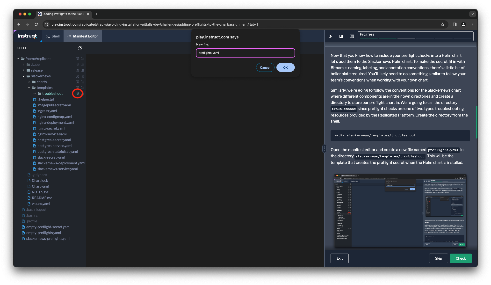
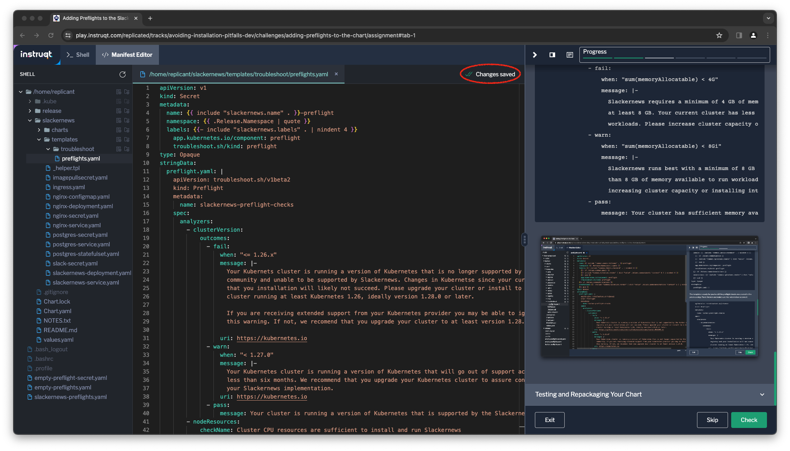

There are many more preflight checks we could define for the
Harbor registry, but let's stop here and shift to how we can
deliver these checks as part of the application. To do this,
we're going to incorporate them into our Helm chart and
release a new version using the Replicated Platform.

Makeing Preflights Available with Your Application
==================================================

We defined our preflight checks in a manifest that looks a
lot like a Kubernetes resource. It's useful to think of it as
one, since it's an important part of successfully distributing
and supporting an application. But it's different in one
important way: it's a resource we expect to run _outside_ of
the destination cluster.

To accommodate this distinction, but still make it available
as part of our Helm chart, we are going to store it in a
Kubernetes secret that that chart creates. This helps us in
two ways:

1. We don't try to create a resource the cluster doesn't
   know about.
2. It's available in the cluster as part of the application
   for the customer to run at any time.

We identify this secret with a label that we add to the
secret when we incorporate it into our chart.

```
troubleshoot.sh/kind: preflight
```

If we consider the "simplest possible" preflight spec from
the first step in the lab, it would become a secret that
looks like this

```
apiVersion: v1
kind: Secret
type: Opaque
metadata:
  name: empty-preflights
stringData:
  preflights.yaml: |-
    apiVersion: troubleshoot.sh/v1beta2
    kind: Preflight
    metadata:
      name: preflight-tutorial
    spec:
      analyzers: []
```

To run it, we can use the `preflight` plugin to `kubectl`
like we did before

```
kubeclt preflight ./empty-preflight-secret.yaml
```

Remember that this preflight check won't run successfully
since we haven't defined any analyzers to check anything.

```
Error: no data has been collected
```

_Note: The preflight check can also be stored as a `ConfigMap`
with the same annoation._

Adding Preflight Checks into the Harbor Helm Chart
==================================================

Now that you know how to include your preflight checks into a
Helm chart, let's add them to the Harbor Helm chart. To make
the secret fit in with Bitnami's naming, labeling, and annotation
conventions there's a little bit of boiler plate required. You'll
likely need to do something similar to follow your team's
conventions when working with your own chart.

Open the manifest editor and create a new file named
`preflights.yaml` in the directory `harbor/templates`. This will
be the template that creates the preflight secret when the Helm
chart is installed.



After creating the file, you may have to click on the filename
to make sure it is opened.

Add the following to the file. As noted above, there's a lot of
templating to make sure nanming, labels, and annotations are
consistent. If you look beyond that, we're really just creating a
secret that will have for some string data at the key `preflight.yaml`.
Also note the label `troubleshoot.sh/kind: preflight` which
identifies the secret for the `preflight` command.

```
apiVersion: v1
kind: Secret
metadata:
  name: {{ include "common.names.fullname" . }}-preflight
  namespace: {{ .Release.Namespace | quote }}
  labels: {{- include "common.labels.standard" . | nindent 4 }}
    {{- if .Values.commonLabels }}
    {{- include "common.tplvalues.render" ( dict "value" .Values.commonLabels "context" $ ) | nindent 4 }}
    {{- end }}
    app.kubernetes.io/component: preflight
    troubleshoot.sh/kind: preflight
  {{- if .Values.commonAnnotations }}
  annotations: {{- include "common.tplvalues.render" ( dict "value" .Values.commonAnnotations "context" $ ) | nindent 4 }}
  {{- end }}
type: Opaque
stringData:
  preflight.yaml: |
```

The template is ready for you to add the preflight checks we
created in the previous step. Paste them in and make sure
the indentation is correct.

```
    apiVersion: troubleshoot.sh/v1beta2
    kind: Preflight
    metadata:
      name: harbor-preflight-checks
    spec:
      analyzers:
        - clusterVersion:
            outcomes:
              - fail:
                  when: "< 1.19.x"
                  message: |-
                    Your Kubernets cluster is running a version of Kubernetes that is not supported by the Harbor container
                    registry and your installation will not succeed. Please upgrade your cluster or install to a different
                    cluster running at least Kubernetes 1.19, ideally version 1.24.0 or later.
                  uri: https://github.com/bitnami/charts/blob/main/bitnami/harbor/README.md
              - warn:
                  when: "< 1.24.0"
                  message: |-
                    Your Kubernetes cluster is running a version of Kubernetes that is not longer supported by the Kubernetes
                    community. If you are receiving extended support from your Kubernetes provider you may be able to ignore
                    this warning. If not, we recomend that you upgrade your cluster to at least version 1.24.0.
                  uri: https://kubernetes.io
              - pass:
                  message: Your cluster is running a version of Kubernetes that is supported by the Harbor container registry.
        - nodeResources:
            checkName: Cluster CPU resources are sufficient to install and run Harbor
            outcomes:
              - fail:
                  when: "sum(cpuAllocatable) < 2"
                  message: |-
                    Harbor requires a minimum of 2 CPU cores in order to run, and runs best with
                    at least 4 cores. Your current cluster has less than 2 CPU cores available to Kubernetes
                    workloads. Please increase cluster capacity or install into a different cluster.
                  uri: https://goharbor.io/docs/2.8.0/install-config/installation-prereqs/
              - warn:
                  when: "sum(cpuAllocatable) < 4"
                  message: |-
                    Harbor runs best with a minimum of 4 CPU cores. Your current cluster has less
                    than 4 CPU cores available to run workloads. For the best experience, consider
                    increasing cluster capacity or installing into a different cluster.
                  uri: https://goharbor.io/docs/2.8.0/install-config/installation-prereqs/
              - pass:
                  message: Your cluster has sufficient CPU resources available to run Harbor
        - nodeResources:
            checkName: Cluster memory is sufficient to install and run Harbor
            outcomes:
              - fail:
                  when: "sum(memoryAllocatable) < 4G"
                  message: |-
                    Harbor requires a minimum of 4 GB of memory in order to run, and runs best with
                    at least 8 GB. Your current cluster has less than 4 GB available to Kubernetes
                    workloads. Please increase cluster capacity or install into a different cluster.
                  uri: https://goharbor.io/docs/2.8.0/install-config/installation-prereqs/
              - warn:
                  when: "sum(memoryAllocatable) < 8Gi"
                  message: |-
                    Harbor runs best with a minimum of 8 GB of memory. Your current cluster has less
                    than 8 GB of memory available to run workloads. For the best experience, consider
                    increasing cluster capacity or installing into a different cluster.
                  uri: https://goharbor.io/docs/2.8.0/install-config/installation-prereqs/
              - pass:
                  message: Your cluster has sufficient memory available to run Harbor
        - nodeResources:
            checkName: Cluster has sufficient storage to install and run Harbor
            outcomes:
              - fail:
                  when: "sum(storageAllocatable) < 40G"
                  message: |-
                    Harbor requires a minimum of 40 GB of storage in order to run, and runs best with
                    at least 160 GB. Your current cluster has less than 40 GB available to Kubernetes
                    workloads. Please increase cluster capacity or install into a different cluster.
                  uri: https://goharbor.io/docs/2.8.0/install-config/installation-prereqs/
              - warn:
                  when: "sum(storageAllocatable) < 160Gi"
                  message: |-
                    Harbor runs best with a minimum of 160 GB of storage. Your current cluster has less
                    than 160 GB of storage available to run workloads. For the best experience, consider
                    increasing cluster capacity or installing into a different cluster.
                  uri: https://goharbor.io/docs/2.8.0/install-config/installation-prereqs/
              - pass:
                  message: Your cluster has sufficient storage available to run Harbor
```



Testing and Repackaging Your Chart
==================================

You can test out your changes by templating out your Helm chart and
piping the results to `kubectl preflight`. This is how your customers
will run the checks from your released chart as well.

```
helm template harbor | kubectl preflight -
```

If your satisfied with tests, bump the version of your Helm chart in the file
`harbor/Chart.yaml` (from `16.7.0` to `16.8.0`) the repackage it. You can edit
the verison in the Manifest Editor or run the following command to do it from
the shell.

```
yq -i '.version = "16.8.0"' harbor/Chart.yaml
```

and run the `helm package` command to package the updated version

```
helm package harbor --destination ./release
```

