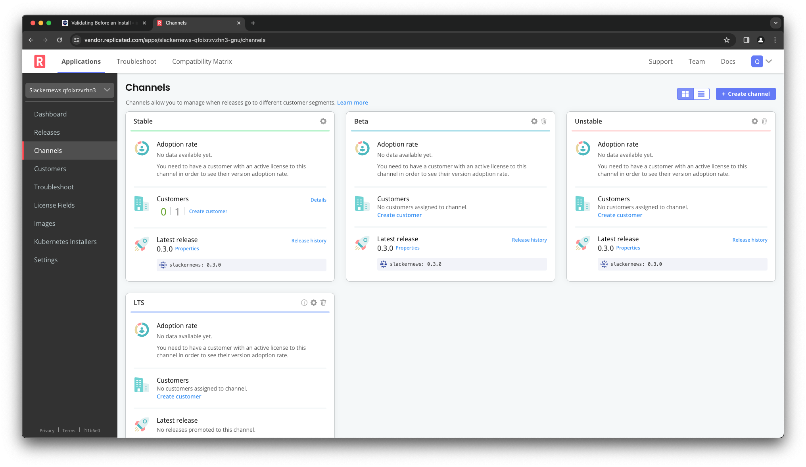
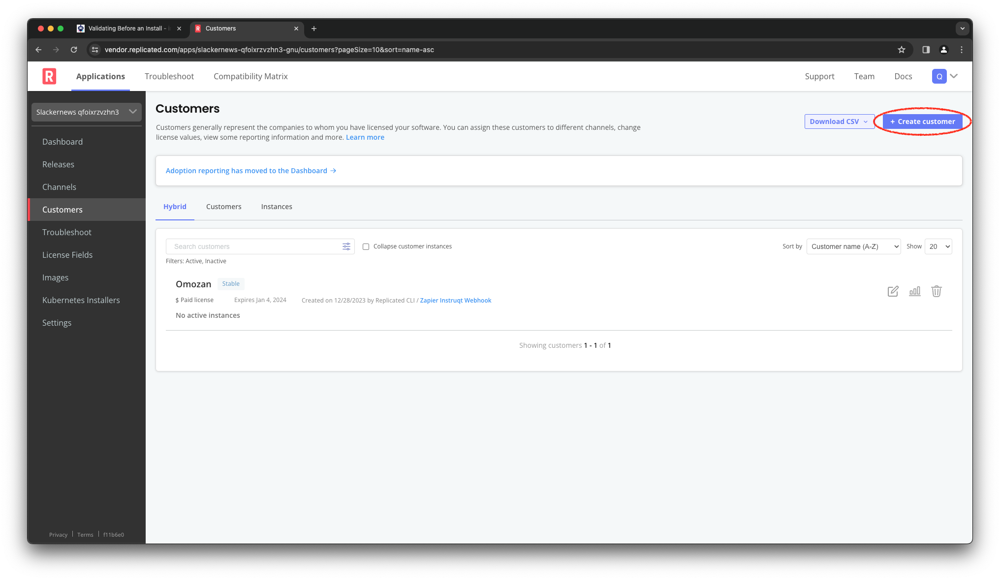
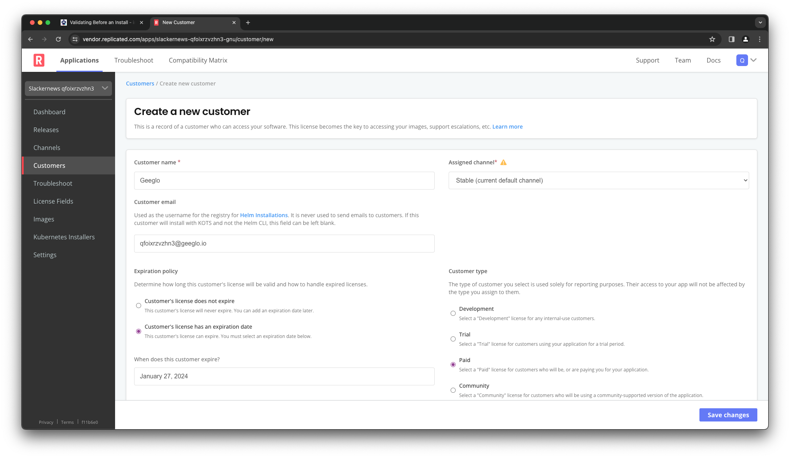
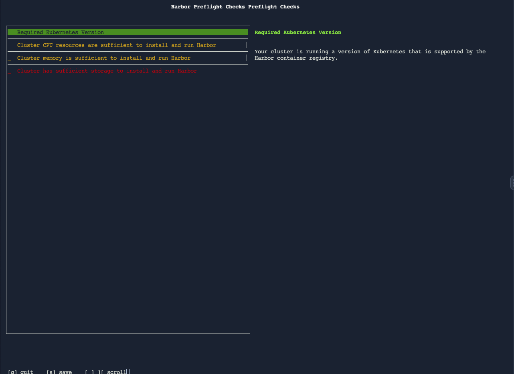

Having a release with your preflights included means you can
take advantage of the Replicated Platform to distribute those
preflights. The entitlements that provide access to your
application control access to the preflight checks as well.
To run the preflights, your customer templates out your
Helm chart and pipes the output to the `preflight` plugin
to `kubectl`, just like you did to test your changes.

Logging Into the Vendor Portal
==============================

To run the preflights as a customer, we need to have their
login credentials to the Replicated registry. The lab setup
process configured a customer for the Harbor application,
but in this step we're going to add a new customer. We'll
do this in the Replicated Vendor Portal,.

Click on the Vendor Portal tab to open up a new browser window and
access the portal. Log in with these credentials

Username: `[[ Instruqt-Var key="USERNAME" hostname="shell" ]]`<br/>
Password: `[[ Instruqt-Var key="PASSWORD" hostname="shell" ]]`

You'll land on the "Channels" page for your app, which will show
the release channels we discussed in the previous step. Notice that
each of the default channels shows the current version `16.8.0`,
while the channel LTS, which we haven't released to, reflects
that.



Creating a Customer
===================

To create a customer, select "Customers" from the menu on the left
the click the "Create Customer" button.



Call your customer "Geeglo" and assign them to the `Stable` channel.
Let's assume this customer is not yet a customer, but prospect who
is evaluating our application. Let's assume allow our customers to
evaluate our software on a trial license for 30 days.  Set them up
as a "Trial" customer with a license that has an expiration date
of [[ Instruqt-Var key="LICENSE_EXPIRY" hostname="shell" ]]. Set
their email to [[ Instruqt-Var key="CUSTOMER_EMAIL" hostname="shell" ]].



Running Preflight Checks
========================

Your customer will prepare for their installation by running
the preflights checks. Since the preflights are embedded in
the Harbor Helm chart, they first need to log into the Replicated
registry with the `helm` command. This gives them access to
your Helm chart via the Replicated Platform.

If you compelted the [Distributing Your Application with Replicated](https://play.instruqt.com/replicated/tracks/distributing-your-application-with-replicated)
lab, you'll remember that each customer has their own login
credentials that are specific to their entitlements to your
application. You can get those instructions by clicking the
"Helm Install Instructions" button on the customer page.


In lab, we only want to execut the first step in the process,
which is the log into the registry. Because you just created
the customer, you'll have to copy the login command from the
vendor portal page.

From there, they can use the `helm template` command to extract the
preflight checks to run with `kubectl preflight`.

```
helm template oci://registry.replicated.com/[[ Instruqt-Var key="REPLICATED_APP" hostname="shell" ]]/harbor \
  | kubectl preflight -
```

Running the checks this way shows them the same screen you saw when
you tested the preflights earlier, with the Kubernetes version check
passing, the storage check failing, and two warnings.


