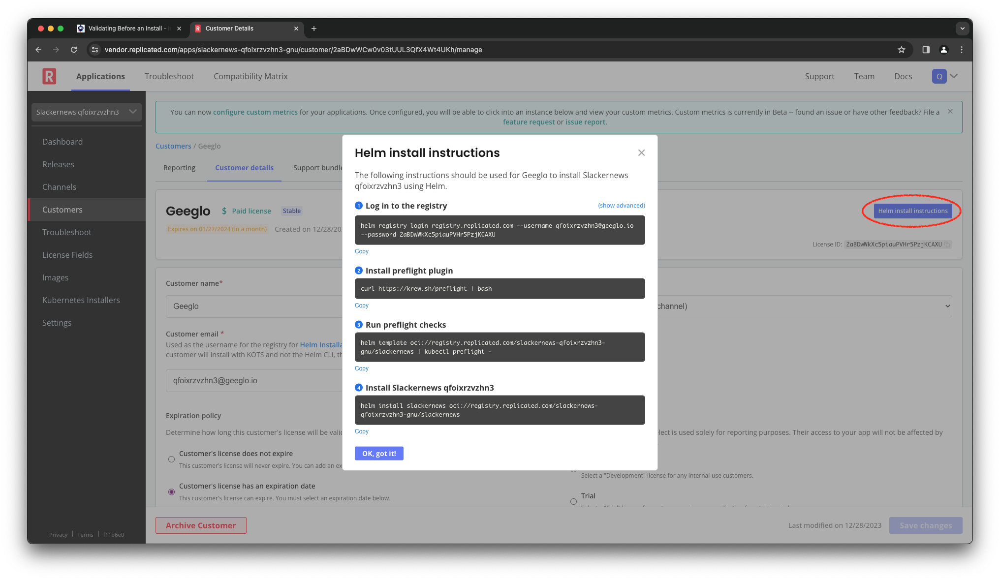

We're going to continue playing the role of the customer
who had a failing preflight check for the Harbor registry.
Let's also assume that the customer decided to increase
the capacity of the cluster and is ready to perform
the installation.

Validating the Added Capacity
=============================

The first step to resuming the installation process is
to make sure that the cluster has been upgraded with the
necessary resources. We can do that by re-running the
preflight checks against the now expanded cluster.

```
helm template oci://registry.replicated.com/[[ Instruqt-Var key="REPLICATED_APP" hostname="shell" ]]/harbor \
  | kubectl preflight -
```

In the background, the lab setup process added two
additional nodes to the cluster so that the memory
and CPU capacity has increased. The results of the
checks confirm this change.


Installing the Application
==========================

Now that the preflight checks have passed, it's safe to
install the application. You can find the installation
command for the customer "Geeglo" in the Replicated
vendor portal. Since we've already run the first two
steps of logging into the registry and running our
preflight checks, we have only the installation
with the Helm command to complete.

You can use the Vendor Portal tab to look up the
install instruction, just like you did in the
previous step before running the preflights.
Click "Customers" in the left navigation, then
click on "Geeglo". You access the instructions
using the "Helm Install Instructions" button on
the top right.



We need to tack some additional values that Harbor
needs to come up correctly. This helps us make sure
the installation will complete.

```
helm install harbor \
  oci://registry.replicated.com/[[ Instruqt-Var key="REPLICATED_APP" hostname="shell" ]]/harbor \
  --set service.type=NodePort --set service.nodePorts.https=30443 \
  --set externalURL=[[  Instruqt-Var key="EXTERNAL_URL" hostname="cluster" ]]
```

Note that the cluster we're using is fairly limited, so
we're using `NodePort` to simplify access.

Verifying the Installation
==========================

From the customer perspective, the installation is
complete when they can log into the application and
see that is was complete. Once your install is complete,
the tab "Harbor Registry" should show the login page
for Harbor.


You can even log in if you run the commands from the
output of the `helm install` command to get the username
and password.

```
echo Username: "admin"
echo Password: $(kubectl get secret --namespace default harbor-core-envvars -o jsonpath="{.data.HARBOR_ADMIN_PASSWORD}" | base64 -d)
```

🏁 Finish
=========

You've now successfully seen how you can provide preflight
checks to your customer to help them avoid potential pitfalls
installing your application. You've also seen how those
preflights can help your customer understand what they need
to do to prepare for an install, and how they can complete
a successful install once the preflight checks pass.

