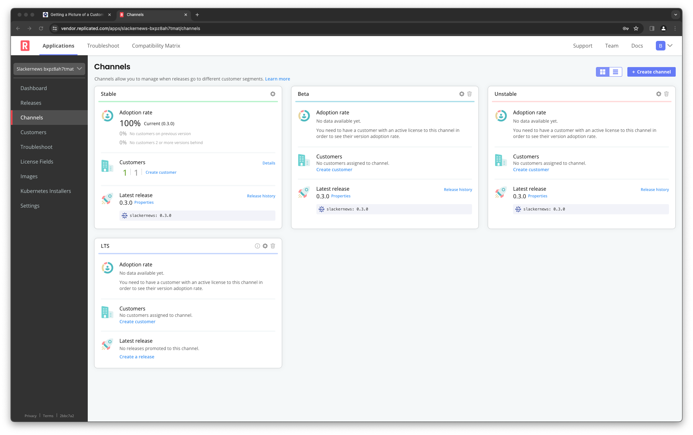
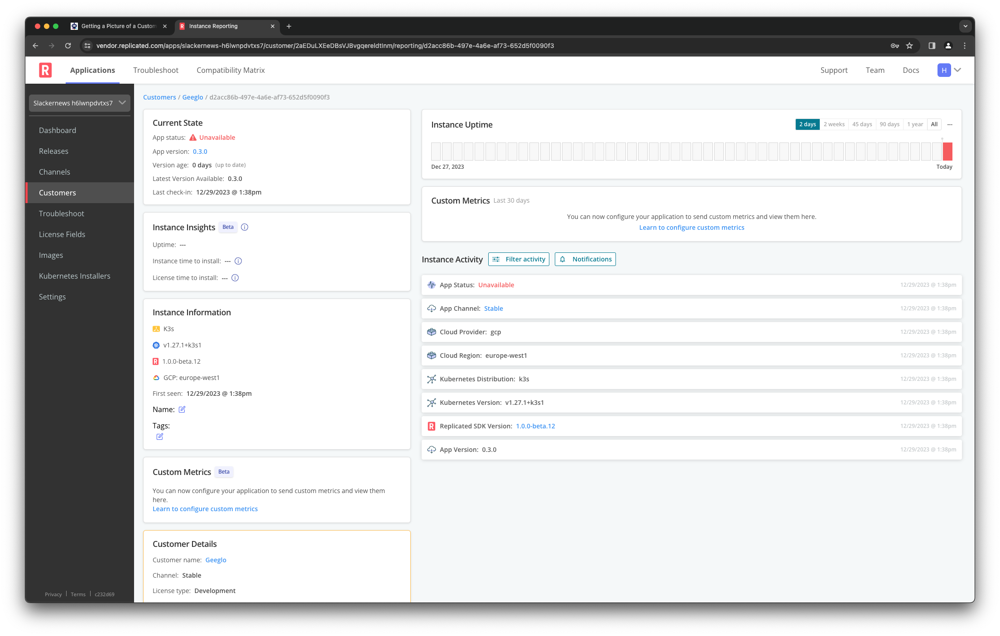
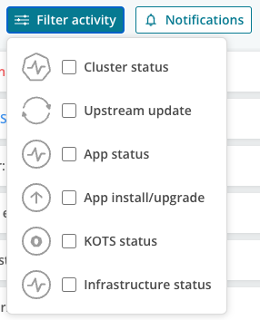

👋 Introduction
===============

When your software is running in a customer cluster, you no longer have direct
access to troubleshoot when things go wrong. You won't be able to see what's
running, read logs, or even confirm that the instance ever started up. Your
customer can do these things, but they may need your guidance to do them
correctly and coordinating that information sharing can be challenging.

In this lab, we're going to use the Harbor registry as a substitute for your
application and assume we have two customers "Omozan" and "Geeglo" that are
running the application. Geeglo has submitted a support ticket to your team and
you have been assigned to help them resolve it.

Observing a Customer Instance
===============================

The Replicated Platform provides a feature called Instance Insights that
collects and interprets telemetry information from your application. It's
enabled implicitly when you incorporate the Replicated SDK into your
application. The insights provided include the version of your application the
customer is running, details about the cluster, and current instance health.

The starting point for any support ticket should be to log into the
Replicated Vendor Portal to look at the details on the customer's instance.
Click on the Vendor Portal tab to open up a new browser window and access the
portal. The labs setup has configure credentials for you that you can use to
log in.

Username: `[[ Instruqt-Var key="USERNAME" hostname="shell" ]]` 
Password: `[[ Instruqt-Var key="PASSWORD" hostname="shell" ]]`

We're going to log into the portal and take a look at Geeglo's instance to get
some context on their instance. Once you log in, you'll land on a page showing
the release channels for your applications. Release channels connect each of
your customers to the appropriate stream of releases. You can learn more about
release channels in the [Distributing Your Application with
Replicated](https://play.instruqt.com/replicated/tracks/distributing-with-replicated)
lab.

Select the "Customers" link from the left navigation to go see a list of
customers. At the top of the page is the Adoption Graph for your application.
The graph has minimal data in the lab environment, since only one instance is
running and it was installed as part of setting up the lab.

You'll see that Geeglo, who submitted the support ticket, has one instance and
that it is currently unavailable. You can click on the identifier for that
instance to see more details about it.

Reviewing the Instance
======================

The instance details will give you a lot information to help you engage with
Geeglo on their support ticket:

* A general overview of how stable this instance has been in from the uptime
  graph. You can change the timeline of the graph to gain more insight.
* The current version of your application they are running, and how long that
  version has been installed. You can also at a glance if it's the current
  version or if they have fallen behind.
* What type of Kubernetes cluster they are running on, what version of
  Kubernetes it is, and details about the cloud environment it's running in.
* Details about their license and which release channel they are assigned to.

You also see a stream of events come from their cluster. The events can help
you reconstruct the history of their instance in terms of installation,
upgrades, availability, and some changes to the infrastructure (like changing
Kubernetes versions or distributions).

You can filter the list of events using the "Filter activity" button.

Instance Activity
=================

Different types of activity can help you understand the state of customer
instance in order to more quickly resolve their issues.

<table>
<thead>
<tr>
<th>Activity Type</th>
<th>Information Available<th>
</tr>
</thead>
<tbody>
<tr>
<td>Application Installation and Upgrade Events</td><td>These events tell you when the instances was installed or upgraded. They include information about the status of the application, the channel the release came from, and the version of the release. Possible statuses are _Ready_, _Updating_, _Degraded_, _Unavailable_, or _Missing_. Status is based on the ready state of various application resources.</td>
</tr>
<tr>
<td>App status</td><td>Show changes to the application status outside of installation and upgrades. These events will show the same statuses as the install and upgrade events.</td>
</tr>
<tr>
<td>Cluster status</td><td>Provide details on the cluster running the application. You'll see events relating to the Kubernetes distribution and it's version. If the cluster is a Replicated embedded Kubernetes cluster that you provided with your application ther will be additional information about the number of nodes, their status, and the specification the cluster was built from. Currently the Kubernetes distribution is identified is it is EKS, GKE, K3s, or RKE.</td>
</tr>
<tr>
<td>Infrastructure status</td><td>Share details about the underlying cloud infrastructure where the cluster is running. Currently limited to showing information about AWS, GCP, and Digital Ocean. These events show the cloud provider and the region.</td>
</tr>
<tr>
<td>Replicated status</td><td>These events let you know the version of the Replicated SDK or Replicated KOTS that the instance is running. For this lab, the application is using the Replicated SDK.</td>
</tr>
<tr>
<td>Upstream update</td><td>Let you know when you released new updates on the release channel the instance is assigned to. Shows events when a new version is released including the version label and the number of version behind that the instance is running. The number of versions behind may be zero, if the instance is up-to-date.</td>
</tr>
<tr>
</tbody>
</table>

This information helps you form a more thorough picture of Geeglo's instance and
narrow down the questions you need to ask to help troubleshoot. They can also
help you find solutions more quickly as search through your support knowledge
base.
