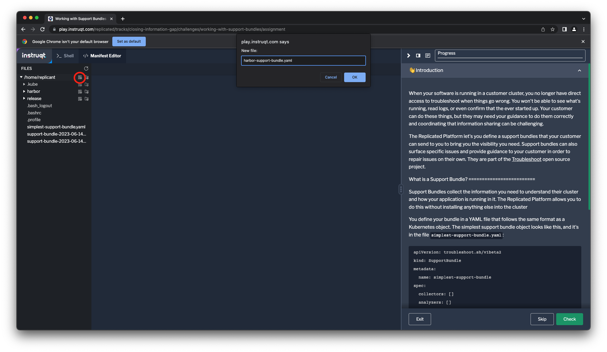
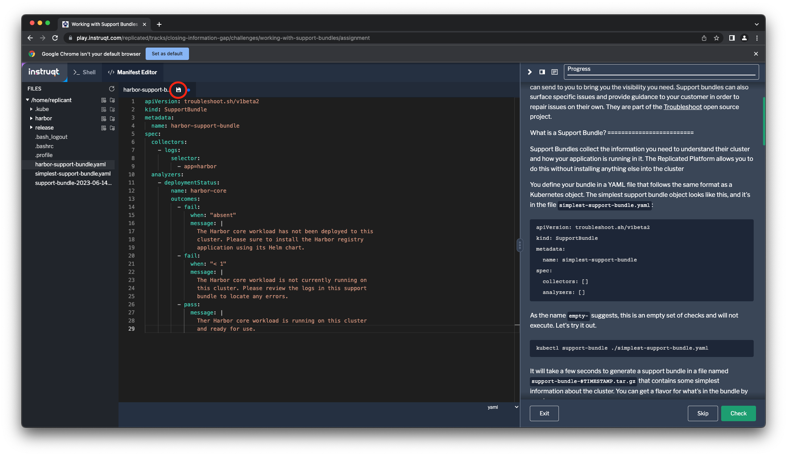
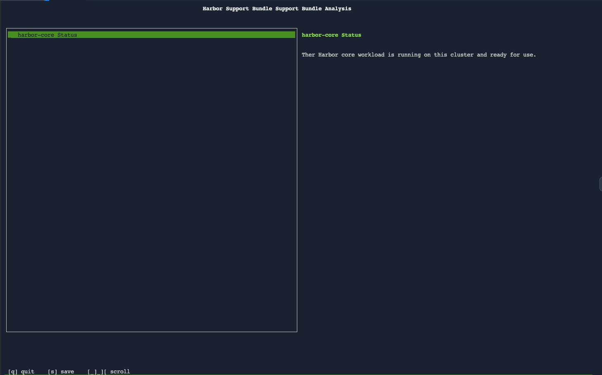

Instance Insights is a powerful tool to help you understand information you
need to know to assist a customer. It's the first tool you should pick up to
get context for the issue and can lead you toward the right troubleshooting
path. It was built to provide a set of insights for any application distributed
with the Replicated Platform. This limits it to information that's common
across applications.

Support bundles are another critical tool for troubleshooting customer issues.
The Replicated Platform allows you to define a bundle that your customer can
send to give you even more visibility into their environment. Since you define
the support bundle, it can collect details that are specific to troubleshooting
your application. Support bundles can also surface specific issues and provide
guidance to your customer in order to resolve issues on their own. They are part
of the [Troubleshoot](https://troubleshoot.sh) open source project.

What is a Support Bundle?
=========================

Support Bundles collect the information you need to understand your customer's
cluster and how your application is running in it. The Replicated Platform
allows you to do this without installing anything else into the cluster.

You define your bundle in a YAML file that follows the same format as a
Kubernetes object. The simplest support bundle object looks like this, and it's
in the file `simplest-support-bundle.yaml`:

```
apiVersion: troubleshoot.sh/v1beta2
kind: SupportBundle
metadata:
  name: simplest-support-bundle
spec:
  collectors: []
  analyzers: []
```

You can view the file in the Manifest Editor tab or from the command line.
Let's try collecting a support bunglde with it.

```
kubectl support-bundle ./simplest-support-bundle.yaml
```

It will take a few seconds to generate a support bundle in a file named
`support-bundle-$TIMESTAMP.tar.gz` that contains some simple information
about the cluster. You can get a flavor for what's in the bundle by running

```
tar -tzf support-bundle-*.tar.gz | less
```

You'll see the files that were collected cataloging all of the resources in the
cluster and some information about the cluster itself. If you completed the
[Avoiding Installation
Pitfalls](https://play.instruqt.com/embed/replicated/tracks/avoiding-installation-pitfalls?token=em_gJjtIzzTTtdd5RFG)
lab you might be surprised this doesn't return an error since the comparable
preflight check failed. This is because the bundle is valid if it only collects
information, while a preflight check is not. By default both preflight checks
and support bundles will collect a minimum set of information.

Analyzers and Collectors
========================

Your support bundle both collects information about the cluster and analyzes it
to provide more insight into its state. If you have completed the [Avoiding
Installation
Pitfalls](https://play.instruqt.com/replicated/tracks/avoiding-installation-pitfalls)
lab these concepts will be familiar to you as the two types of objects that
make up preflight checks. Support bundles are also made up of _collectors_ that
collect data and _analyzers_ that analyze it.

There two default collectors included in every support bundle. The
`clusterInfo` collector collects information about the running cluster, and the
`clusterResources` collector collects information about many of the resources
running in the cluster. These give you some baseline support information, but
you will generally want to add more collectors to gather logs and other details
about your application state.

Log collection is the first thing most teams add to their support bundle. Let's
add some logging collectors so that our support bundle will collect logs
from the Harbor application.

```
- logs:
    selector:
      - app=harbor
```

This definition specifies that the logs from any workload where the label `app`
has the value `harbor`. The Harbor Helm chart we're using for this lab applies
that label to all of the resources it creates for the application.

The first analyzers teams add are generally those that identify if different
workloads are running (i.e. in a `Ready` state). Harbor has many services,
let's just take one for this first step.

```
- deploymentStatus:
    name: harbor-core
    outcomes:
      - fail:
          when: "absent"
          message: |
            The Harbor core component has not been deployed to this cluster. Please be sure to install the Harbor registry
            application using its Helm chart.
      - fail:
          when: "< 1"
          message: |
            The Harbor core component is not currently running on this cluster. Please review the logs in this support
            bundle to locate any errors.
      - pass:
          message: |
            Ther Harbor core component is running on this cluster and ready for use.
```

Taken together, your support bundle definition will look like this:

```
apiVersion: troubleshoot.sh/v1beta2
kind: SupportBundle
metadata:
  name: harbor-support-bundle
spec:
  collectors:
    - logs:
        name: /app/harbor/logs
        selector:
          - app.kubernetes.io/name=harbor
        selector:
          - app=harbor
  analyzers:
    - deploymentStatus:
        name: harbor-core
        namespace: default
        outcomes:
          - fail:
              when: "absent"
              message: |
                The Harbor core component has not been deployed to this cluster. Please sure to install the Harbor registry application using its Helm chart.
          - fail:
              when: "< 1"
              message: |
                The Harbor core component is not currently running on this cluster. Please review the logs in this support bundle to locate any errors.
          - pass:
              message: |
                Ther Harbor core component is running on this cluster and ready for use.
```

Getting Started
===============

Let's create a support bundle using this definition. Click on the "Manifest
Editor" tab and create a new file named `harbor-support-bundle.yaml` in the
`/home/replicant` directory.



Paste the YAML above into the new file and save it.



Now collect a support bundle using this definition.

```
kubectl support-bundle ./harbor-support-bundle.yaml
```

You'll see that that your bundle has been collected and get a screen showing
the result for the analyzer you added.


