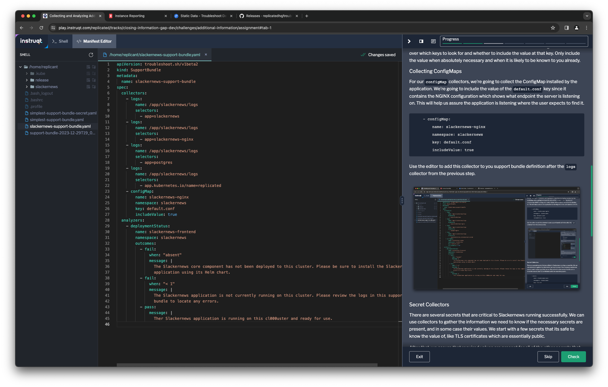
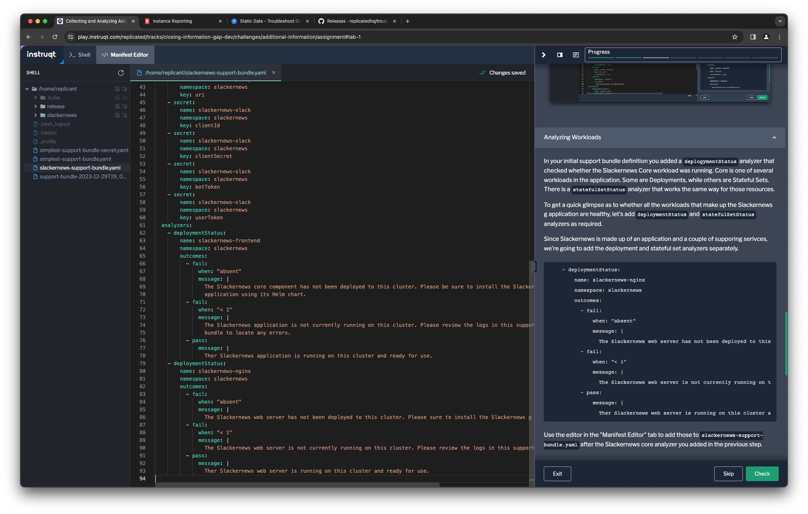

You have a pretty useful support bundle right now. You can collect all the logs
from the Harbor registry and you're able to verify if its core service is
running. This can be very useful information to help your team resolve support
cases more quickly with minimal back-and-forth with your customer.

Let's expand the support bundle to collect more information and provide
additional insight into the running application.

Collecting Application Configuration
====================================

The default support bundle collectors give you some useful details about the
Kubernetes cluster and many common resource types. Two types it does not
automatically collect are Secrets and ConfigMaps. These may contain valuable
troubleshooting clues, so you can specify collectors to include them.

You don't want to collect too much information when adding Secrets and
ConfigMaps to your support bundle. The support bundle collection process
redacts many sensitive values, but application configurations are likely to
contain more sensitive details than logs or other data you might collect. This
is especially true of values stored in secrets.

We're going to define collectors for some ConfigMaps and Secrets that are
critical to operating the Harbor registry. ConfigMaps are collected with the
`configMap` collector and Secrets with the `secret` collector. Both of these
give you different ways to control what to look for and what's collected. You
can choose to collect only specific resources or to collect them based on a
selector. You also have fine-grained control over which keys to look for and
whether to include the value at that key. Only include the value when
absolutely necessary and when it is likely to be known to you already.

## Collecting ConfigMaps

For our `configMap` collectors, we're going to collect all of the ConfigMaps
installed by the application without their values. We'll also collect the value
of the endpoint that is configured for Harbor to confirm it is set to where the
customer is trying to access it.

```
    - configMap:
        namespace: default
        selector:
        - app.kubernetes.io/name=harbor
    - configMap:
        name: harbor-core
        namespace: default
        key: EXT_ENDPOINT
        includeValue: true
```

Use the editor at the "Manifest Editor" tab to add these collectors to you
support bundle definition after the `logs` collector from the previous step.



## Secret Collectors

There are several secrets that are critical to Harbor running successfully. We
can use collectors to gather the information we need to know if the necessary secrets
are present, and in some case their values. We start with a few secrets that
its safe to know the value of, like TLS certificates which are essentially
public.

```
    - secret:
        name: harbor-core
        namespace: default
        key: tls.crt
        includeValue: true
    - secret:
        name: harbor-ingress
        key: ca.crt
        includeVale: true
    - secret:
        name: harbor-ingress
        key: tls.crt
        includeVale: true
    - secret:
        namespace: default
        selector:
        - app.kubernetes.io/name=harbor
```

Use the editor to add these after the `configMap` collectors in your support
bundle specification file.


Analyzing Workloads
===================

In your initial support bundle definition you added a `deplogymentStatus`
analyzer that checked whether the Harbor Core workload was running. Core is one
of several workloads in the application. Some are Deployments, while others are
Stateful Sets. There is a `statefulSetStatus` analyzer that works the same way
for those resources.

To get a quick glimpse as to whether all the workloads that make up the Harbor
registry application are healthy, let's add `deploymentStatus` and
`statefulSetStatus` analyzers as required.

Since Harbor is made up of a lot of services, we're going to add the deployment
and stateful set analyzers separately.

```
    - deploymentStatus:
        name: harbor-jobservice
        namespace: default
        outcomes:
          - fail:
              when: "absent"
              message: |
                The Harbor job service has not been deployed to this cluster. Please sure to install the Harbor registry application using its Helm chart.
          - fail:
              when: "< 1"
              message: |
                The Harbor job service is not currently running on this cluster. Please review the logs in this support bundle to locate any errors.
          - pass:
              message: |
                Ther Harbor job service is running on this cluster and ready for use.
    - deploymentStatus:
        name: harbor-portal
        namespace: default
        outcomes:
          - fail:
              when: "absent"
              message: |
                The Harbor portal workload has not been deployed to this cluster. Please sure to install the Harbor registry application using its Helm chart.
          - fail:
              when: "< 1"
              message: |
                The Harbor portal workload is not currently running on this cluster. Please review the logs in this support bundle to locate any errors.
          - pass:
              message: |
                Ther Harbor portal workload is running on this cluster and ready for use.
    - deploymentStatus:
        name: harbor-registry
        namespace: default
        outcomes:
          - fail:
              when: "absent"
              message: |
                The Harbor registry workload has not been deployed to this cluster. Please sure to install the Harbor registry application using its Helm chart.
          - fail:
              when: "< 1"
              message: |
                The Harbor registry workload is not currently running on this cluster. Please review the logs in this support bundle to locate any errors.
          - pass:
              message: |
                Ther Harbor registry workload is running on this cluster and ready for use.
```

Use the editor in the "Manifest Editor" tab to add those to
`harbor-support-bundle.yaml` after the Harbor core analyzer you added in the
previous step.



We'll do the same for the various stateful sets that are part of the
application. Add these after the deployments.

```
    - statefulsetStatus:
        name: harbor-postgresql
        namespace: default
        outcomes:
          - fail:
              when: "absent"
              message: |
                The Harbor database has not been deployed to this cluster. Please sure to install the Harbor registry application using its Helm chart.
          - fail:
              when: "< 1"
              message: |
                The Harbor database is not currently running on this cluster. Please review the logs in this support bundle to locate any errors.
          - pass:
              message: |
                Ther Harbor database is running on this cluster and ready for use.
    - statefulsetStatus:
        name: harbor-redis-master
        namespace: default
        outcomes:
          - fail:
              when: "absent"
              message: |
                The Harbor cache has not been deployed to this cluster. Please sure to install the Harbor registry application using its Helm chart.
          - fail:
              when: "< 1"
              message: |
                The Harbor cache is not currently running on this cluster. Please review the logs in this support bundle to locate any errors.
          - pass:
              message: |
                Ther Harbor cache is running on this cluster and ready for use.
    - statefulsetStatus:
        name: harbor-trivy
        namespace: default
        outcomes:
          - fail:
              when: "absent"
              message: |
                The Trivy iamge scanner has not been deployed to this cluster. Please sure to install the Harbor registry application using its Helm chart.
          - fail:
              when: "< 1"
              message: |
                The Trivy image scanner is not currently running on this cluster. Please review the logs in this support bundle to locate any errors.
          - pass:
              message: |
                The Trivy image scanner is running on this cluster and ready for use.
```


One Last Step
=============

Let's add the analyzers that are part of the Harbor preflight checks to the
support bundle, just to make sure nothing troublesome has changed about the
cluster that could cause trouble for the instance. If you didn't complete the
[Avoiding Installation
Pitfalls](https://play.instruqt.com/replicated/tracks/avoiding-installation-pitfalls)
lab you may not have seen these before. They test to make sure the Kubernetes
version, CPU, and memory of the cluster will support running the Harbor
registry.

```
    - clusterVersion:
        outcomes:
          - fail:
              when: "< 1.19.x"
              message: |-
                Your Kubernets cluster is running a version of Kubernetes that is not supported by the Harbor container
                registry and your installation will not succeed. Please upgrade your cluster or install to a different
                cluster running at least Kubernetes 1.19, ideally version 1.24.0 or later.
              uri: https://github.com/bitnami/charts/blob/main/bitnami/harbor/README.md
          - warn:
              when: "< 1.24.0"
              message: |-
                Your Kubernetes cluster is running a version of Kubernetes that is not longer supported by the Kubernetes
                community. If you are receiving extended support from your Kubernetes provider you may be able to ignore
                this warning. If not, we recomend that you upgrade your cluster to at least version 1.24.0.
              uri: https://kubernetes.io
          - pass:
              message: Your cluster is running a version of Kubernetes that is supported by the Harbor container registry.
    - nodeResources:
        checkName: Cluster CPU resources are sufficient to install and run Harbor
        outcomes:
          - fail:
              when: "sum(cpuAllocatable) < 2"
              message: |-
                Harbor requires a minimum of 2 CPU cores in order to run, and runs best with
                at least 4 cores. Your current cluster has less than 2 CPU cores available to Kubernetes
                workloads. Please increase cluster capacity or install into a different cluster.
              uri: https://goharbor.io/docs/2.8.0/install-config/installation-prereqs/
          - warn:
              when: "sum(cpuAllocatable) < 4"
              message: |-
                Harbor runs best with a minimum of 4 CPU cores. Your current cluster has less
                than 4 CPU cores available to run workloads. For the best experience, consider
                increasing cluster capacity or installing into a different cluster.
              uri: https://goharbor.io/docs/2.8.0/install-config/installation-prereqs/
          - pass:
              message: Your cluster has sufficient CPU resources available to run Harbor
    - nodeResources:
        checkName: Cluster memory is sufficient to install and run Harbor
        outcomes:
          - fail:
              when: "sum(memoryAllocatable) < 4G"
              message: |-
                Harbor requires a minimum of 4 GB of memory in order to run, and runs best with
                at least 8 GB. Your current cluster has less than 4 GB available to Kubernetes
                workloads. Please increase cluster capacity or install into a different cluster.
              uri: https://goharbor.io/docs/2.8.0/install-config/installation-prereqs/
          - warn:
              when: "sum(memoryAllocatable) < 8Gi"
              message: |-
                Harbor runs best with a minimum of 8 GB of memory. Your current cluster has less
                than 8 GB of memory available to run workloads. For the best experience, consider
                increasing cluster capacity or installing into a different cluster.
              uri: https://goharbor.io/docs/2.8.0/install-config/installation-prereqs/
          - pass:
              message: Your cluster has sufficient memory available to run Harbor
```

You may want to add these as your first analyzers, since they call attention
to items that might prevent workloads from running and might explain other
failed analyzers.


Generate the More Complete Support Bundle
==========================================

Now that you've enhanced your support bundle with more information about the
running application, let's generate another bundle and take a look at the
analyzers.

```
kubectl support-bundle ./harbor-support-bundle.yaml
```

You'll see that that your bundle has been collected and get a
text interface showing the results of the analyzers you added.


Press `q` to leave the support bundle analyzers interface.
