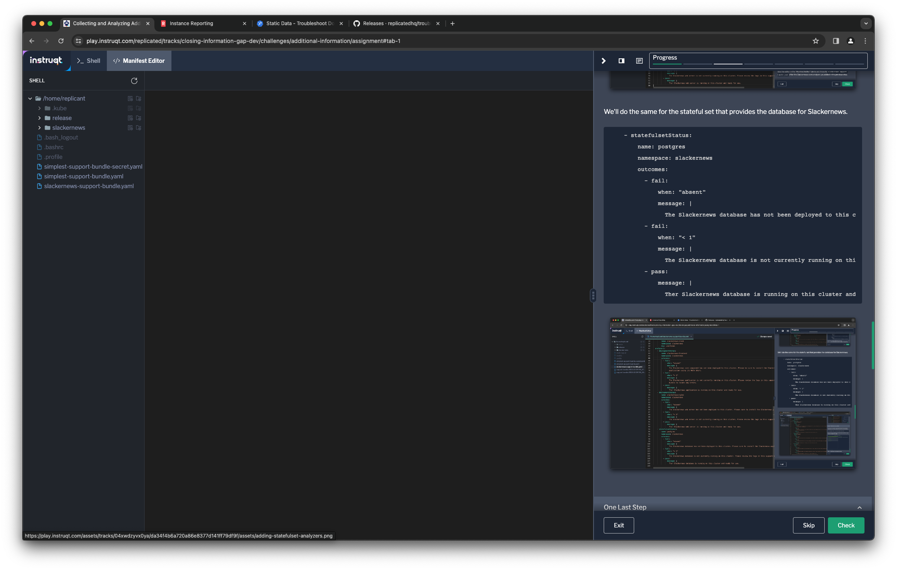
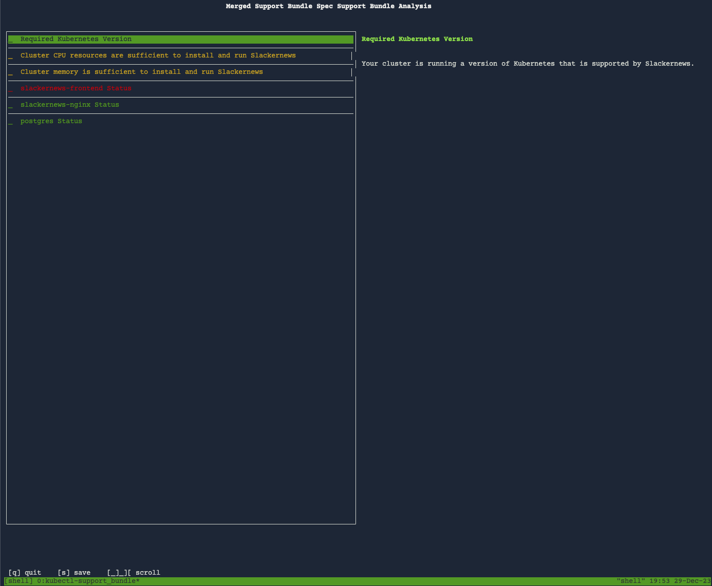

You have a useful support bundle right now. You can collect the logs
from the Slackernews app and you're able to verify if its core service is
running. This can be very useful information to help your team resolve support
cases more quickly with minimal back-and-forth with your customer.

Let's expand the support bundle to collect more information and provide
additional insight into the running application.

Expanding Log Collection
========================


The Slackernews application uses different labels to identify different
components that it installs. We want to make sure we get the logs from all the
components, including the Replicated SDK. To do this, we need to add additional
log collectors.

```
    - logs:
        name: /app/slackernews/logs
        selectors:
          - app=slackernews-nginx
    - logs:
        name: /app/slackernews/logs
        selectors:
          - app=postgres
    - logs:
        name: /app/slackernews/logs
        selectors:
          - app.kubernetes.io/name=replicated
```

Use the editor at the "Manifest Editor" tab to add these collectors to you
support bundle definition after the `logs` collector from the previous step.


Collecting Application Configuration
====================================

The default support bundle collectors give you some useful details about the
Kubernetes cluster and many common resource types. Two types it does not
automatically collect are Secrets and ConfigMaps. These may contain valuable
troubleshooting clues, so you can specify collectors to include them.

You don't want to collect too much information when adding Secrets and
ConfigMaps to your support bundle. The support bundle collection process
redacts many sensitive values, but application configurations are likely to
contain more sensitive details than logs or other data you might collect. This
is especially true of values stored in secrets.

We're going to define collectors for some ConfigMaps and Secrets that are
critical to operating the Slackernews g. ConfigMaps are collected with the
`configMap` collector and Secrets with the `secret` collector. Both of these
give you different ways to control what to look for and what's collected. You
can choose to collect only specific resources or to collect them based on a
selector. You also have fine-grained control over which keys to look for and
whether to include the value at that key. Only include the value when
absolutely necessary and when it is likely to be known to you already.
## Collecting ConfigMaps

For our `configMap` collectors, we're going to collect the ConfigMap installed
by the application. We're going to include the value of the `default.conf` key
since it contains the NGINX configuration which shows what endpoint the server
is listening on. This will help us assure the application is listening where
the user expects to find it.

```
    - configMap:
        name: slackernews-nginx
        namespace: slackernews
        key: default.conf
        includeValue: true
```

Use the editor to add this collector to you support bundle definition after the
`logs` collector from the previous step.


## Secret Collectors

There are several secrets that are critical to Slackernews running successfully. We
can use collectors to gather the information we need to know if the necessary secrets
are present, and in some case their values. We start with a few secrets that
its safe to know the value of, like TLS certificates which are essentially
public.

After that, we assure that required values are present for all of the other
secrets that are needed to run the application.

```
    - secret:
        name: slackernews-nginx
        namespace: slackernews
        key: tls.crt
        includeValue: true
    - secret:
        name: slackernews-nginx
        key: tls.key
        includeVale: true
    - secret:
        name: slackernews-postgres
        namespace: slackernews
        key: password
    - secret:
        name: slackernews-postgres
        namespace: slackernews
        key: uri
    - secret:
        name: slackernews-slack
        namespace: slackernews
        key: clientId
    - secret:
        name: slackernews-slack
        namespace: slackernews
        key: clientSecret
    - secret:
        name: slackernews-slack
        namespace: slackernews
        key: botToken
    - secret:
        name: slackernews-slack
        namespace: slackernews
        key: userToken
```

Use the editor to add these after the `configMap` collectors in your support
bundle specification file.


Analyzing Workloads
===================

In your initial support bundle definition you added a `deploymentStatus`
analyzer that checked whether the Slackernews Core workload was running. Core is one
of several workloads in the application. Some are Deployments, while others are
Stateful Sets. There is a `statefulSetStatus` analyzer that works the same way
for those resources.

To get a quick glimpse as to whether all the workloads that make up the Slackernews
g application are healthy, let's add `deploymentStatus` and
`statefulSetStatus` analyzers as required.

Since Slackernews is made up of an application and a couple of supporing
services, we're going to add the deployment and stateful set analyzers
separately.

```
    - deploymentStatus:
        name: slackernews-nginx
        namespace: slackernews
        outcomes:
          - fail:
              when: "absent"
              message: |
                The Slackernews web server has not been deployed to this cluster. Please sure to install the Slackernews g application using its Helm chart.
          - fail:
              when: "< 1"
              message: |
                The Slackernews web server is not currently running on this cluster. Please review the logs in this support bundle to locate any errors.
          - pass:
              message: |
                Ther Slackernews web server is running on this cluster and ready for use.
```

Use the editor in the "Manifest Editor" tab to add those to
`slackernews-support-bundle.yaml` after the Slackernews core analyzer you added in the
previous step.


We'll do the same for the stateful set that provides the database for Slackernews.

```
    - statefulsetStatus:
        name: postgres
        namespace: slackernews
        outcomes:
          - fail:
              when: "absent"
              message: |
                The Slackernews database has not been deployed to this cluster. Please sure to install the Slackernews application using its Helm chart.
          - fail:
              when: "< 1"
              message: |
                The Slackernews database is not currently running on this cluster. Please review the logs in this support bundle to locate any errors.
          - pass:
              message: |
                Ther Slackernews database is running on this cluster and ready for use.
```



One Last Step
=============

Let's add the analyzers that are part of the Slackernews preflight checks to the
support bundle, just to make sure nothing troublesome has changed about the
cluster that could cause trouble for the instance. If you didn't complete the
[Avoiding Installation
Pitfalls](https://play.instruqt.com/replicated/tracks/avoiding-installation-pitfalls)
lab you may not have seen these before. They test to make sure the Kubernetes
version, CPU, and memory of the cluster will support running the Slackernews
g.

```
    - clusterVersion:
        outcomes:
          - fail:
              when: "<= 1.26.x"
              message: |-
                Your Kubernets cluster is running a version of Kubernetes that is no longer supported by the Kubernetes
                community and unable to be supported by Slackernews. Changes in Kubernetse since your current version mean
                that you installation will likely not succeed. Please upgrade your cluster or install to a different
                cluster running at least Kubernetes 1.26, ideally version 1.28.0 or later.

                If you are receiving extended support from your Kubernetes provider you may be able to ignore
                this warning. If not, we recomend that you upgrade your cluster to at least version 1.28.0.

              uri: https://kubernetes.io
          - warn:
              when: "< 1.27.0"
              message: |-
                Your Kubernetes cluster is running a version of Kubernetes that will go out of support active support in
                less than six months. We recommend that you upgrade your Kubernetes cluster to assure continued success with
                your Slackernews implementation.
              uri: https://kubernetes.io
          - pass:
              message: Your cluster is running a version of Kubernetes that is supported by Slackernews.
    - nodeResources:
        checkName: Cluster CPU resources are sufficient to install and run Slackernews
        outcomes:
          - fail:
              when: "sum(cpuAllocatable) < 2"
              message: |-
                Slackernews requires a minimum of 2 CPU cores in order to run, and runs best with
                at least 4 cores. Your current cluster has less than 2 CPU cores available to Kubernetes
                workloads. Please increase cluster capacity or install into a different cluster.
          - warn:
              when: "sum(cpuAllocatable) < 4"
              message: |-
                Slackernews runs best with a minimum of 4 CPU cores. Your current cluster has less
                than 4 CPU cores available to run workloads. For the best experience, consider
                increasing cluster capacity or installing into a different cluster.
          - pass:
              message: Your cluster has sufficient CPU resources available to run Slackernews
    - nodeResources:
        checkName: Cluster memory is sufficient to install and run Slackernews
        outcomes:
          - fail:
              when: "sum(memoryAllocatable) < 4G"
              message: |-
                Slackernews requires a minimum of 4 GB of memory in order to run, and runs best with
                at least 8 GB. Your current cluster has less than 4 GB available to Kubernetes
                workloads. Please increase cluster capacity or install into a different cluster.
          - warn:
              when: "sum(memoryAllocatable) < 8Gi"
              message: |-
                Slackernews runs best with a minimum of 8 GB of memory. Your current cluster has less
                than 8 GB of memory available to run workloads. For the best experience, consider
                increasing cluster capacity or installing into a different cluster.
          - pass:
              message: Your cluster has sufficient memory available to run Slackernews
```

You may want to add these as your first analyzers, since they call attention
to items that might prevent workloads from running and might explain other
failed analyzers.


Generate the More Complete Support Bundle
==========================================

Now that you've enhanced your support bundle with more information about the
running application, let's generate another bundle and take a look at the
analyzers.

```
kubectl support-bundle ./slackernews-support-bundle.yaml
```

You'll see that that your bundle has been collected and get a
text interface showing the results of the analyzers you added.



Press `q` to leave the support bundle analyzers interface.
