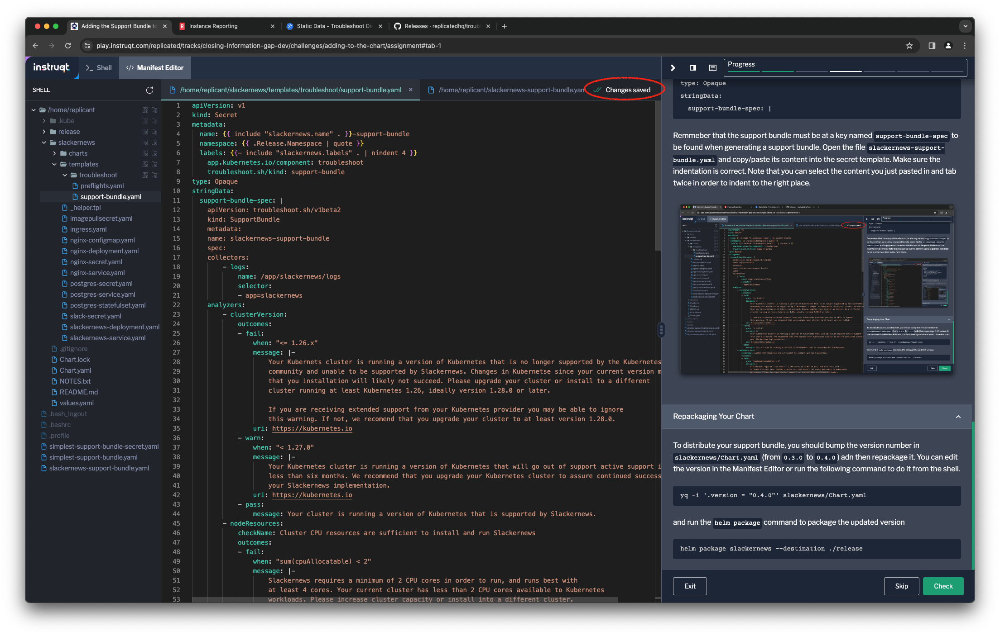

You've put together a pretty robust support bundle definition for the Slackernews
registry. Now it's time to distribute that definition to your customers so that
they can collect a support bundle when you need it.

Making the Support Bundle Available
===================================

The Support Bundle specification looks a lot like a Kubernetes custom resource,
but strictly speaking it isn't. Instead it runs outside of the cluster and is
interpreted by the `support-bundle` plugin to the `kubectl` command.

Even if it isn't a Kubernetes resource, we still want to distribute the support
bundle specification as part of the application Helm chart. This saves you from
having to find a different distribution mechanism. It also makes it easier for
your customer to gather a support bundle for you.

To include the support bundle definition with your application, you're going to
store it in a Kubernetes secret. There are a couple of constraints on this
secret:

1. It has to have a label `troubleshoot.sh/kind: support-bundle`
2. You need to use the key `support-bundle-spec` for your support bundle
   specification.

If we consider the baseline support bundle from the first step in the lab, it
becomes a secret that looks like this


```
apiVersion: v1
kind: Secret
type: Opaque
metadata:
  name: simplest-support-bundle
  labels:
    troubleshoot.sh/kind: support-bundle
stringData:
  support-bundle-spec: |-
    apiVersion: troubleshoot.sh/v1beta2
    kind: SupportBundle
    metadata:
      name: simplest-support-bundle
    spec:
      collectors: []
      analyzers: []
```

Let's add this secret to our cluster and execute it.

```
kubectl create -f simplest-support-bundle-secret.yaml
kubectl support-bundle --load-cluster-specs
```

_Note: The support bundle definition can also be stored as a `ConfigMap` with
the same annotation._


Adding Your Definition to the Slackernews Helm Chart
===============================================

Knowing that you should create a secret for your support bundle sets you up to
include it into the Slackernews Helm chart. There's some boilerplate required to
define that secret consistently with the naming, annotation, and labeling
conventions used in the chart. Bitnami, who provided the chart we're working
with, has a set of these. Your team likely has some as well.

Open the manifest editor and create a new file named `support-bundle.yaml` in
the directory `slackernews/templates/troubleshoot`. This will be the template that creates the
support bundle specification secret when the Helm chart is installed.


After creating the file, you may have to click on the filename to make sure it
is opened. Add the following to the file. This handles the metadata conventions
mentioned above and also add the label that specifies this is a support bundle
definition.

```
apiVersion: v1
kind: Secret
metadata:
  name: {{ include "slackernews.name" . }}-support-bundle
  namespace: {{ .Release.Namespace | quote }}
  labels: {{- include "slackernews.labels" . | nindent 4 }}
    app.kubernetes.io/component: troubleshoot
    troubleshoot.sh/kind: support-bundle
type: Opaque
stringData:
  support-bundle-spec: |
```

Remember that the support bundle must be at a key named `support-bundle-spec`
to be found when generating a support bundle. Open the file
`slackernews-support-bundle.yaml` and copy/paste its content into the secret
template. Make sure the indentation is correct. Note that you can select the
content you just pasted in and tab twice in order to indent to the right place.



Repackaging Your Chart
======================

To distribute your support bundle, you should bump the version number in
`slackernews/Chart.yaml` (from `0.3.0` to `0.4.0`) adn then repackage it. You can edit
the version in the Manifest Editor or run the following command to do it from
the shell.

```
yq -i '.version = "0.4.0"' slackernews/Chart.yaml
```

and run the `helm package` command to package the updated version

```
helm package slackernews --destination ./release
```

