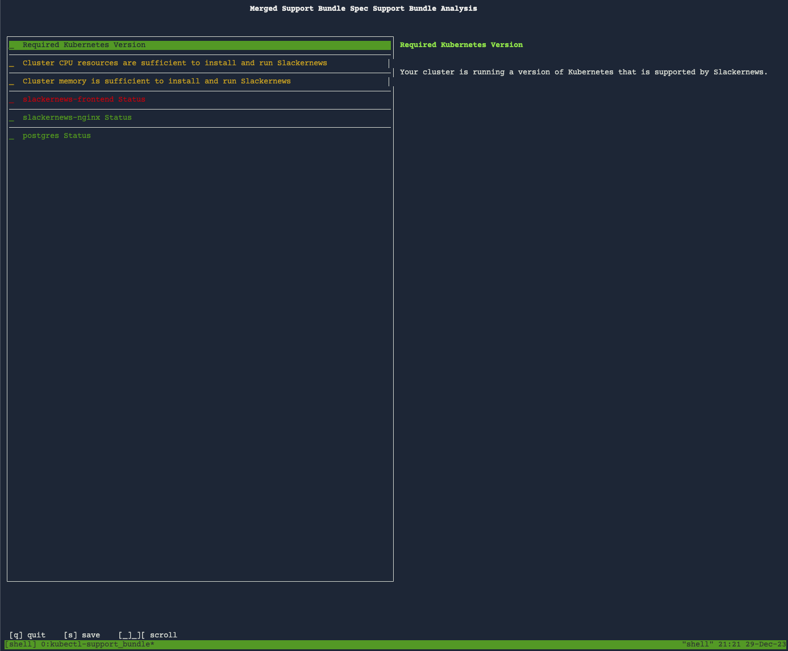
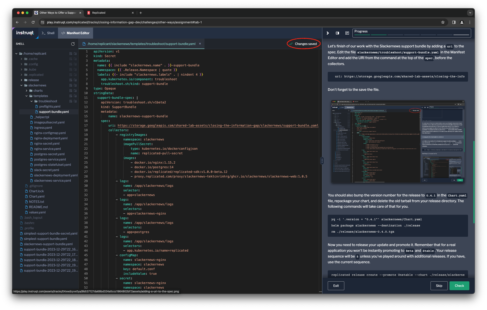

Now that your application contains a support bundle definition, your support
team can request a support bundle from your customer to help troubleshoot their
issue. Since we've just released the verison containing the support bundle,
your customer will need to upgrade their instance first. Note that we're going
to go back and forth between the customer perspective and your perspective
during this step.

Upgrading the Instance
======================

We're going to start the lab from the perspective of our customer Geeglo. In
order to upgrade the application they need to log into the Replicated registry.
They will already have their credentials since this is not the first install.
If you need to provide them to them again, you can get them from the Replicated
Vendor portal.

```
helm registry login registry.replicated.com \
  --username [[ Instruqt-Var key="CUSTOMER_EMAIL" hostname="shell" ]] \
  --password [[ Instruqt-Var key="REGISTRY_PASSWORD" hostname="shell" ]]
```

Once they've logged in, they can run the `helm upgrade` command to upgrade
their instance.

```
helm upgrade harbor \
  oci://registry.replicated.com/[[ Instruqt-Var key="REPLICATED_APP" hostname="shell" ]]/harbor \
```

Check to see if the support bundle secret has been created.

```
kubectl get secret
```

You should see the secret `harbor-support-bundle` in the list of secrets. This
mean the support bundle is now available in the cluster.

```
NAME                           TYPE                 DATA   AGE
harbor-postgresql              Opaque               1      18m
replicated                     Opaque               12     18m
harbor-core-envvars            Opaque               7      18m
harbor-core                    Opaque               4      18m
harbor-jobservice-config       Opaque               1      18m
harbor-jobservice-envvars      Opaque               1      18m
harbor-jobservice              Opaque               1      18m
harbor-nginx                   Opaque               3      18m
harbor-notary-server-envvars   Opaque               2      18m
harbor-notary-server           Opaque               5      18m
harbor-registry                Opaque               3      18m
harbor-support-bundle          Opaque               1      45s
harbor-trivy-envvars           Opaque               4      18m
harbor-preflight               Opaque               1      45s
sh.helm.release.v1.harbor.v1   helm.sh/release.v1   1      18m
sh.helm.release.v1.harbor.v2   helm.sh/release.v1   1      46s
```

Collecting a Support Bundle Using an In-Cluster Spec
====================================================

Let's continue on as Geeglo and collect a support bundle using the in-cluster
specification you've provided to them. For this lab, we're going to assume they
already have the support bundle plugin installed. Instead of specifying a
support bundle file, they use the flag `load-cluster-specs` to load the support
bundle from the secret your chart created. We'll also specify the filename for
the bundle. You may want to ask your customers to specify a filename including
their company name to make it easier to keep track of the bundles you are
working with.

```
kubectl support-bundle --load-cluster-specs --output geeglo-support-bundle.tar.gz
```

This will show the analyzer results screen you saw when running the support bundle in your environment.



You'll notice there's one different from when you tested the support bundle.
One of the analyzers is showing a failure, since the job service component is
not running in the customer cluster. This may be enough for the Geegle team to
start troubleshooting on their own and resolve the issue, or it may require
them to send the support bundle along to your support team for additional
diagnosis.

Troubleshooting with the Support Bundle
=======================================

Let's shift back to your perspective and assume that the Geeglo team has sent
you the support bundle. There are a few different ways for you to interact with
a support bundle:

* Opening up the tarball and digging through the files
* Uploading the support bundle to the Replicated Vendor Portal for a GUI showing analyzer results and allow you to navigate the file structure.
* Using a combination of `kubectl support-bundle` and the `sbctl` command to investigate the bundle contents.

We're going to use the third approach since it provides a familiar experience
to engineers who work with Kubernetes. Members of your support team who are
less comfortable on the command-line or with Kubernetes may opt to use the
Vendor Portal. Digging into the tarball is useful once you're familiar with the
support bundle structure and want to take a quick look.

### Analyzing the Support Bundle

The first thing we'll do is check the analyzers in the bundle we just received
from the vendor using the `support-bundle` command. Note that we have to
reference both the bundle and it's definition in order to see the analyzer
results.

```
kubectl support-bundle analyze --bundle geeglo-support-bundle.tar.gz ./harbor-support-bundle.yaml | less
```

This command will output a YAML file showing results of all of the analyzers.
Look through the output to see which analyzers have an `isfail` or `iswarn`
value of `true` to see if it helps you isolate the issue. You'll notice the
same failure that you saw when you were pretending to be Geeglo.

```
- ispass: false
  isfail: true
  iswarn: false
  strict: false
  title: harbor-jobservice Status
  message: |
    The Harbor job service is not currently running on this cluster. Please review the logs in this support bundle to locate any errors.
  uri: ""
  iconkey: kubernetes_deployment_status
  iconuri: https://troubleshoot.sh/images/analyzer-icons/deployment-status.svg?w=17&h=17
  involvedobject: null
```

### Exploring the Support Bundle with `sbctl`

The command `sbctl` is another command provided by Replicated that starts a
server that uses the internal structure of the support bundle file to respond
to requests made to the Kubernetes API. This means you can use the same
`kubectl` commands you would use to troubleshoot the customer cluster with the
support bundle that you would use if your were connected to it.

You can start the `sbctl` with either the `server` subcommand, that starts the
server in the background, or with the `shell` command that starts the server
along with a shell that is configured for `kubectl` to connect to it by
default. Let's use the `shell` version here.

```
sbctl shell --support-bundle-location ./geeglo-support-bundle.tar.gz
```

The server will start and you'll be dropped into a new shell connected to it.

```
API server logs will be written to /tmp/sbctl-server-logs-289614664
Starting new shell with KUBECONFIG. Press Ctl-D when done to end the shell and the sbctl server
local-kubeconfig-2237268620
replicated@shell:~$
```

Since you know the issue is with the job service deployment, you can start your
troubleshooting there. Let's `describe` it to see if we can discover why it
might not be running.

```
kubectl describe deployment harbor-jobservice | less
```

You'll can confirm that is wasn't running when the bundle was collected by
looking at the number of replicas, then scroll through to see if anything more
interesting jumps out.

```
Replicas:               1 desired | 0 updated | 0 total | 0 available | 0 unavailable
```

At the end of the output, you'll one of the conditions might jump out at you.

```
Conditions:
  Type          Status   Reason
  ----          ------   ------
  Available     False    MinimumReplicasUnavailable
  Progressing   Unknown  DeploymentPaused
```

It seems that someone at Geeglo paused the rollout of the Harbor job service
deployment. It's possible they also killed the running replica, or that it
failed in some other way and could not be replaced because of this condition.
You've likely found the cause of Geeglo's outage, and can work with them to
resume the paused deployment.

What if They Can't (or Won't) Upgrade?
======================================

Including a support bundle in your release is an important practice to make
sure the support bundle is available for their instance. In this example, we've
just made the support bundle is available for the first time while our customer
Geeglo is having an issue. This means they have to upgrade in order to collect
a support bundle. That might not alway be desirable, or even possible.

The support bundle command just needs a specification to run, and it doesn't
matter how it locates it. It can load it from a local file, a URI, or (as we
did above) a secret in the cluster. You can provide the specification at a
publically available URL to make it easy for them to collect a bundle with
changing their cluster.

The support bundle specification for this lab is publically available on a
Google Cloud Storage bucket. To collect a support bundle using that spec, run
the following command:

```
kubectl support-bundle https://storage.googleapis.com/shared-lab-assets/closing-the-information-gap/harbor/support-bundle.yaml
```

You'll see the now familiar analzer screen showing your customer's cluster.
Since they've now resolved the incident, it will the job service running. If
you look closely, you'll also notice an additional analyzer in this version of
the support bundle.


You can also use this mechanism to release your support bundle independent of
your application. This can allow the support team to evolve the bundle
independent of your development team and without requiring a full system
release. If you choose to distribute your support bundle at it's own URI, you should
still include it in your application. The support bundle spec allows has a
`uri` property that will be checked before using the specification as is. If
the spec can be retrieved, it will replace the spec that references it.

Let's finish of our work with the Harbor support bundle by adding a `uri` to
the spec. For simplicity, we're going to add it to the local YAML then collect
a support bundle using that file. Edit the file `harbor-support-bundle.yaml` in
the Manifest Editor and add the URI from the command at the top of the `spec`, before the collectors.

```
  uri: https://storage.googleapis.com/shared-lab-assets/closing-the-information-gap/harbor/support-bundle.yaml
```

Don't forget to the save the file.



If you collect a support bundle using the updated spec, you'll notice that you
see the added analyzer result. This is because the command checked the URI for an updated
spec before executing, found one, and used it.

```
kubectl support-bundle harbor-support-bundle.yaml
```


You can also add this to your Helm chart and go through the release cycle top
be able to run it from within the cluster. Those steps are left for your to
explore on your own. The time limit for the lab has been adjusted accordingly.
