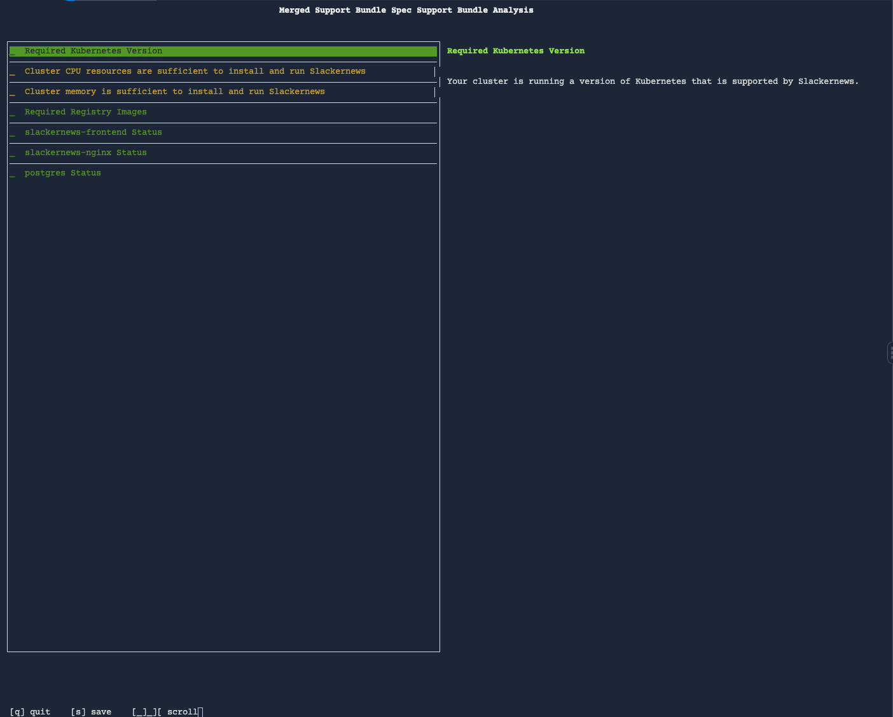
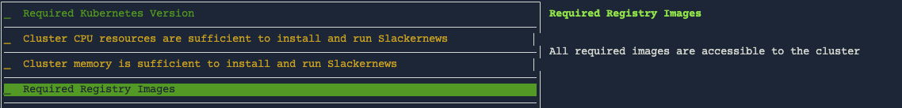

The support bundle command just needs a specification to run, and it doesn't
matter how it locates it. It can load it from a local file, a URI, or (as we
did above) a secret in the cluster. You can provide the specification at a
publicly available URL to make it easy for them to collect a bundle with
changing their cluster.

Using a URI to Collect a Support Bundle
=======================================

The support bundle specification for this lab is publicly available on a
Google Cloud Storage bucket. To collect a support bundle using that spec, run
the following command:

```
kubectl support-bundle --namespace slackernews https://storage.googleapis.com/shared-lab-assets/closing-the-information-gap/slackernews/slackernews-support-bundle.yaml
```

You'll see the now familiar analyzer screen showing your customer's cluster.
Since they've now resolved the incident, it will the job service running. If
you look closely, you'll also notice an additional analyzer in this version of
the support bundle.



You can also use this mechanism to release your support bundle independent of
your application. This can allow the support team to evolve the bundle
independent of your development team and without requiring a full system
release. If you choose to distribute your support bundle at it's own URI, you
should still include it in your application. The support bundle spec allows has
a `uri` property that will be checked before using the specification as is. If
the spec can be retrieved, it will replace the spec that references it.

Including the URI in the Bundle You Distribute
==============================================

Let's finish of our work with the Slackernews support bundle by adding a `uri` to
the spec. Edit the file `slackernews/templates/troubleshoot/support-bundle.yaml` in the
Manifest Editor and add the URI from the command at the top of the `spec`,
before the collectors.

```
  uri: https://storage.googleapis.com/shared-lab-assets/closing-the-information-gap/slackernews/support-bundle.yaml
```

Don't forget to the save the file.


You should also bump the version number for the release to `0.4.1` in the
`Chart.yaml` file, repackage your chart, and delete the old tarball from your
release directory. The following commands will take care of that for you.


```
yq -i '.version = "0.4.1"' slackernews/Chart.yaml
helm package slackernews --destination ./release
rm ./release/slackernews-0.4.0.tgz
```

Now you need to release your update and promote it. Remember that for a real
application you won't be instantly promoting to `Beta` and `Stable`. Your
release sequence will be `5` unless you've played around with additional
releases. If you have, use the current sequence.

```
replicated release create --promote Unstable --chart ./release/slackernews-0.4.1.tgz --version 0.4.1  \
  --release-notes "Provides the ability to upgrade the support bundle independent of the application"
replicated release promote 4 Beta --version 0.4.1 \
  --release-notes "Provides the ability to upgrade the support bundle independent of the application"
replicated release promote 4 Stable --version 0.4.1 \
  --release-notes "Provides the ability to upgrade the support bundle independent of the application"
```

Running the New Bundle as Geeglo
================================

You can now resume acting as Geeglo to upgrade your installation and collect a
new support bundle containing a reference to your independently released
bundle.

```
helm upgrade --namespace slackernews slackernews \
  oci://registry.replicated.com/[[ Instruqt-Var key="REPLICATED_APP" hostname="shell" ]]/slackernews
kubectl support-bundle --namespace slackernews --load-cluster-specs
```

Note that you didn't add a new analyzer to the support bundle defintion in your
Helm chart, but you still see the new analyzer in your results this is because
the `support-bundle` command checked the URI for an upgrade, found one, and
used in instead of the out-of-date specification.



