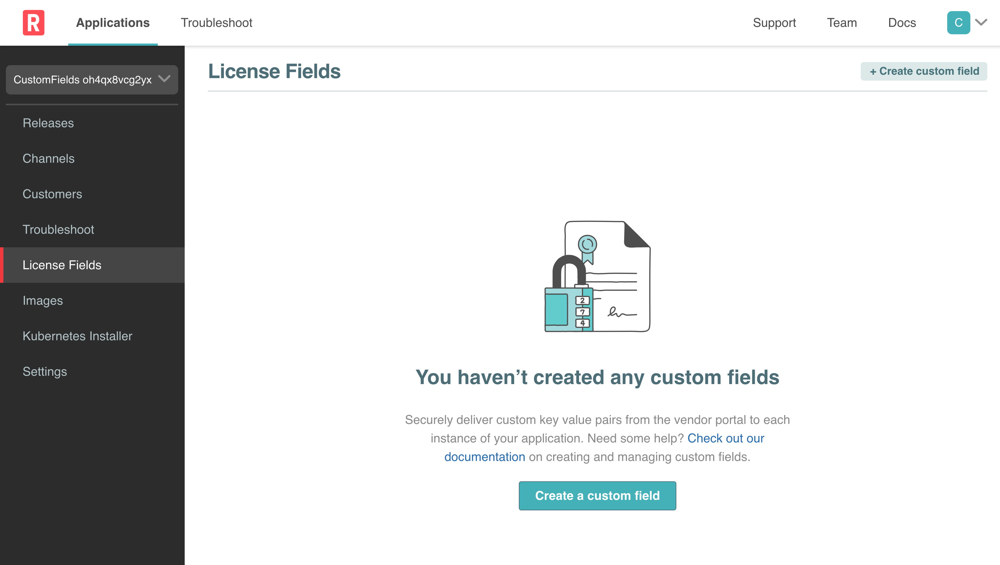
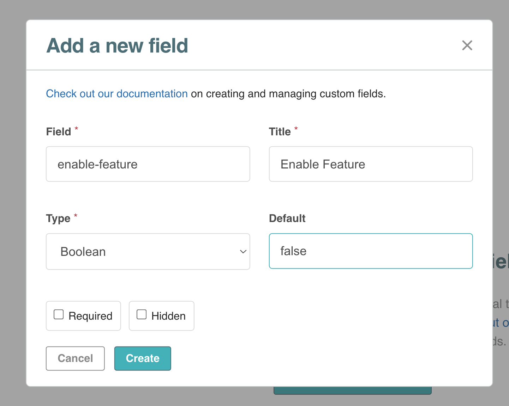

### Vendor Portal login

To access the Vendor Portal, you will need your participant id. If you go to the Shell tab, it will show you the username and password to be used for the Vendor tab. It will be of the following format:

```
username: [PARTICIPANT_ID]@replicated-labs.com
password: [PARTICIPANT_ID]
```

Once you have the credentials, you can login into the Vendor tab and you should land on the Channels. Channels allow you to manage who has access to which releases of your application.

### Create Custom Field

Let's create the [Custom License Field](https://docs.replicated.com/vendor/licenses-adding-custom-fields) that we will use as a switch for our Super Duper Feature:

Navite to **License Fields** on the Left hand side navigator.

<p align="center"></img></p>

Click on **Create custom field** and use the following values:

* **Field:** enable-feature
* **Title:** Enable Feature
* **Type:** Boolean
* **Default:** false

Leave the **Required** and **Hidden** boxes unchecked. Below is a screenshot of what it should look like:

<p align="center"></img></p>

Click on the **Create** button to create the field. Stay logged in to the Vendor Portal as we will need it in the next challege.

Congratulations! You have completed this challenge.