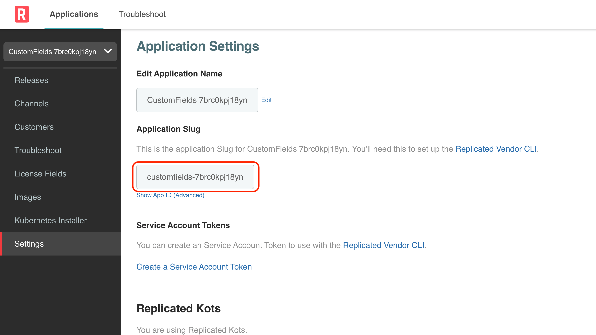
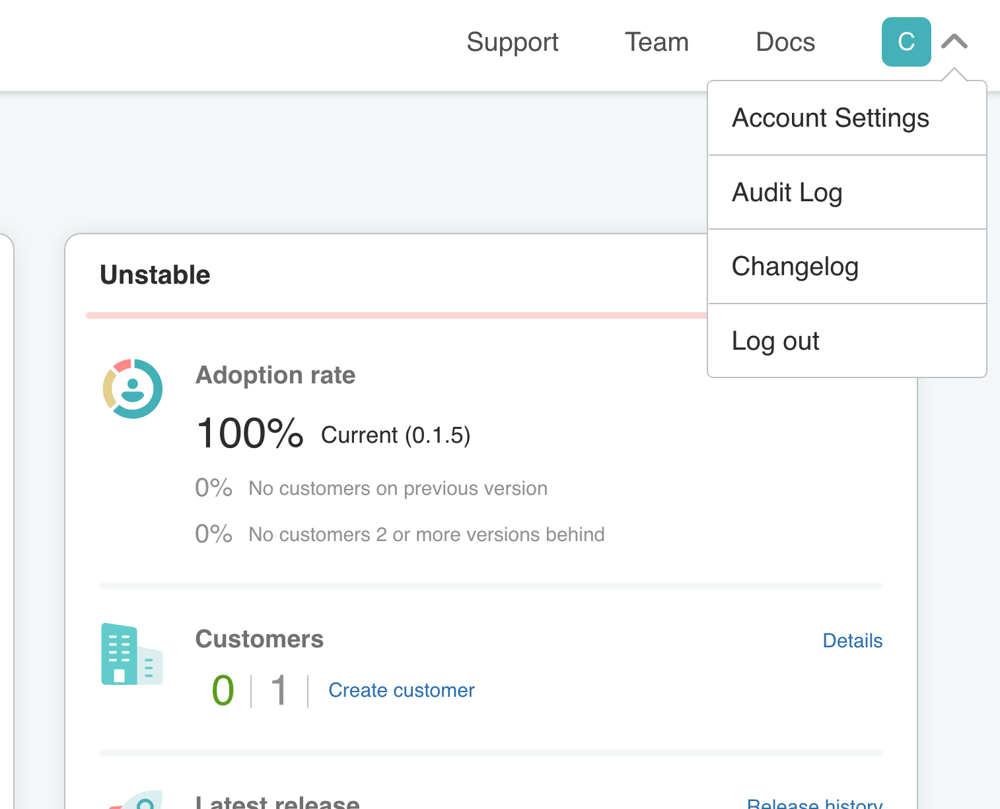
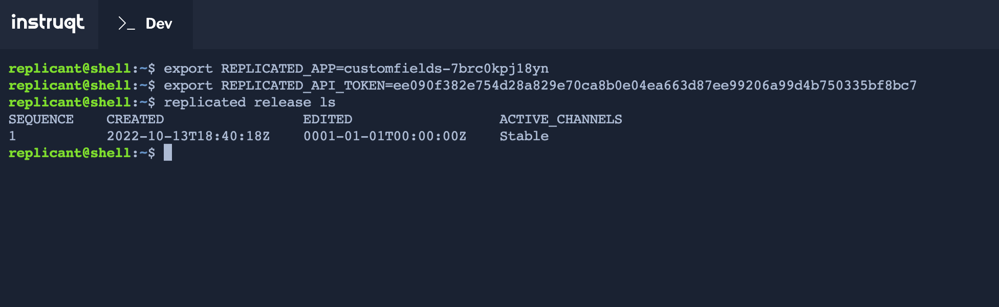
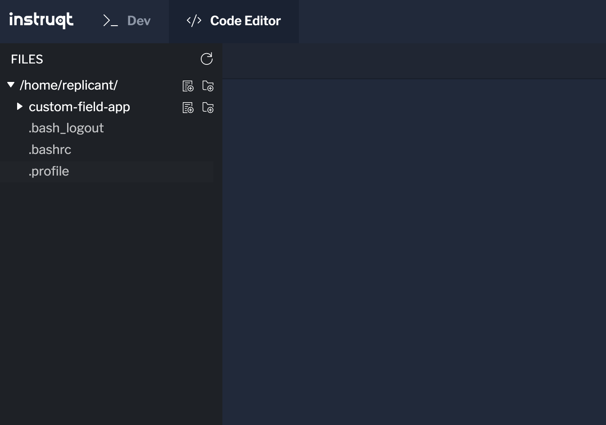
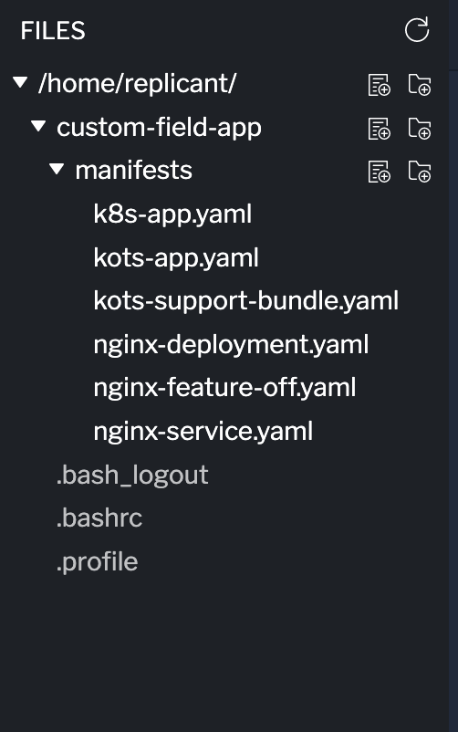
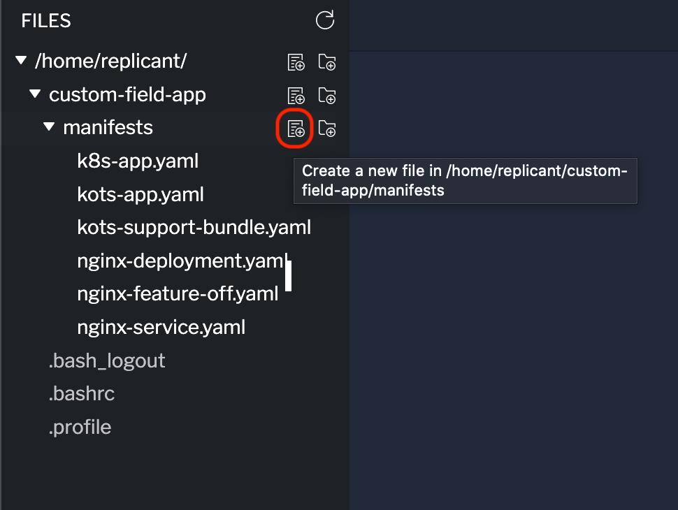
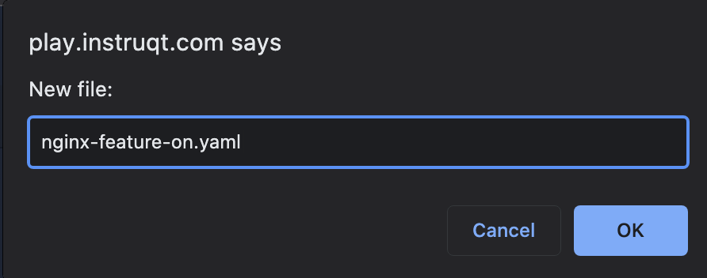
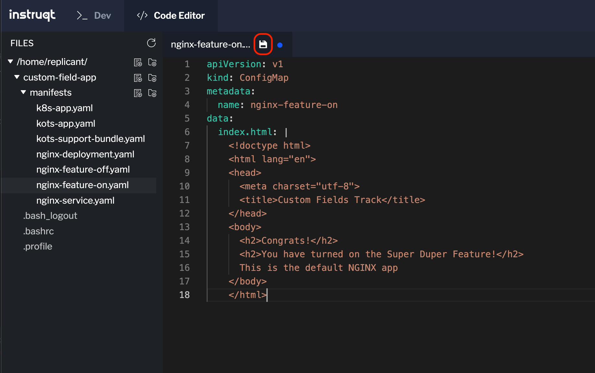
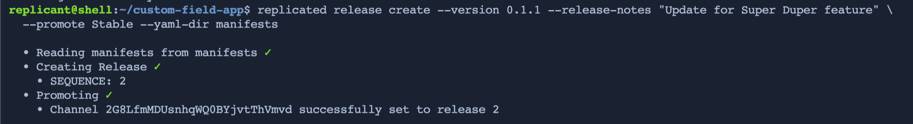

## Setting Up the Dev Environment ##

The application that has been provisioned for you does not currently have the new feature added. So in this challenge we will update the application to include the new feature, which will be in a new `ConfigMap`. We'll then update the application to use the right `ConfigMap` based on the value of the Custom License File we created in the previous challenge.

Before we update the application, let's set up our dev environment. In this lab, you will notice some new tabs:

* **Dev:** This is a Linux environment preloaded with some handy tools, like the `replicated` command line. This will be our dev environment.
* **Code Editor:** This is a code editor provided by Instruqt. We will use this to edit the manifests.

Let's start by setting our environment variables in our dev environment. The two environment variables are `REPLICATED_APP` and `REPLICATED_API_TOKEN` which tell the `replicated` command line where to push changes. This is covered in the Replicated CLI track in more detail.

Both values for these are in the Vendor Portal. Click on the **Vendor** tab to go to the Vendor Portal, and if you are prompted to log in, use the credentials in the **Shell** tab.

Once you are logged in to the Vendor Portal, head over to the **Dev** tab to set the Environment Variables.

Set the `REPLICATED_APP` to be the **application slug** found in the setting in the vendor portal. 

<p align="center"></img></p>

Set the `REPLICATED_API_TOKEN` to your user token, which you can create under your Account Settings.

<p align="center"></img></p>

Navigate all the way down until you see **User API Tokens** and create one with read & write access.

Once you have set your environment variables, you can run `replicated release ls` to see if you get any results. If you are not sure how to set the Environment Variables, see screenshot below:

<p align="center"></img></p>

If you receive the same result then we have our dev environment ready!

## Downloading the Application Manifests

Next, we are going to download the manifests from the vendor portal. To download the latest version of the application, we'll employ the [release download](https://docs.replicated.com/reference/replicated-cli-release-download) command.

The command needs the `SEQUENCE` we want to download, which was displayed in the results of the `release ls` command:
```
SEQUENCE    CREATED                 EDITED                  ACTIVE_CHANNELS
1           2022-09-20T19:53:57Z    0001-01-01T00:00:00Z    stable
```
Let's create a directory structure before we start dowloading files. Create a directory for this lab in your environment and a `manifests` sub directory to store the manifests.

```
mkdir custom-fields-app

cd custom-fields-app

mkdir manifests

```
To download the contents of the release run the following command

```
replicated release download 1 -d ./manifests

```
A succesful download will yield results similar to this:

```shell
  • Fetching Release 1 ✓  
  • Writing files to ./manifests
    • k8s-app.yaml
    • kots-app.yaml
    • kots-support-bundle.yaml
    • nginx-deployment.yaml
    • nginx-feature-off.yaml
    • nginx-service.yaml

```

Now we are ready to update the application.

## Making Updates to the Application

We are going to add a second `ConfigMap` that will be used when the Super Duper Feature is enabled. 

Head over to the **Code Editor** tab, which contains a directory tree that should look similar to this

<p align="center"></img></p>

You can expand the **custom-fields-app** directory to see its contents:

<p align="center"></img></p>

Use the **New File** icon (highlighted in red below) to create a new file in the **manifests** directory. Make sure the file is created in the **manifests** directory, otherwise it will not be included in our new release.

<p align="center"></img></p>

Enter `nginx-featue-on.yaml` as the file name in the dialog 

<p align="center"></img></p>

Copy and paste the content below:

```yaml
apiVersion: v1
kind: ConfigMap
metadata:
  name: nginx-feature-on
data:
  index.html: |
    <!doctype html>
    <html lang="en">
    <head>
      <meta charset="utf-8">
      <title>Custom Fields Track</title>
    </head>
    <body>
      <h2>Congrats!</h2>
      <h2>You have turned on the Super Duper Feature!</h2>
      This is the default NGINX app
    </body>
    </html>
```

To save the changes, click on the **Save** icon (highlighted in red below):

<p align="center"></img></p>

Next, we are going to update the `nginx-deployment.yaml` file to choose which ConfigMap to use.

To do this, we will use [templating](https://docs.replicated.com/vendor/packaging-template-functions), specifically, the [License Context](https://docs.replicated.com/reference/template-functions-license-context).

In the `volumes` section of the file, we will use an `if statement` to determine the `ConfigMap` at run time.

Replace the name of the ConfigMap with the following:


```yaml
'{{repl if (eq (LicenseFieldValue "enable-feature") "true") }}nginx-feature-on{{repl else}}nginx-feature-off{{repl end}}'
```

Below is what a diff would look like after the change:

```diff
      volumes:
        - name: html
          configMap:
-           name: nginx-feature-off
+           name: '{{repl if (eq (LicenseFieldValue "enable-feature") "true") }}nginx-feature-on{{repl else}}nginx-feature-off{{repl end}}'
```

The above basically states that if the Custom License Field is set to true, the value of the `name` key is `nginx-feature-on`, otherwise the value will be `nginx-feature-off`

To save changes, click on the save icon on the file tab in the editor. 

Now we are ready to create a new release. Head back to the **Dev** tab and run the following command (make sure you are on the `custom-fields-app` directory):

```
replicated release create --version 0.1.1 --release-notes "Update for Super Duper feature" \
  --promote Stable --yaml-dir manifests
```

The output should look very similar to the output below

<p align="center"></img></p>

Let's verify our release was indeed created and promoted to the channel by running `replicated release ls`. There should be a new SEQUENCE associated to the **stable** channel.

If that is the case, you have completed this challenge and ready to move to the next one!
