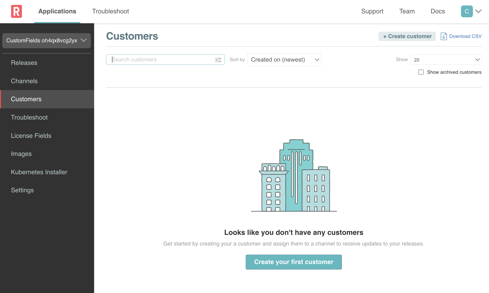
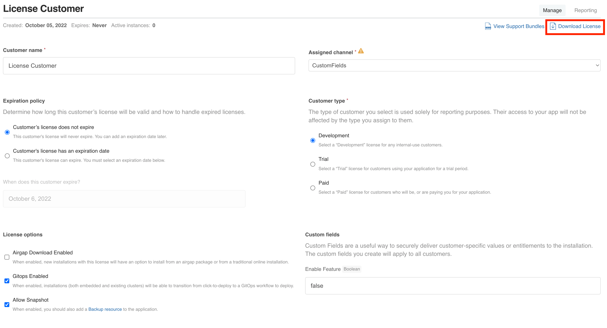
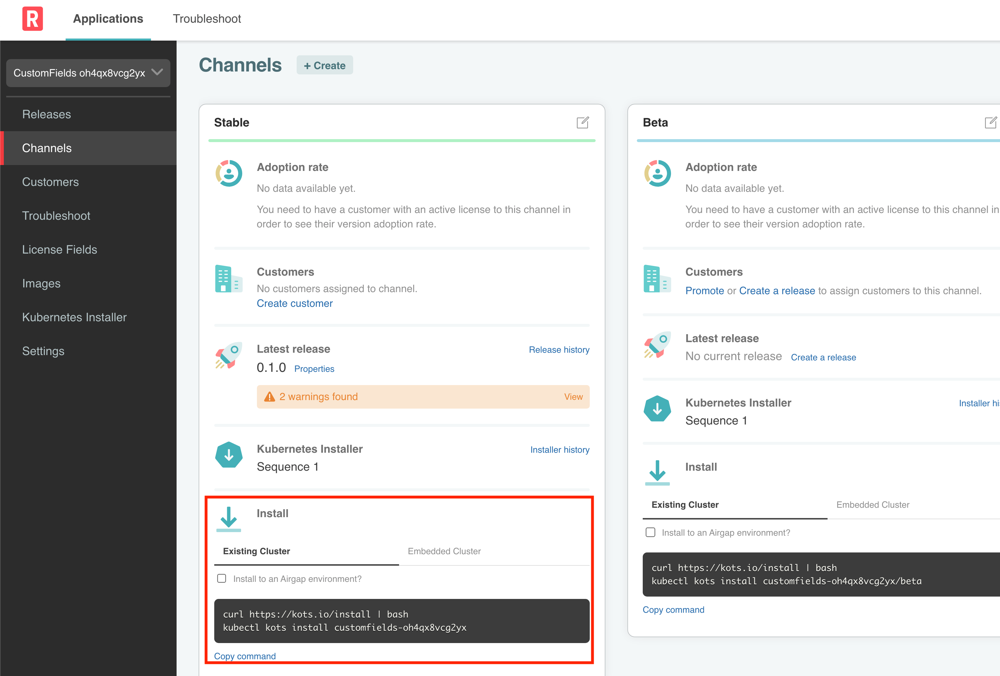

## Create Customer ##

Now that we have created our Custom License Field and updated the application, we are ready to put this into motion.

Let's create a new Customer, set the feature flag to `false` and install the application. We will take a look at the application without the Super Duper feature turned on. Then, we'll update the field to `true` and update the application we deployed and verify that the feature is now on.

Go back to your browser that has the Vendor Portal open. If you closed it, no worries, click on the **Open External Window** button on the **Vendor** tab.

<p align="center"></img></p>

If your session expired, go to the **Shell** tab to get your credentials.

Let's create a customer, which will create the license file we need to install our sample application. To do this, navigate to **Customers** and click on the **Create Customer** button highlighted below.

<p align="center"></img></p>

Provide the following information

* **Customer name:** Enter the name of the customer. In the screenshot below, we use `License Customer` as the name.

* **Assigned channel:** By assigning a channel, we can ensure the right version of the application is installed. Select the `CustomFields` channel.
* **Expiration policy:** These settings allow to specify if the license should have an expiration date. The expiration date ensures that a new install or upgrades are not allowed as well as restricting access to the image registry. For this lab, leave the setting as-is.
* **Customer type:** The type of customer you select is used solely for reporting purposes. Their access to your app will not be affected by the type you assign to them. For this lab, select **Development**.
* **License Options:** This section allows you toggle on & off Replicated features. Leave this section as-is
* **Custom Fields:** Custom Fields allow you to include custom metadata with the license. The values in these fields can be consumed by the application. In this lab, we have created the **Enable Feature** field. When the field is set to `true` the feature is enabled, and we set to `false` it is not. Let's leave it as `false` for now.
* **Download Portal:** If the customer has **Airgap Download** enabled, the **Download Portal** provides a place for your customers to download all the nescessary assets.

Once you save the customer, you should see the **Download License** link highlighted below.

<p align="center"></img></p>

Click on the link to download the file. The license file is a YAML file that you can open with your favorite editor. An example is included below. Note that the license file includes a signature (ommitted below for brevity) which is used to verify at install time that the license file was not tampered.

```yaml
apiVersion: kots.io/v1beta1
kind: License
metadata:
  name: licensecustomer
spec:
  appSlug: fernando-replicated-com
  channelID: 2FinlqqbXVCkqD8DxHOosnYKkoW
  channelName: CustomFields
  customerName: License Customer
  endpoint: https://replicated.app
  entitlements:
    enable-feature:
      title: Enable Feature
      value: false
      valueType: Boolean
    expires_at:
      description: License Expiration
      title: Expiration
      value: ""
      valueType: String
  isGitOpsSupported: true
  isNewKotsUiEnabled: true
  isSnapshotSupported: true
  licenseID: 2Fia5D7MVFBmV5xsnB8FaAmo6vF
  licenseSequence: 5
  licenseType: dev
  signature: eyJsaWNlbnNlRGF...
  ```

## Get Install Command

Navigate to **Channels** and find the **Stable** channel. At the bottom of the channel card are the install commands. We need to copy the commands for
**Existing Cluster** as shown here:

<p align="center"></img></p>


Copy the command to save it to your clipboard.


Congratulations! You have finished this challenge!
