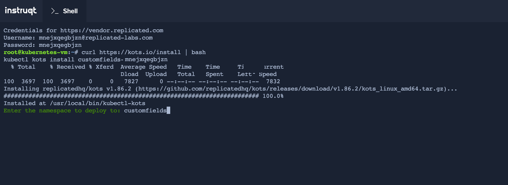
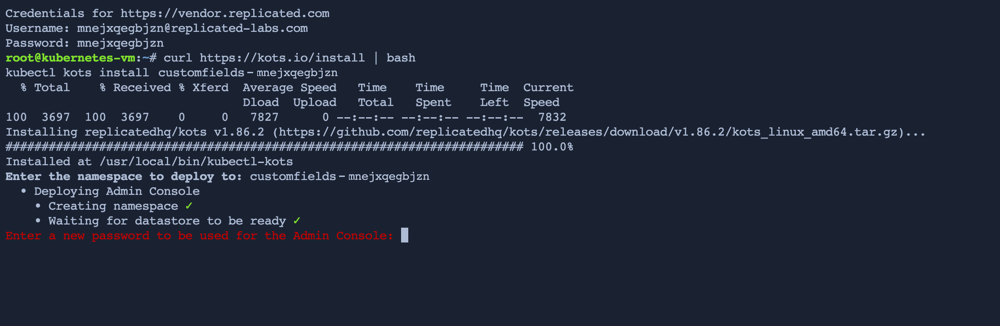
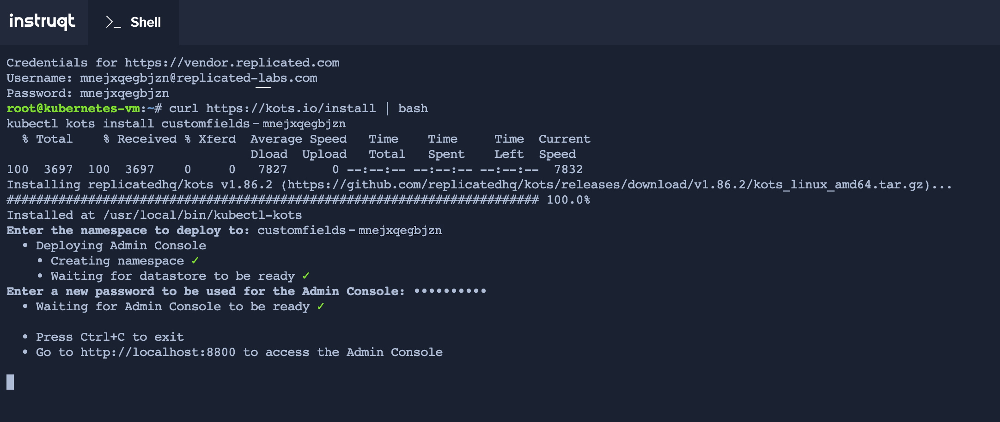

💡 Install kots
================

In the previous challenge you already copied the installation command for an existing cluster. It looked like:
```bash
curl https://kots.io/install | bash
kubectl kots install [YOUR-APP-NAME]
```

If you don't have the command anymore, you can always go back to the `Vendor` tab and copy it from `Channels > Stable` (the existing cluster install command).

Run this command in the `Shell` tab. If propmted for an installation path, leave it blank to use the default. When asked for the `namespace`, you can just press enter and use the one suggested:

<p align="center"></img></p>

The installation will take a couple minutes, and ask to provide a secure password. Remember it as it will be needed in the next Challenge.

<p align="center"></img></p>

Once finished you will see the following output:

<p align="center"></img></p>

Congratulations for finishing this challenge! Click on **Next** to proceed to the next challenge!
