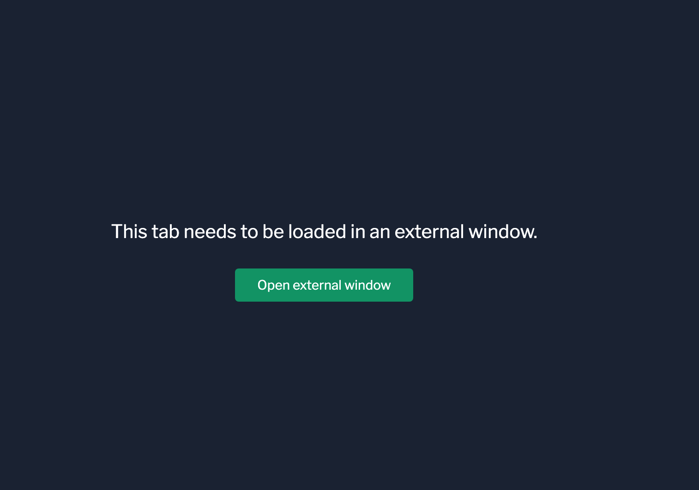
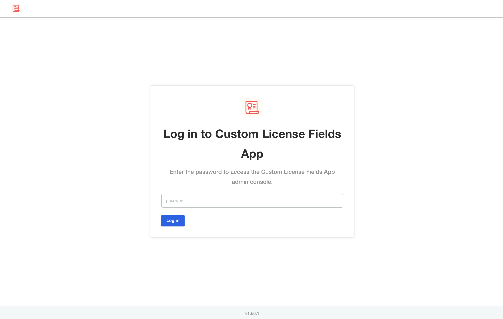
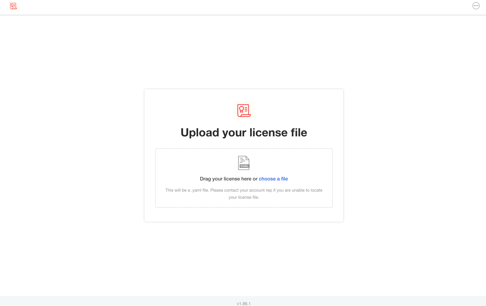
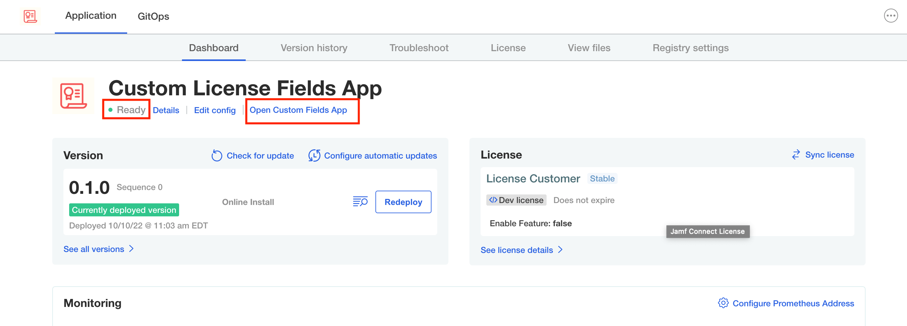
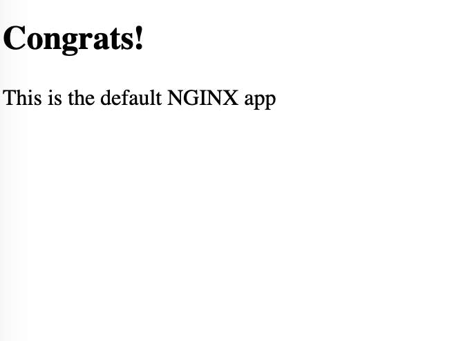

Login to the admin Console by clicking on the **Open External Window** button.

</img>

Enter the password you set during the installation of the Admin Console in the previous challenge.

</img>

Upload the license file we downloaded a couple of challenges ago.

</img>

Wait until the application is `ready` to click on the `Open License Custom Fields App` link

</img>

The sample app should open with the following output:

</img>

If you see the same output, congratulations! You have completed this challenge!