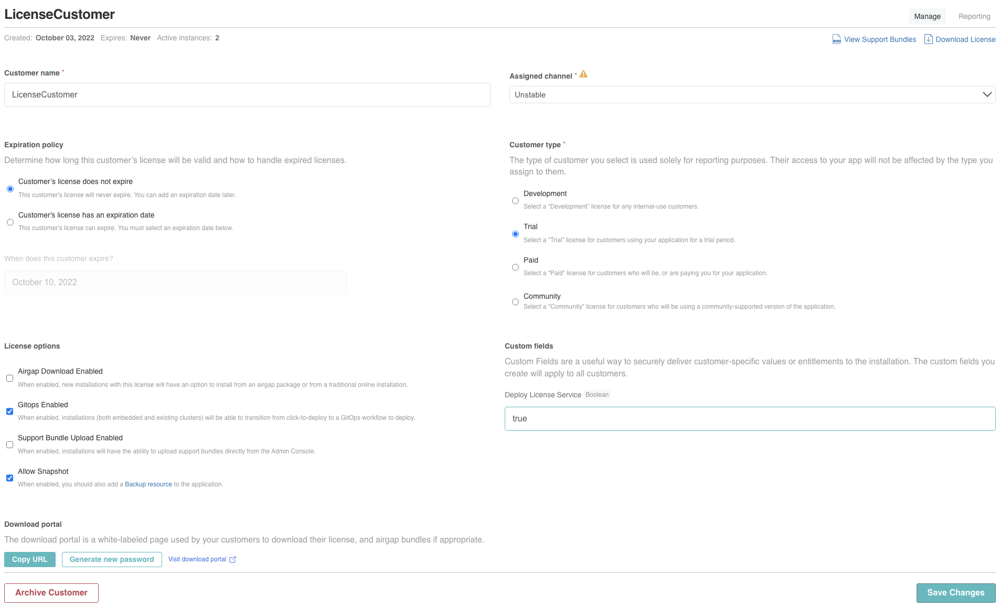
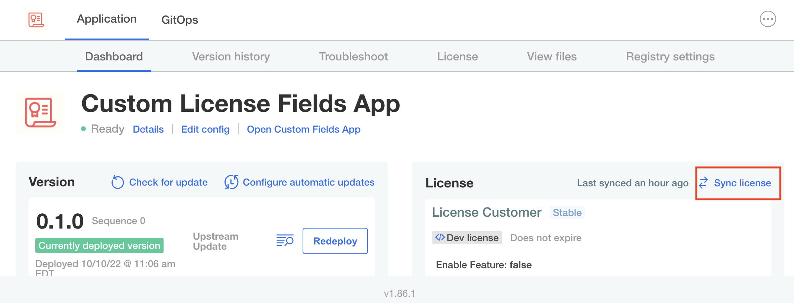
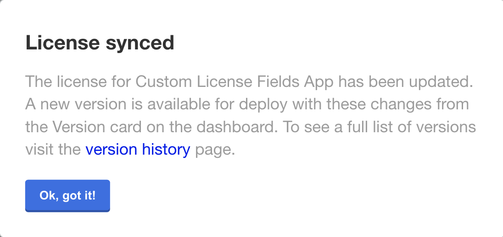
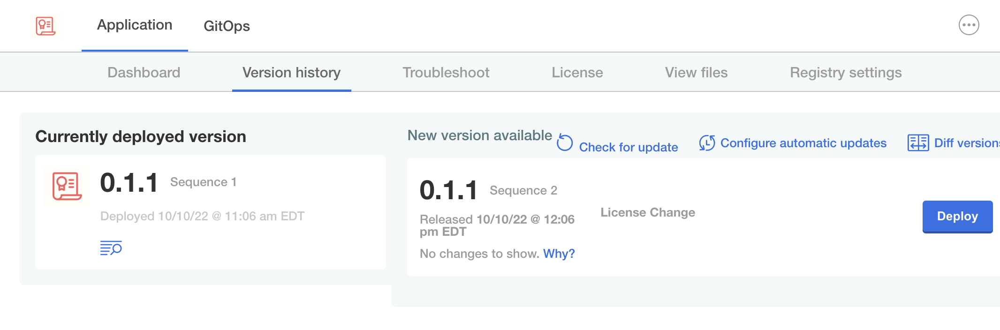
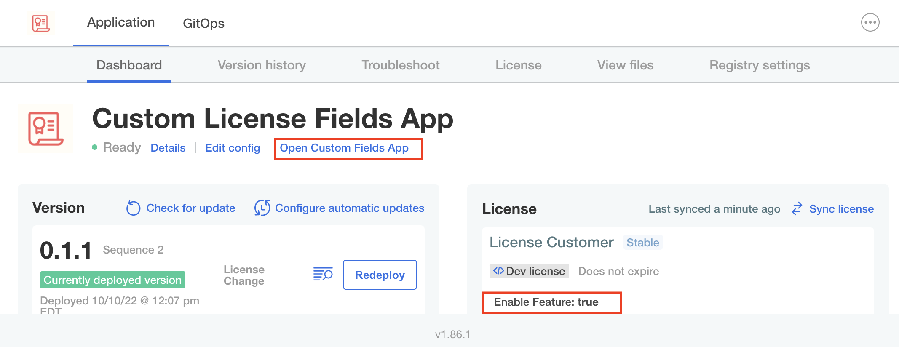
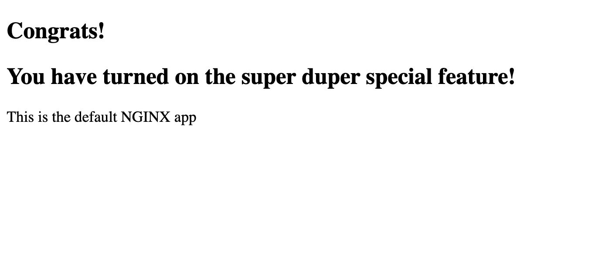

## Update the Customer License

Let's now enable the feature for this customer.

Navigate back to **Customers** and open the customer created earler and set the **Enable Fetaure** custom field to `true`:

</img>

Save the changes. The feature is now available for the customer. If the customer has an online installation you do not need to download the license again.

## Update Deployed App

Click on the **Admin Console** tab to access the Admin Console.

Click on **sync licenses** highlighted below

</img>

A dialog is displayed explaining that there is a new version of the application. This is because the underlying manifests have been modified by the license change.

</img>

Click on **Version History** which will take you to **Version history**

</img>

Click on **Deploy** to deploy the update that should now include the Super Duper feature.

Once the update is deployed, click on the Dashboard tab and once the application is **Ready** click on the **Open Custom Fields App** link, which should now look like this:

</img>

You may need to clear your cache or do a hard refresh to see the change

</img>

If you receive the above result, pat yourself on the back for a great job done!

This track is now complete.
