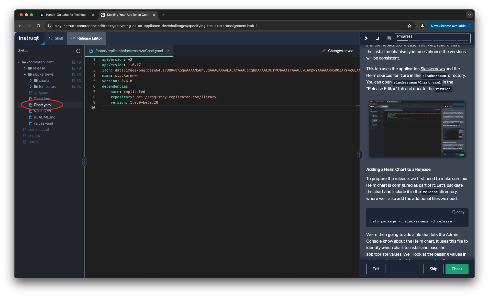
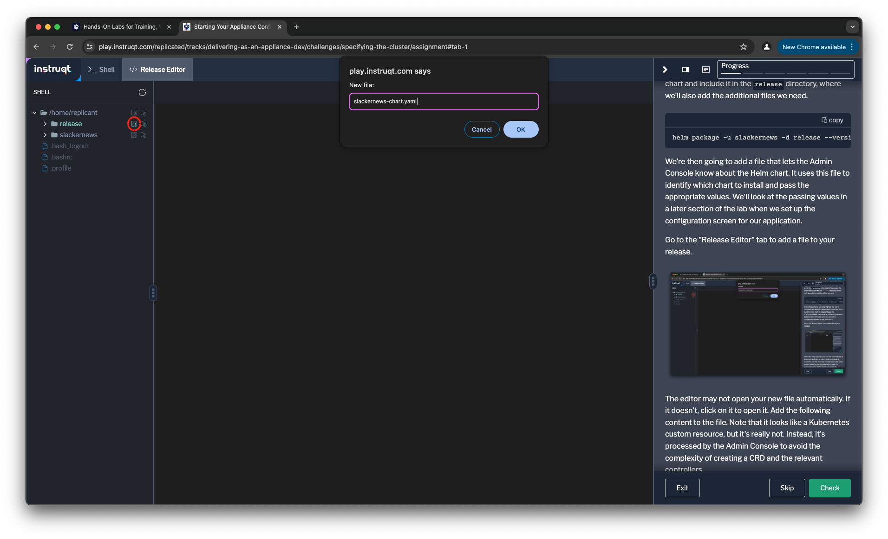

A virtual Kubernetes appliance consists of your application, a Kubernetes
cluster, and a console that your customer uses to install your application and
manage the appliance. We refer to the Kubernetes cluster that's included as the
Embedded Cluster since it's "embedded" with your application. The console to
install and manage your application is called the Admin Console. Under the
hood, the Admin Console uses Helm to install and upgrade your application.

You release your application as a Kubernetes applicance by releasing a Helm
chart and some additional configuration on the Replicated Platform. The most
important file is the configuration for the Embedded Cluster, which can very
simple. All it requires is the version of the cluster to use.

```
apiVersion: embeddedcluster.replicated.com/v1beta1
kind: Config
spec:
  version: [[ Instruqt-Var key="EMBEDDED_CLUSTER_VERSION" hostname="shell" ]]
```

That specification lets the Replicated Vendor Portal know which version of
Kubernetes to embed. There are [more options for the
configuration](https://docs.replicated.com/reference/embedded-config), but
that's all you need to get started.

The Replicated Release
======================

The Replicated Platform distributes your software to your customers. To do
this, it needs to know about your application, its customers, and the files
you're shipping to them. We talk about those files as a release.

Every release is built around a Helm chart, and that's all it needs. If you've
completed the [Distributing Your Application with
Replicated](https://play.instruqt.com/replicated/tracks/distributing-with-replicated)
lab, you built a release around a Helm chart and installed it using Helm
tools. To use other installation methods supported by the Replicated Platform
you supplement the Helm chart with additional configuration files. We need a
minimum of two configuration files: the Embedded Cluster configuration and a
file that describes which Helm chart to install.

Our Initial Appliance
=====================

To create our initial appliance, we're going to add our Helm chart and two
configuration files to the `release` directory. These are the bare minimum set
of files we need to create the appliance.

### Bumping the Chart Version

Strictly speaking, we don't have to bump the version of our Helm chart since
we haven't changed it. It's a good practice to increment it, though, since we
want to have consistent versions between the Helm release and the Replicated
release. That way your customer will see a consistent version regardless of
the install mechanism they choose.

This lab uses the application [SlackerNews](https://slackernews.io) and the
Helm sources for it are in the `slackernews` directory. Open
`slackernews/Chart.yaml` in the "Release Editor" tab and update the `version`
to `0.6.0`.



### Adding a Helm Chart to a Release

To prepare the release, we first need to make sure our Helm chart is configured
as part of it. Let's package the chart and include it in the
`release` directory, where we'll also add the additional files we need.

```
helm package -u slackernews -d release
```

We're then going to add a file that lets the Admin Console know about the Helm
chart. It uses this file to identify which chart to install and pass the
appropriate values. We'll look at the passing values in a later section of the
lab when we set up the configuration screen for our application.

Go to the "Release Editor" tab to add a file named `slackernews-chart.yaml` to
your release.



The editor may not open your new file automatically. If it doesn't, click on
it to open it. Add the following content to the file. Note that it looks like
a Kubernetes custom resource, but it's really not. Instead, it's processed by
the Admin Console to avoid the complexity of creating a CRD and the relevant
controllers. The name and version in this file need to match the metadata for
our SlackerNews Helm chart to identify it correctly.

```
apiVersion: kots.io/v1beta2
kind: HelmChart
metadata:
  name: slackernews
spec:
  # chart identifies a matching chart from a .tgz
  chart:
    name: slackernews
    chartVersion: 0.6.0

  # values are used in the customer environment, as a pre-render step
  # these values will be supplied to helm template
  values: {}
```

You're not limited to only one Helm chart as part of your application.
Including multiple `HelmChart` objects let's the Admin Console know it has to
install multiple Helm charts. For SlackerNews, we have only a single chart.

### Including the Embedded Cluster

We showed a simple Embedded Cluster configuration earlier in the lab. Let's use
that basic configuration for SlackerNews. Create another file in the `release`
folder named `embedded-cluster.yaml` and copy the contents of the configuration
into it.

```
apiVersion: embeddedcluster.replicated.com/v1beta1
kind: Config
spec:
  version: [[ Instruqt-Var key="EMBEDDED_CLUSTER_VERSION" hostname="shell" ]]
```

Releasing the Appliance
========================

With the three files we have, we can now release Slackernwes Kubernetes
appliance. We're going to use the `replicated` command-line tool for to create
the release. The first thing we'll do is set some environment variables to let
the command know who we are and what application we're working with. Use the
"Shell" tab to set these variables:

```
export REPLICATED_API_TOKEN="[[ Instruqt-Var key="REPLICATED_API_TOKEN" hostname="shell" ]]"
export REPLICATED_APP="[[ Instruqt-Var key="REPLICATED_APP" hostname="shell" ]]"
```

We create a new release with the `release create` subcommand for `replicated`.
If you've completed some of our other labs you may notice a difference here:
we're using a flag `--yaml-dir` instead of `--chart`. That's because this
release requires the additional configuration files we've created.

```
replicated release create --yaml-dir ./release
```

This creates a release for version `0.6.0` of your SlackerNews appliance on
the vendor portal. To make it available to your customers, you need to publish
it to a release channel. Release channels are used by the Replicated Platform
to assure customers get access to the release you intend for them to get. The
[Distributing Your Application with
Replicated](https://play.instruqt.com/replicated/tracks/distributing-with-replicated)
lab explains them in more detail.

There are three default release channels: `Unstable` for internal builds,
`Beta` for your beta programs, and `Stable` for generally available releases.
We're going to use the `release promote` subcommand to make sure our release is
available on all three of them.

```
replicated release promote 7 Unstable --version 0.6.0 \
  --release-notes "Adds an embedded cluster configuration to facilitate an appliance experience"
```

followed by

```
replicated release promote 7 Beta --version 0.6.0 \
  --release-notes "Adds an embedded cluster configuration to facilitate an appliance experience"
```

and then

```
replicated release promote 7 Stable --version 0.6.0 \
  --release-notes "Adds an embedded cluster configuration to facilitate an appliance experience"
```

You can see the that your release is on all three channels by listing your
available channels by running

```
replicated channel ls
```

which will show the current release and version on each channel.

```
ID                             NAME        RELEASE    VERSION
2gWopn8RA2fQyMEXSoO0WdtwxX3    Stable      7          0.6.0
2gWopkEwUauoDmR2FaU4SMuL9wz    Beta        7          0.6.0
2gWopmvSXKiRRCDUXkAfP2p2Pcv    Unstable    7          0.6.0
2gWotHQsBB4bR5duhVhpQIAYWKs    LTS
```

You'll notice there's an additional channel that doesn't have your release on
it. That's an example of a release channel you could add when releasing your
own application. SlackerNews determined that some customere wanted "long-term
support" releases since they upgrade more slowly and wanted longer support
guarantees for the versions they installed.
