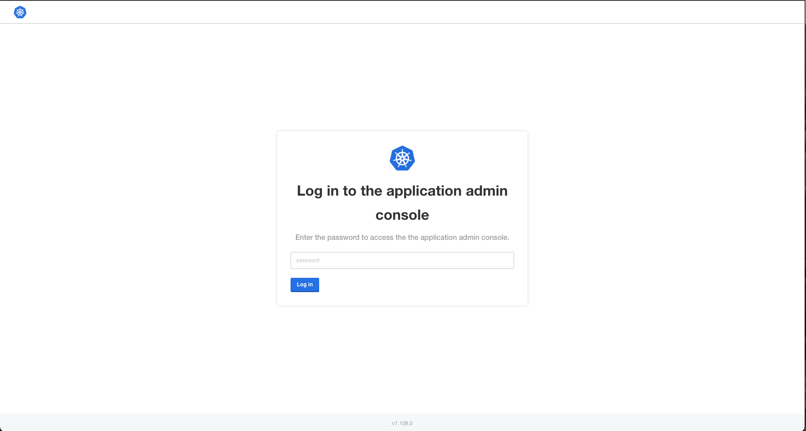
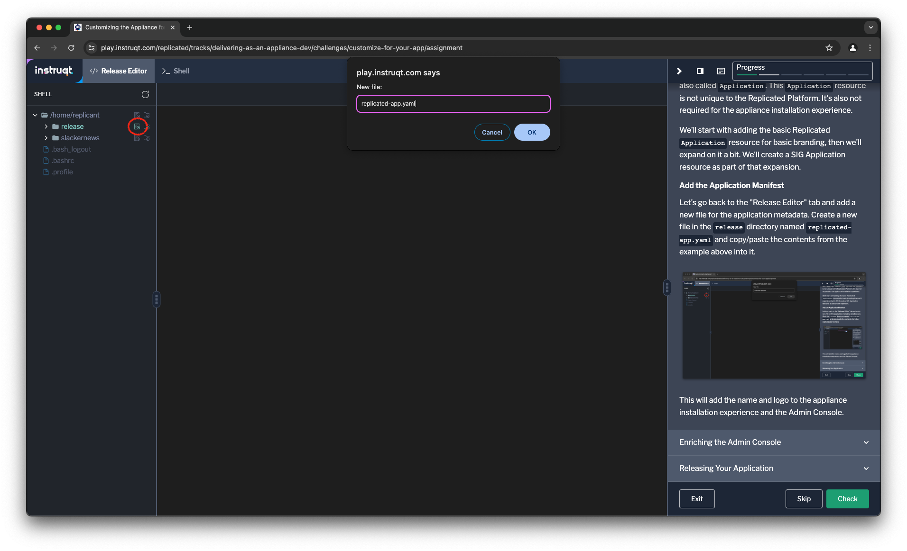
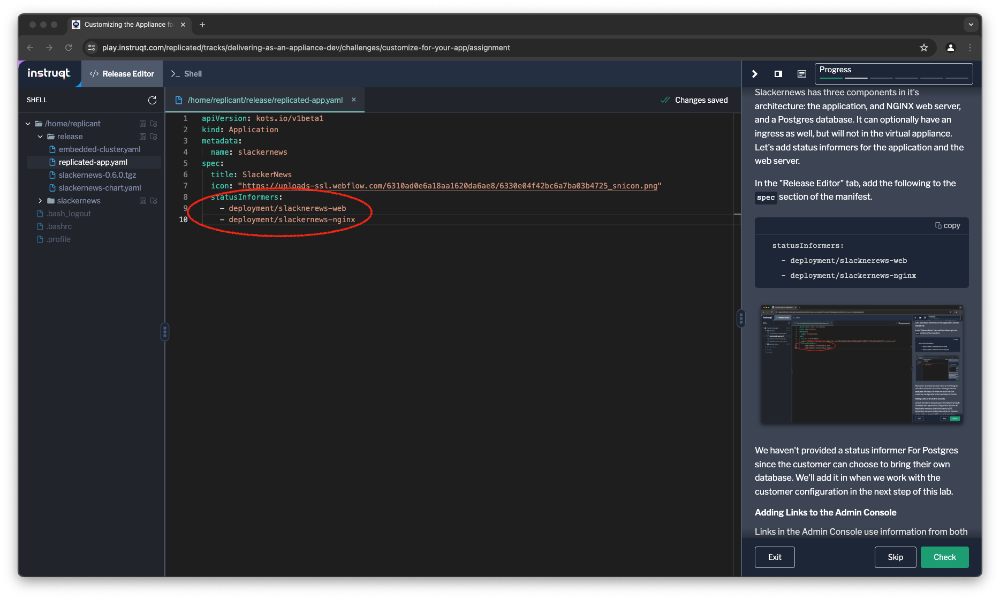

The Kubernetes appliance installation is one of the first things
your customer will experience about your application. The way we've implemented
it so far uses a lot of defaults. We didn't try to install it yet, but if we
had, we'd notice it's not particularly clear that this is a Slackernews
appliance.



This definitely violates our brand standards!

Don't worry, Replicated provides a few options to customize the appliance
installer. The first customizations we're going to look at will make it clear
which application we're installing.

Add a Name and Logo to the Appliance
====================================

We've already looked at two of the manifests we use for configuring the
appliance experience: one for the embedded Kubernetes cluster and one for the
Slackernews Helm chart. There are other manifests as well. We're going to look
at the `Application` manifest, which describes the application being installed.

```
apiVersion: kots.io/v1beta1
kind: Application
metadata:
  name: slackernews
spec:
  title: SlackerNews
  icon: "https://uploads-ssl.webflow.com/6310ad0e6a18aa1620da6ae8/6330e04f42bc6a7ba03b4725_snicon.png"
```

There are other things we can configure in this file as well, but for this lab
we'll focus just on the title and the icon. For other possible properties, take
a look at the [reference
documentation](https://docs.replicated.com/reference/custom-resource-application).
Not all of the possible values apply for the Kubernetes appliance experience.

The appliance installation process also supports another resource that
describes application metadata. The resource is based defined by the
Kubernetes Apps Special Interest Group (SIG) and is also called `Application`.
This `Application` resource is not unique to the Replicated Platform. It's
also not required for the appliance installation experience.

We'll start with adding the basic Replicated `Application` resource for basic
branding, then we'll expand on it a bit. We'll create a SIG Application
resource as part of that expansion.

### Add the Application Manifest

Let's go back to the "Release Editor" tab and add a new file for the
application metadata. Create a new file in the `release` directory named
`replicated-app.yaml` and copy/paste the contents from the example above into
it.



This will add the name and logo to the appliance installation experience and
the Admin Console.

Enriching the Admin Console
===========================

To improve the Slackernews appliance experience, we're going to take advantage
of some additional features of the Admin Console. We'll configure an
application status indicator and add a link to access the Slackernews app.
These will help an administrator understand the running state of the
application and quickly connect to it.

### Reporting Status on the Admin Console

Application status is reported based on status informers identified in the
Replicated `Application` resource. Status informers help the Admin Console
determine the application status to display. The status is an aggregation
across the provided status informers.

Application status is similar to the status you see for a Kubernetes
resource when using the `kubectl` command. The statuses provided are based on
the resources configured as status informers.

<table>
<thead>
</tr><th>Status</th><th>Description</th></tr>
</thead>
<tbody>
<tr><td>Ready</td><td>All of the resources are ready</td></tr>
<tr><td>Unvailable</td><td>One or more of the resources are unavailable</td></tr>
<tr><td>Degraded</td><td>One or more of the resources are in a degraded state</td></tr>
<tr><td>Updating</td><td>There are multiple versions of the some resource present</td></tr>
<tr><td>Missing</td><td>The resources have not yet been created</td></tr>
</tbody>
</table>

Status informers can reference on of several types of resource:

* Deployments
* Stateful sets
* Daemon sets
* Services
* Persistent volume claims
* Ingresses

Each status informer will be in one of the states above, as determined by the
resource it references. Missing is the same for all resources: it has not yet
been created.

<table>
<tbody>
<tr><td><code>Deployment</code><br/><code>StatefulSet</code></td><td>Status is based on the number
of replicas that are ready. A resources is ready if all replicas are
available, degraded one but not all replicas are ready, and unavailable if
none are ready. If there are replicas are from different versions then the
resources is updating.</td></tr>
<tr><td><code>DaemonSet</code></td><td>Similar to </code>Deployment</code> or </code>StatfulSet</code> but based on
the daemon pods</td></tr>
<tr><td><code>Service</code><br/><code>Ingress</code></td><td>Services are ready if all endpoints are ready and any
needed load balancers have been assigned. They are degraded if at least one
endpoint is ready when more are requests, and unavailable if none are ready
and no load balancer(s) have been assigned. Ingress is based on the same
criteria for it's backing service.</td></tr>
<tr><td><code>PersistentVolmeClaim</code></td><td>A PVC is ready if the claim is bound and
unavailable if it is either lost or pending. Those are the only two states.</td></tr>
</tbody>
<table>

Slackernews has three components in it's architecture: the application, and
NGINX web server, and a Postgres database. It can optionally have an ingress
as well, but will not in the virtual appliance. Let's add status informers for
the application and the web server.


In the "Release Editor" tab, add the following to the `spec` section of the
manifest.

```
  statusInformers:
    - deployment/slacknerews-web
    - deployment/slackernews-nginx
```



We haven't provided a status informer For Postgres since the customer can
choose to bring their own database. We'll add it in when we work with the
customer configuration in the next step of this lab.

### Adding Links to the Admin Console

Links in the Admin Console use information from both the Replicated
application configuration and the SIG Application resource. Let's first
specify a SIG Application resource and include a link in it. The link can be
either a absolute URL or a reference to a service in the cluster.  For links
to the application you should use a URL that points to a service. This will
enable the Admin Console to provide a link that works even when port
forwarding is required. Absolute URLs are useful for things like your
documentation that are convenient for an administrator but not unique to this
install.

Create another new file in the `release` directory named
`sig-application.yaml` with the following contents.

```
apiVersion: app.k8s.io/v1beta1
kind: Application
metadata:
  name: slackernews
  labels:
    app.kubernetes.io/name: "slackernews"
    app.kubernetes.io/version: "0.6.1"
spec:
  selector:
    matchLabels:
     app.kubernetes.io/name: "slackernews"
  componentKinds:
    - group: core
      kind: Service
    - group: apps
      kind: Deployment
  descriptor:
    version: "0.6.1"
    description: "SlackerNews"
    icons:
      - src: "https://uploads-ssl.webflow.com/6310ad0e6a18aa1620da6ae8/6330e04f42bc6a7ba03b4725_snicon.png"
        type: "image/png"
    type: slackernews
    links:
      - description: 🔗 Open Slackernews
        url: "http://slackernews"
      - description: 📖 Read the Docs
        url: "https://docs.slackernews.io"
```

You can see there's a bit of overlap between the two files, which is why we
waited to define it until we needed it.

Both links will appear in the Admin Console with this configuration, but we
need to update the Replicated application configuration to make the relative
link `🔗 Open Slackernews` work. We'll do that specifying the port in the
Replictaed application object.

Open the `replicated-app.yaml` file and update the spec with a `ports`
section. You can specify whichever `localPort` you want, but the
`applicatonUrl` needs to match the `url` above and the `servicePort` needs to
be correct for the service you're linking to.

```
    ports:
      - serviceName: slackernews
        servicePort: 3000
        localPort: 3000
        applicationUrl: "http://slackernews"
```

Releasing Your Application
==========================

We're still not going to install our appliance, but let's release these
changes to get into the habit or releasing changes quickly.

First we want to bump the version in our Helm chart. You could consider this
part optional since we didn't update the chart. I recommend you do it, since
different customer may install the application in different ways. It will be
much easier for your team if Helm installs using version `0.6.1` and appliance
installs using version `0.6.1` are using the same bits.

You can bump the chart version in your editor, or just run the following two
commands

```
yq -i '.version = "0.6.1"' slackernews/Chart.yaml
yq -i '.spec.chart.chartVersion = "0.6.1"' release/slackernews-chart.yaml
```

You need to edit both files to assure that the appliance refers to the current
chart. You also need to repackage you're Helm chart and make sure your old
package isn't still in the release directory.

```
helm package -u slackernews -d release
rm release/slackernews-0.6.0.tgz
```

Create a new release, and promote it directly to the "Unstable" channel.

```
replicated release create --promote Unstable --chart ${HOME_DIR}/release/slackernews-0.6.1.tgz --version 0.6.1 \
  --release-notes "Configures appliance branding, status, and dashboard links" \
  --app ${REPLICATED_APP} --token ${REPLICATED_API_TOKEN}
```

We'll be making a few more changes before we install, so let's skip promoting
the release to the "Beta" and "Stable" channels.
