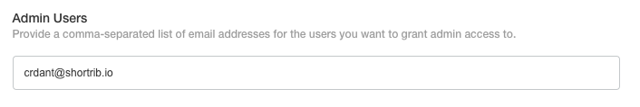
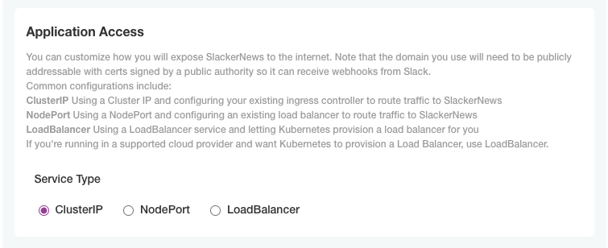
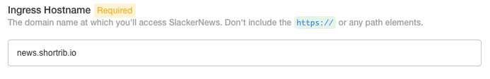
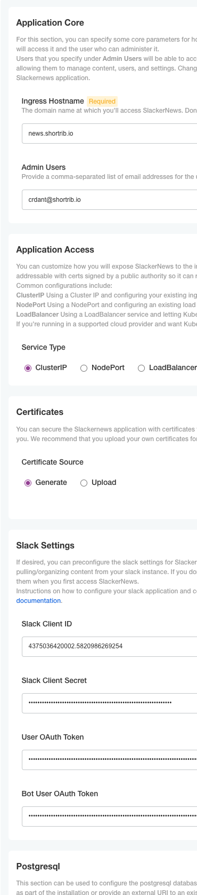

One of the benefits of building a Kubernetes appliance is providing a guided
experience for your customer to have a successful installation. One key to
success is ensuring the application is correctly configured. Replicated
Embedded Cluster lets you offer a simple web screen to help customers set
critical values correctly.

Configuring Your Application
=============================

Like other aspects of the appliance, the configuration screen is defined using
a YAML manifest. The manifest defines a `Config` resource that describes your
configuration options and the screen that your customer will use to configure
the application. Configurations is organized into groups, and each group can
have a fields of different types. The type of field defines the widget used.
The supported types account for all of the standard web form inputs.

<table>
<thead>
<tr><th>Type</th><th>Widget</th></tr>
</thead>
<tbody>
<tr><td><code>bool></code></td><td>checkbox</td></tr>
<tr><td><code>file</code></td><td>file upload</td></tr>
<tr><td><code>heading</code></td><td>a subheading within a group</td></tr>
<tr><td><code>label</code></td><td>an label supporting another field</td></tr>
<tr><td><code>password</code></td><td>password field with obscured text and visibility
toggle</td></tr>
<tr><td><code>radio</code></td><td>radio buttons</td></tr>
<tr><td><code>text</code></td><td>a standard text field</td></tr>
<tr><td><code>textarea</code></td><td>a larger text area</td></tr>
</tbody>
</table>

Each field has several other properties to specify things like its name,
default value, and whether it's required, among other things. The full list of
properties is in the [item
properties](https://replicated.zoom.us/my/crdant?pwd=NU5VVktueXV4QW0wcXFFRElHTkxudz09)
section of the Replicated documentation.

### Configuring SlackerNews

The SlackerNews Helm chart has several values that need to be set for it to
run as expected. Here's a first cut at the fields we want to collect: this
shows all of the values someone might want to enter to get a start with using
SlackerNews.

```yaml
apiVersion: kots.io/v1beta1
kind: Config
metadata:
  name: slackernews-config
spec:
  groups:
    - name: slackernews
      title: Application Core
      items:
        - name: slackernews_domain
          title: Ingress Hostname
        - name: slackernews_admin_user_emails
          title: Admin Users
          type: text

    - name: ingress
      title: Application Access
      items:
        - name: service_type
          title: Service Type
          type: select_one
          items:
            - name: cluster_ip
              title: ClusterIP
            - name: node_port
              title: NodePort
            - name: load_balancer
              title: LoadBalancer
        - name: node_port_port
          title: Node Port
          type: text

    - name: tls
      title: Certificates
      items:
        - name: certificate_source
          type: select_one
          title: Certificate Source
          items:
            - name: generate_internal
              title: Generate
            - name: upload_existing
              title: Upload
        - name: tls_cert
          title: Certificate
          type: file
        - name: tls_key
          title: Private Key
          type: file
        - name: tls_ca
          title: Signing Authority
          type: file

    - name: slack
      title: Slack Settings
      items:
        - name: slack_clientid
          title: Slack Client ID
          type: text
        - name: slack_clientsecret
          title: Slack Client Secret
          type: password
        - name: slack_user_token
          title: User OAuth Token
          type: password
        - name: slack_bot_token
          title: Bot User OAuth Token
          type: password

    - name: postgres
      title: Postgresql
      items:
        - name: deploy_postgres
          type: bool
          title: Deploy Postgresql Database
          default: "1"
        - name: postgres_password
          type: password
          title: Postgresql Password
        - name: postgres_external_uri
          type: text
          title: Postgresql URI
```

Let's add this configuration to the Replicated Platform release. Create a file
in the `release` directory named `config.yaml` and paste the content above into
it.

Improving the Configuration Experience
======================================

This configuration works, but has a few weaknesses:

1. It's not clear what all of the fields are for and how they interact.
2. Does the user need to fill out all the fields?
3. Some values might have defaults that are good enough for most users.
4. A few values have specific formats that the user might not enter correctly.

We can improve the experience by adding more detail to each configuration
field in a few ares: help text, default values, and validation. We can also
address the relationship between fields by hiding/showing fields based on the
value of other options.

### Adding Help Text

Help text is a simple way to provide more information about a field. It shows
above the widget to guide the user on what to enter.



Each field can have help text, and you can add a description to each group of
configuration items to provide context across fields. This can be especially
helpful to explain how fields interact when you have dependencies between
them.



We'll add help text to most of our fields, and also add descriptions to each
group. Let's start with the "Application Core" group. Update the `config.yaml`
by replacing the group named `slackernews`.

```yaml
   - name: slackernews
      title: Application Core
      description: |
        For this section, you can specify some core parameters for how
        SlackerNews operates, including the domain where users will access it
        and the user who can administer it.

        Users that you specify under **Admin Users** will be able to access the
        SlackerNews adminstrative console at `/admin`, allowing them to manage
        content, users, and settings. Changes will take effect the next time
        they are active in the SlackerNews application.
      items:
        - name: slackernews_domain
          title: Ingress Hostname
          help_text: >
            The domain name at which you'll access SlackerNews. Don't include
            the `https://` or any path elements.
          type: text
        - name: slackernews_admin_user_emails
          title: Admin Users
          type: text
          help_text: >
            Provide a comma-separated list of email addresses for the users you
            want to grant admin access to.
```

You can see we've used the `help_text` and `description` properties to provide
more instruction and support to the user installing the application. You'll
want to use these properties on most if not all of your configuration groups
and options. We're not going to go through the entire configuration right now,
but at the end of this section we'll take a look at a robust SlackerNews
configuration.

### Requiring Options and Providing Defaults

The goal of the configuration screen is to guide the user through successfully
deploying the appliance. The most important thing it can do is to distinguish
the options that a customer needs to change from other Helm values. It does
this through curating the values presented and explaining them to the user
running the install. The next most important thing it can do is make sure that
values that need to be configured get configured.

There are two ways to do this: specifying an option as required and providing
a default value. Let's continue to focus on the "Application Core" group. The
application can't run without knowing what hostname it's listening on, so
let's use the `required` property on the "Ingress Hostname" option.

```yaml
        - name: slackernews_domain
          title: Ingress Hostname
          help_text: >
            The domain name at which you'll access SlackerNews. Don't include
            the `https://` or any path elements.
          type: text
          required: true
```

Jump into the "Release Editor" and make that change. This will update how the
field is rendered and enforce that the user provides a value before they can
save their configuration.



There are no sensible default values for the options in the "SlackerNews Core"
group, so let's move on temporarily to the "Certificates" group. The
application will always run over TLS, but we can default to generating a
self-signed certificate.

```yaml
        - name: certificate_source
          type: select_one
          title: Certificate Source
          default: generate_internal
          items:
            - name: generate_internal
              title: Generate
            - name: upload_existing
              title: Upload
```

Add those changes as well. We'll see a few default values in the final
configuration.

### Displaying Fields Conditionally

If we accept the default self-signed certificate option, we don't need to
upload the three files that support using our own. We could use the group
description to explain this. A better choice for our users, though, would be
to show those fields only if they're needed. We can do this by adding a
property called `when` to those fields, and using a bit of templating to
determine when the fields should be shown.

```yaml
        - name: tls_cert
          title: Certificate
          type: file
          when: '{{repl ConfigOptionEquals "certificate_source" "upload_existing"}}'
        - name: tls_key
          title: Private Key
          type: file
          when: '{{repl ConfigOptionEquals "certificate_source" "upload_existing"}}'
        - name: tls_ca
          title: Signing Authority
          type: file
          when: '{{repl ConfigOptionEquals "certificate_source" "upload_existing"}}'
```

The templating under `when` is based on Go templates. In this case, we're
looking at the value of the `certificate_source` option and only collecting
the files if the user wants to upload their own certificate. In the next
section of the lab we'll look at templating a bit more.

Make these changes to the three conditional fields in the "Certificates"
group. Like the other features we're looking at, you'll see a few more
conditional fields in the final configuration.

### Validating Input

The last feature we'll look at is input validation. Validation makes sure the
user sets a value in the correct format (unfortunately, we can't make sure
it's the _right_ value, the customer has to handle that). Fields validation
uses regular expressions, though the `Config` definition provides for
Replicated adding more options in the future.

Let's return the "Ingress Hostname" field. It's important for this field to be
a valid hostname. Though we can't check that it's a real domain here (that's
the type of thing preflight checks are for), we can make sure it's a valid
name.

```yaml
          validation:
            regex:
              pattern: ^(([a-zA-Z0-9]([a-zA-Z0-9-]{0,61}[a-zA-Z0-9])?)\.)+([a-zA-Z]{2,6}|[a-zA-Z0-9-]{2,30}\.[a-zA-Z]{2,3})$
              message: Please enter a valid hostname

```

If your customer enters an invalid hostname they'll see the error message and
won't be able to save their configuration until they correct it. Edit the
config to include the validation. Keep in mind that the validation is a regular
expression, so you'll want to test it to make sure it's correct. You can do
that when you install the appliance, which we'll do a bit later.

A More Robust Configuration
============================

All of the techniques we used to enrich our configuration can be applied to
any configuration option. In the case of SlackerNews, we have a few more
changes we could make:

* Explain the rest of the configuration groups and add help text to additional
  options
* Set sensible defaults where appropriate
* Hide other conditional fields
* Validate the input for fields with specific formats

We're not going to go through all of those changes step-by-step, but instead
we'll replace the configuration we've been working on with a more robust one.
The full configuration is located in your home directory in the file
`complete-configuration.yaml`. Please move or copy the contents of that file into your
configuration in place of the one we've been working on.

```
mv ~/complete-configuration.yaml ~/release/config.yaml
```




In the next section we'll see how the Admin Console uses this configuration.
