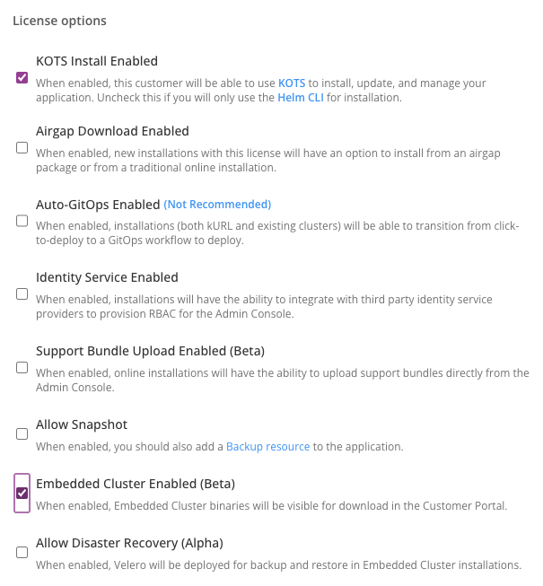
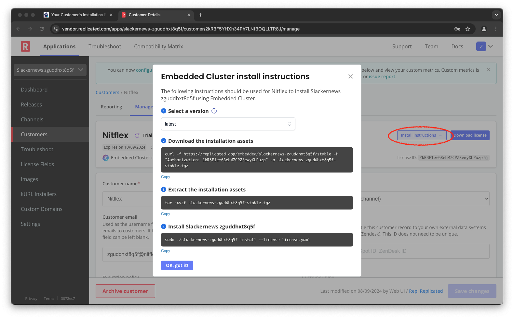

Now that we've prepared SlackerNews for an Embedded Cluster installation,
let's go through the experience a customer has installing it. Installing with
the Embedded Cluster happens in two parts:

1. A command-line download and install that creates a cluster
   running the Replicated Admin Console
2. A GUI experience facilitated by the Admin Console that installs
   your application.

Let's go through the first of these steps. We'll do the second in the next
section of the lab.

Getting the Install Instructions
================================

Each customer has their own unique download for the Embedded Cluster. The
download includes the Embedded Cluster binary, their license, and, for airgap
installs, the airgap bundle containing all required container images. Let's
connect to the Replicated Vendor Portal and get the download instructions for
our customer "Nitflex".

Select the "Vendor Portal" tab and log in with the following credentials:

Username: `[[ Instruqt-Var key="USERNAME" hostname="node" ]]`<br/>
Password: `[[ Instruqt-Var key="PASSWORD" hostname="node" ]]`

Once you're logged in, navigate to the "Customers" page and find the customer
"Nitflex." Click on the name "Nitflex" then select "Manage customer" to see
the customer details and entitlements. We need to enable the Embedded Cluster
for Nitflex to be able to use it.

There are a few license options that affect Embedded Cluster installations:

1. **KOTS Install Enabled** This option enables installing with Replicated's
   KOTS Admin Console, which is used by the Embedded Cluster installation.
4. **Airgap Download Enabled** Allows the customer to download the air-gapped
   version of the Embedded Cluster installer.
2. **Support Bundle Upload Enabled** Configures their license to allow
   uploading support bundles directly from the Admin Console for an online
   installation.
2. **Allow Snapshot** Includes components for application-level [backup and
   restore](https://docs.replicated.com/vendor/snapshots-overview).
2. **Embeded Cluster Enabled** Allows the customer to download the Embedded
   Cluster installer and install an Embedded Cluster instance.
4. **Allow Disaster Recovery** Provides disaster recovery functionality for
   the Embedded Cluster.

We don't need all of these options for this lab. We'll just enable the two
that we require: "KOTS Install Enabled" and "Embedded Cluster Enabled". Scroll
down to "License options" make sure both are active. You'll need to enable
KOTS first.



Once you've enabled the options, click "Save changes" and scroll back to the
top of the page. You may have noticed a button that said "Helm Install
Instructions" earlier. It's now changed to a menu for "Install instructions".
Select "Embedded Cluster" to see the instructions to download and install.



Running the Installer
=====================

You can use the instructions from the Vendor Portal to download and install
SlackerNews using the Replicated Embedded Cluster. Select the "Shell" tab and
enter the download command from the vendor portal.

```bash
curl -f https://replicated.app/embedded/[[ Instruqt-Var key="REPLICATED_APP" hostname="node" ]]/stable \
    -H "Authorization: [[ Instruqt-Var key="LICENSE_ID" hostname="node" ]]" \
    -o [[ Instruqt-Var key="REPLICATED_APP" hostname="node" ]]-stable.tgz
```

This will download a tarball including the installer binary and the license
file for Nitflex. Extract the tarball to access the installer.

```bash
tar -xzvf [[ Instruqt-Var key="REPLICATED_APP" hostname="node" ]]-stable.tgz
```

Then run the installer:

```bash
sudo ./[[ Instruqt-Var key="REPLICATED_APP" hostname="node" ]] install --license license.yaml
```

The installer will prompt you for a password for the Admin Console. You can
enter any password you'd like, but you'll need to remember it when you log in
later. You can copy/paste the password below if you aren't feeling inspired.

```
[[ Instruqt-Var key="ADMIN_CONSOLE_PASSWORD" hostname="node" ]]
```

The installer starts by converting the machine you're running on into a single
node Kubernetes cluster. It will then install several components that support
Embedded Cluster operation, including the Admin Console that you'll use
to complete the installation. You'll see a message and a spinner as each step
runs, replacing it with a checkmark when it completes.

```
? Set the Admin Console password: *********
? Confirm the Admin Console password: *********
✔  Host files materialized!
✔  Host preflights succeeded!
✔  Node installation finished!
✔  Storage is ready!
✔  Embedded Cluster Operator is ready!
✔  Admin Console is ready!
✔  Additional components are ready!
Visit the Admin Console to configure and install slackernews-rzx7ikjdtlno: http://10.5.1.34:30000
```

Once the installer completes, you'll see a message telling you to acccess the
Admin Console to configure and install SlackerNews. You customer will
copy/paste the URL from the output. You can access it directly in the next
step of the lab.
