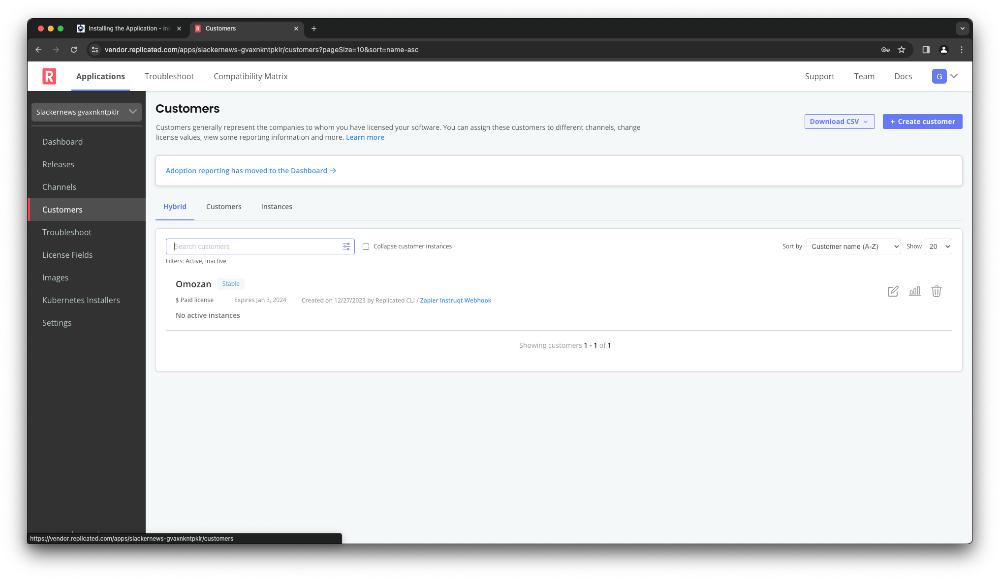
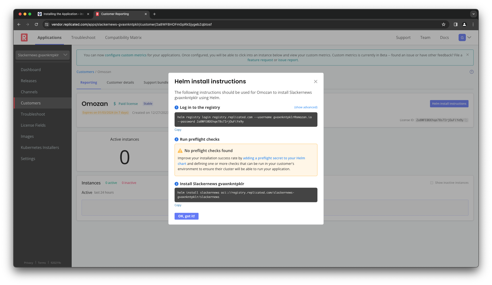

Now that we have a release in the Replicated Platform, you can
distribute its Helm chart to your customers using entitlements
that we manage for you. In this step, we're going to install the
Harbor Helm chart the same way a customer would install your
application.

Logging Into the Vendor Portal
==============================

We're going to use the Replicated Vendor Portal to look up the
installation instructions for the customer "Omozan". The Vendor
Portal is a core interface into the platform. We'll use it again
later in this lab to review the telemetry information we receive
from the SDK.

Click on the Vendor Portal tab to open up a new browser window and
access the portal. Log in with these credentials:

Username: `[[ Instruqt-Var key="USERNAME" hostname="shell" ]]`<br/>
Password: `[[ Instruqt-Var key="PASSWORD" hostname="shell" ]]`

You'll land on the "Channels" page for your app, which will show
the release channels we discussed in the previous step. Notice that
each channel shows the current version `16.7.0` while the channel LTS, which we haven't released to, reflects
that.


_Note: If you are already a user of the Replicated Vendor Portal
you may need to log out using the settings menu in the top right
corner before you can log in as the lab user._

Getting the Install Instructions
================================

Installation instructions are specific to each customer, since they
require unique login credentials for the Replicated registry. We're
going to install as the customer "Omozan" that has been set up as
part of the lab.

Select the "Customers" link from the left navigation. You'll end up on
the Customers landing page.



You'll see the list of customers, with the customer
"Omozan" as the only one in the list. Click on their name and you'll
be brought to their customer page. In the top right corner you'll
see a link to their install instructions.


Click on the link. Normally, if you had not configured your customer's email yet, you would first be prompted to enter a customer
email. However, we have already done this as part of the lab set up, so you should see the install instructions for the customer.



You're going to use these instructions to complete your install.
We'll skip the preflight checks for this lab since we haven't
added any to our chart.

Installing the Application
==========================

Your customer starts their installation by logging into our
registry with the `helm` command. This gives them access to
your Helm chart via the Replicated Platform.

```
helm registry login registry.replicated.com \
  --username [[ Instruqt-Var key="CUSTOMER_EMAIL" hostname="shell" ]] \
  --password [[ Instruqt-Var key="REGISTRY_PASSWORD" hostname="shell" ]]
```

From there, they do a simple Helm install. In our case, we're going to
tack some additional values that Harbor needs to come up correctly.
This helps us make sure the installation is complete before we move
onto the next step in the lab.

```
helm install harbor \
  oci://registry.replicated.com/[[ Instruqt-Var key="REPLICATED_APP" hostname="shell" ]]/harbor \
  --set service.type=NodePort --set nodePort.https=443 \
  --set externalURL=https://[[  Instruqt-Var key="EXTERNAL_URL" hostname="cluster" ]]
```

It's normal for this command to take a little bit of time to
complete as various components of the Harbor registry come up.
