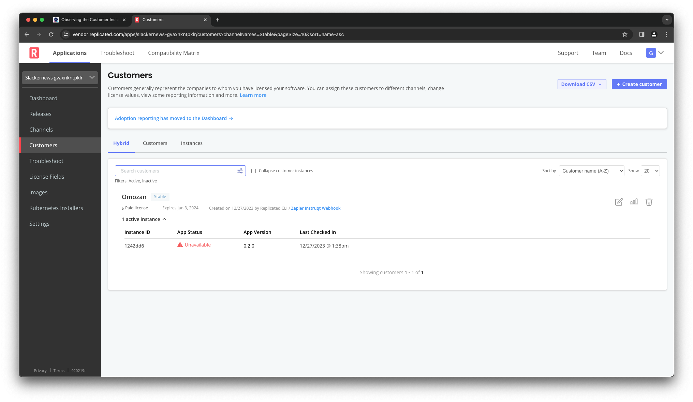
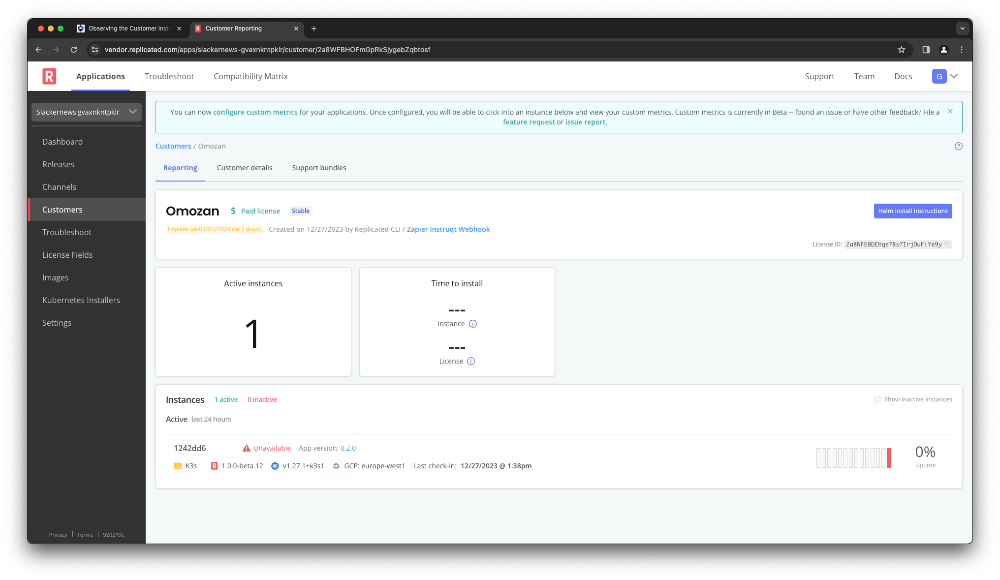
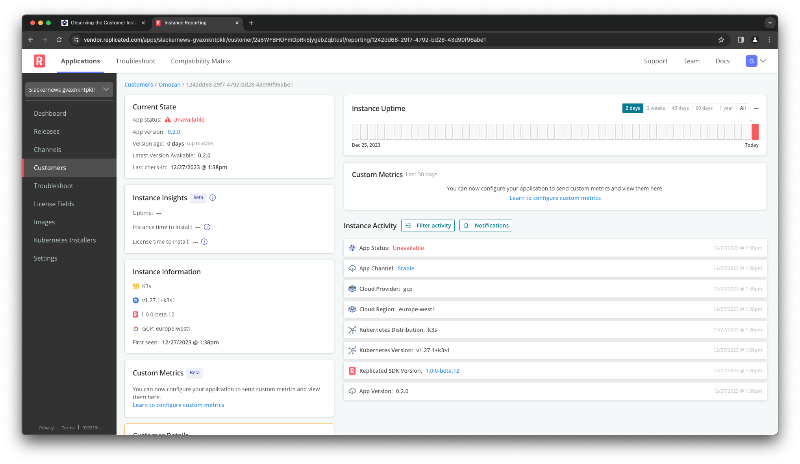

Now that we have installed the application the way your customer
will, let's turn back to your perspective on what is going on
in their environment. We are going to log back into the Vendor
Portal in order to check the status of Omozan's instance.

Logging Into the Vendor Portal
==============================

We are going to return to the Replicated Vendor Portal to look
at the details on the current instance. Click on the Vendor
Portal tab to open up a new browser window and access the
portal. You may still be logged in. If not, log in with these
credentials:

Username: `[[ Instruqt-Var key="USERNAME" hostname="shell" ]]` 
Password: `[[ Instruqt-Var key="PASSWORD" hostname="shell" ]]`

Observing the Customer Instance
===============================

Instance Insights is a feature of the Replicated Vendor Portal
that provides you detailed insights into the experience your
customer is having with your applications. It is automatically
available when you include the Replicated SDK in your application.
The SDK sends telemetry events to the Vendor Portal to reflect
details about the application, the cluster it's running on, and
current health indicators.

We are going to go to the Instance Insights page for the instance we
just installed by navigating from the Vendor Portal landing page.
If you look at the _Stable_ channel, you will see there is one
active customer indicated.

If you click on "Details" you will be brought to a filtered view of
the Customers page showing all customers that are entitled to releases
on the _Stable_ channel. You will see the customer "Omozan" there, and
you will notice it shows one instance. The specific status of the
instance will depend on how quickly you navigated to the page after
starting the install.

Click on the name "Omozon" to see more information about Omozan
and their instances, then click on the instance identifier
for the one instance you see.

Reviewing Instance Activity
===========================

Once you have clicked on the instance identifier, you will see more
details about that instance, including recent activity. The instance
will be in either a _Ready_ state, a _Missing_ state, or an
_Unavailable_ state depending on the progress of your installation.
If it is not yet ready, watch for a minute or two and
you will see the status change to "Ready."

🏁 Finish
=========

Once Omozan's instance is in the _Ready_ state, you have successfully
distributed the application to the customer "Omozan" using the
Replicated Platform.
