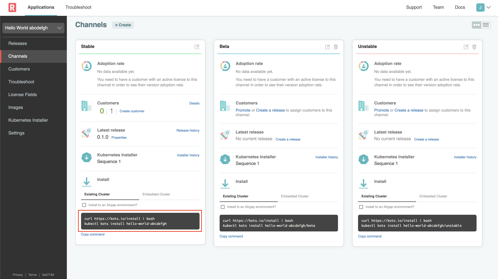

🚀 Let's start
==============

### 1. Vendor Portal login

To access the Vendor Portal, you will need your username and password. The lab
setup has configured your account the following credentials:

```

Username: `[[ Instruqt-Var key="USERNAME" hostname="kubernetes-vm" ]]`<br/>
Password: `[[ Instruqt-Var key="PASSWORD" hostname="kubernetes-vm" ]]`
```

Now that you have the credentials, you can login into the Vendor tab and you should land on the Channels. Channels allow you to manage who has access to which releases of your application.

### 2. Getting the install command

Once you're logged in, go to `Channels > Stable` and grab the existing cluster install command.



We will use this command in the next challenge to kick off the installation process.

### 3. Download a Customer License

A customer license (downloadable as a `.yaml` file) is required to install any KOTS application.
To create a customer license, go to `Customers > Hola Customer` by selecting the "Customers" link on the left in the Vendor Portal. Customers for each lab have already been created for you.


You can view the customer details by clicking the row.
For this Hello World exercise we'll use `Hola Customer`.
You'll notice that the customer is assigned to the "Stable" channel on the right hand side, and the Customer Type is set to "Development".
When you've reviewed these, you can click the "Download License" link in the top right corner.


This will download the file with your customer name and a `.yaml` extension.
This is the license file a customer would need to install your application.
