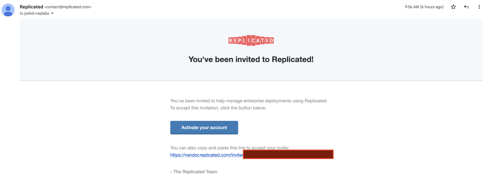
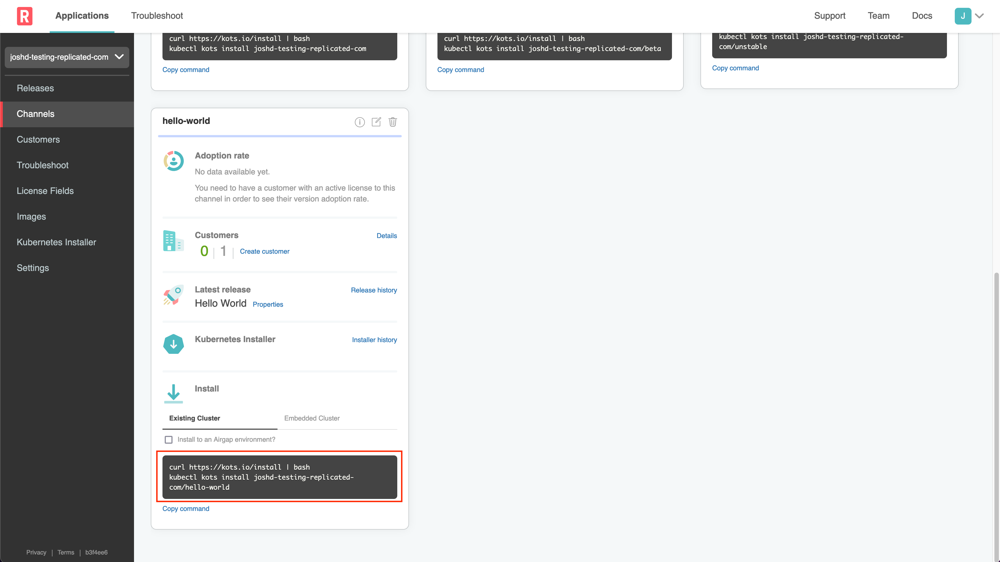
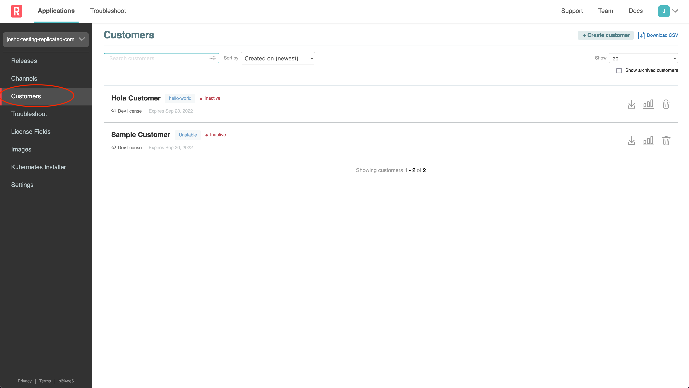
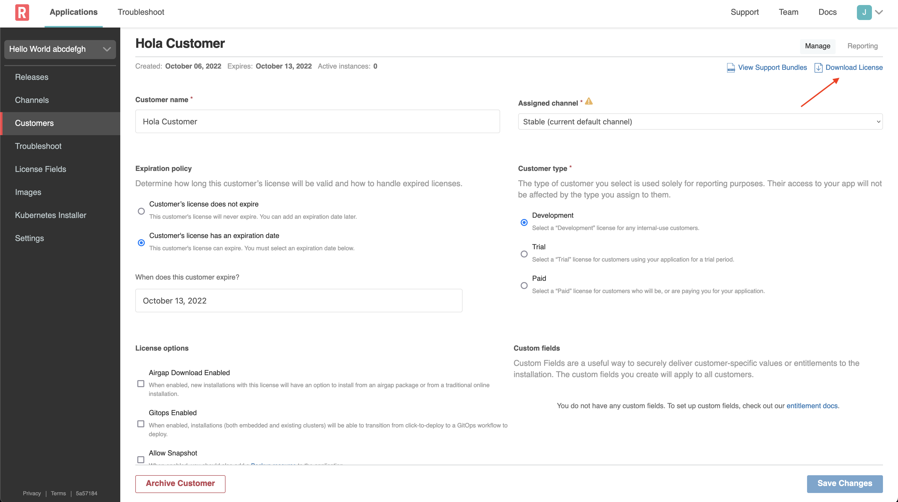

🚀 Let's start
==============

You should have received an invite via email to log into https://vendor.replicated.com -- you'll want to accept this invite and set your password.

**Important Note:** It is important to logout of any existing session in the Replicated vendor portal so that when clicking on the Labs Account invitation email link it takes you to a specific new registration page where you enter your name and password details.  If you get a login screen then this is probably the issue.

The email you received should look like the one below.

Click on the link, and set your password:

### 1. Getting the install command

Once you're logged in, go to `Channels > HelloWorld` and grab the existing cluster install command.

### 2. Download a Customer License

A customer license (downloadable as a `.yaml` file) is required to install any KOTS application.
To create a customer license, go to `Customers > Hola Customer` by selecting the "Customers" link on the left in the Vendor Portal. Customers for each lab have already been created for you.

You can view the customer details by clicking the row.
For this Hello World exercise we'll use `Hola Customer`.
You'll notice that the customer is assigned to the the "HelloWorld" channel on the right hand side, and the Customer Type is set to "Development".
When you've reviewed these, you can click the "Download License" link in the top right corner.

This will download the file with your customer name and a `.yaml` extension.
This is the license file a customer would need to install your application.
