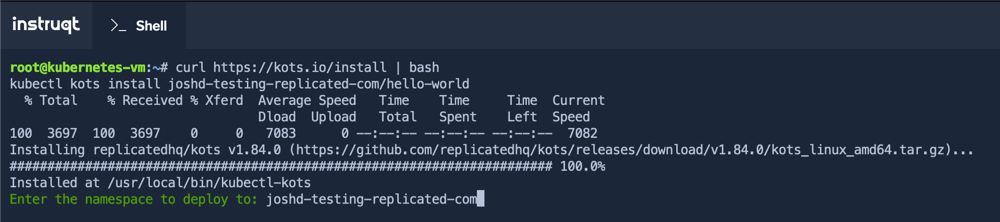
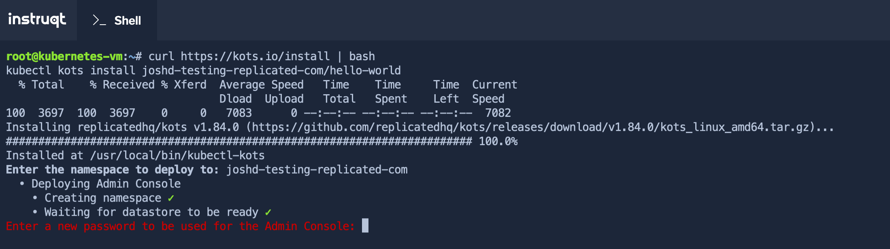
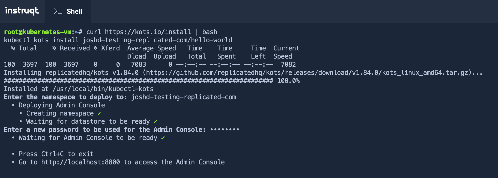

💡 Install kots
================

In the previous challenge you already copied the installation command for an existing cluster. It looked like:

```bash
curl https://kots.io/install | bash
kubectl kots install [[ Instruqt-Var key="REPLICATED_APP" hostname="kubernetes-vm" ]]
```

If you don't have the command anymore, you can always go back to the `Vendor` tab and copy it from `Channels > Stable` (the existing cluster install command).

Run this command in the `Shell` tab. When asked for the `namespace`, you can just press enter and use the one suggested:



The installation will take a couple minutes, and ask to provide a secure password. Remember it as it will be needed in the next Challenge.



Once finished you will see the following output:




Feel free to press `Ctrl+C` and press **Check** to continue to the next challenge.
