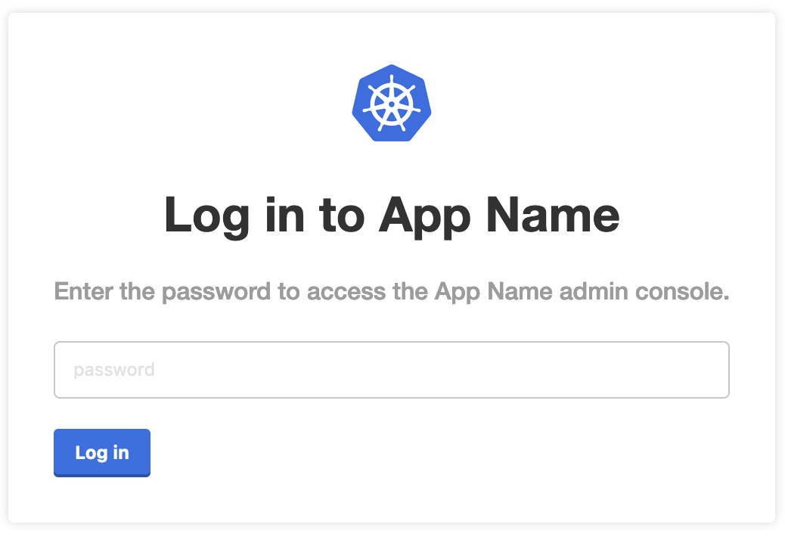
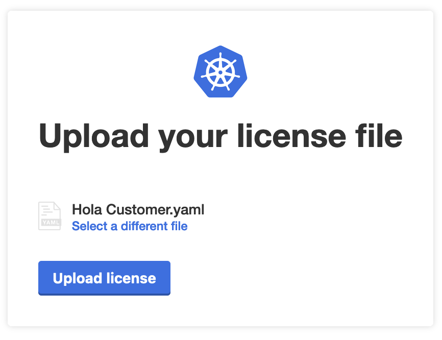
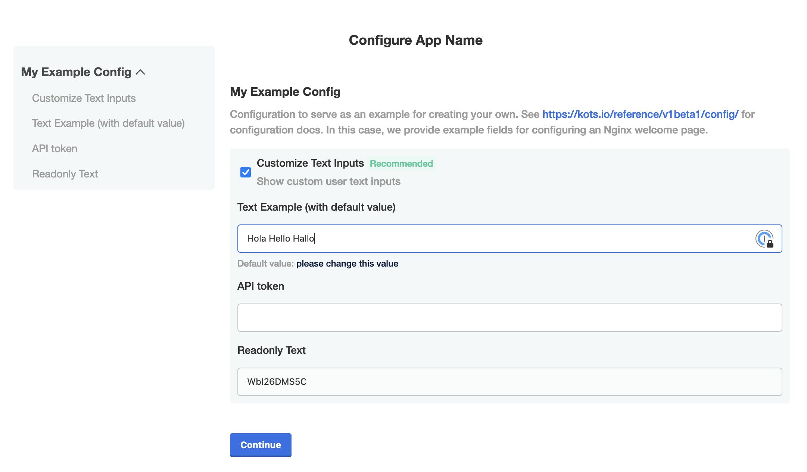
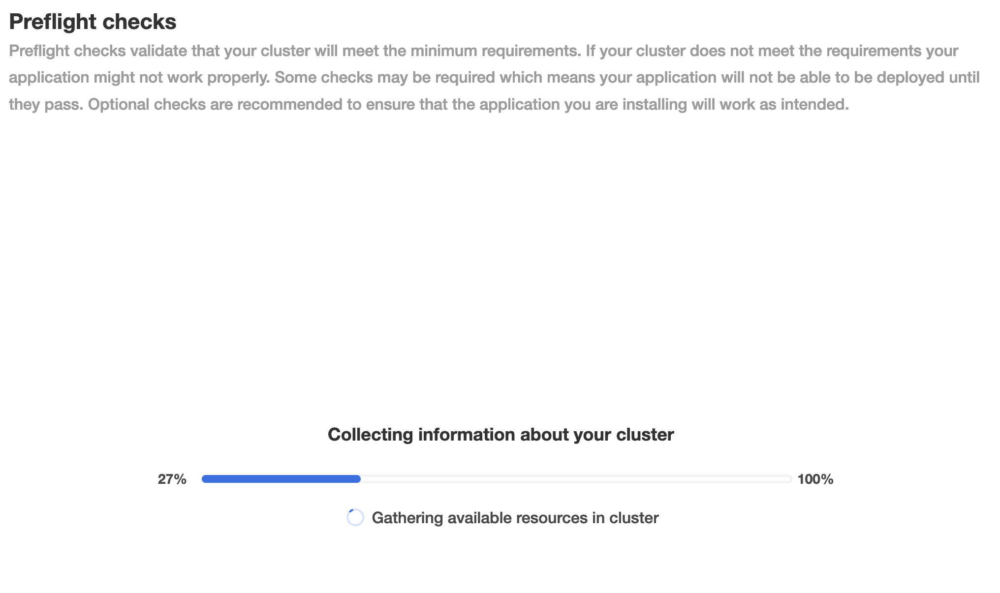
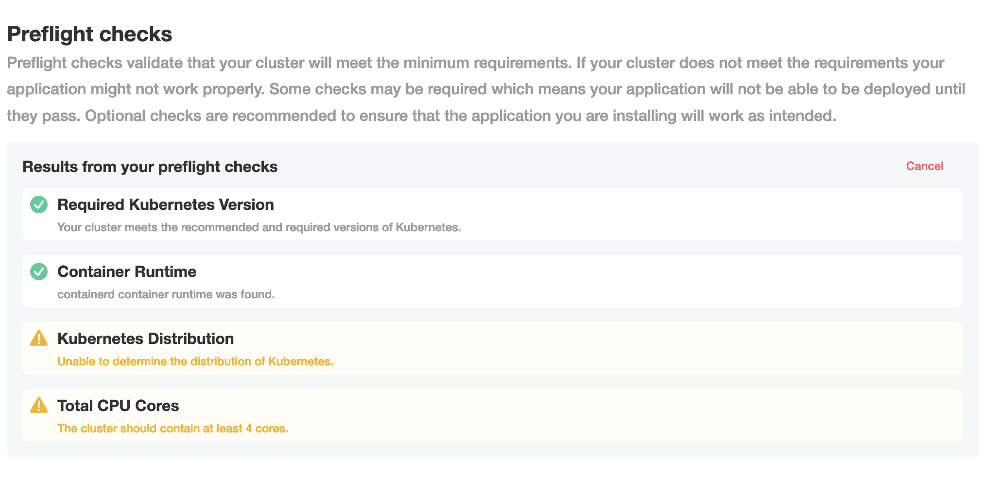
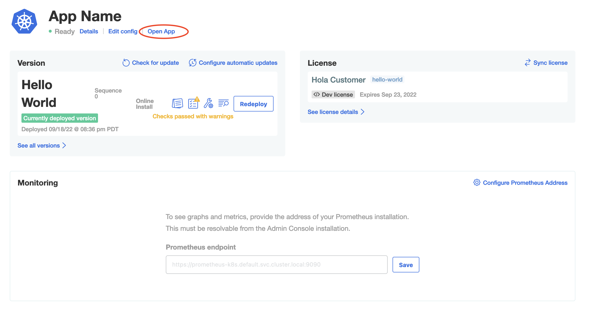

👋 Install Hello World
===============

## Step 01

Go to the Application Installer tab, and login using the password you used in the previous step.

## Step 02

Upload the license for the `Hola Customer` you downloaded in Challenge #2

## Step 03

Customize the hello world application by adding some text examples like below:

## Step 04

Click `Continue` and watch the Preflights run. These preflights will validate the application environment.

Once the preflights are finished, you can check the results which will look like below

For now we will ignore the warnings and click `Continue`.

## Step 05

Once you clicked on `Continue`, the Application Installer will deploy the Hello World Application.

If you want to check the "Hello World", you can do so by clicking on `Open App`

🏁 Finish
=========

If you've viewed the Hello World app, click **Check** to finish this track.
