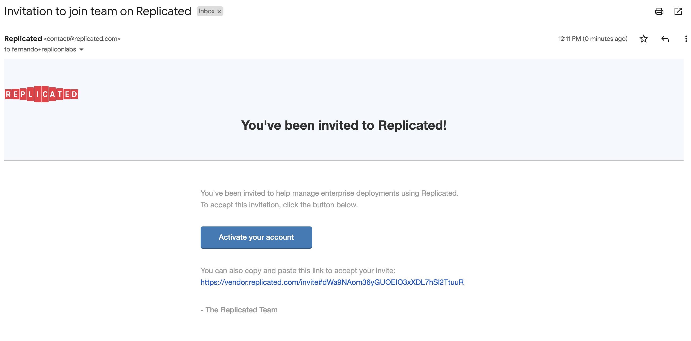
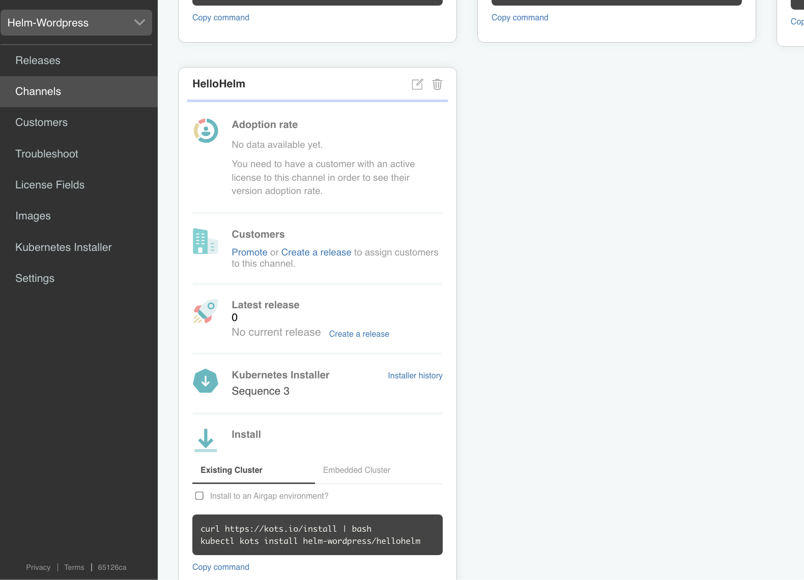
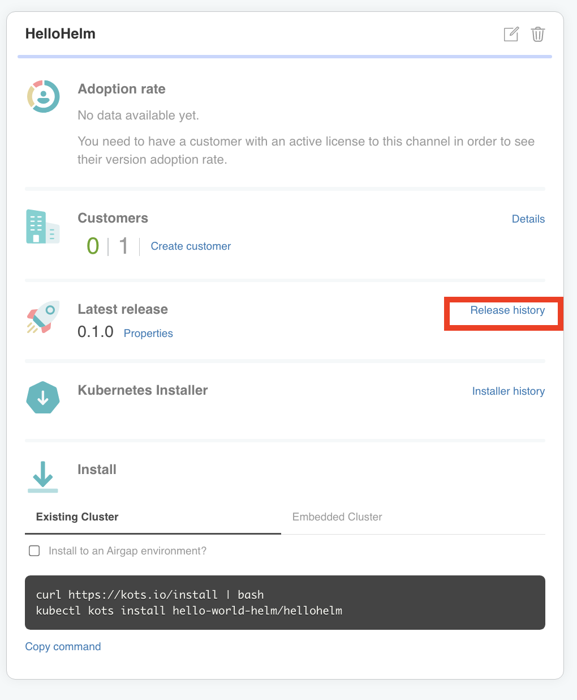
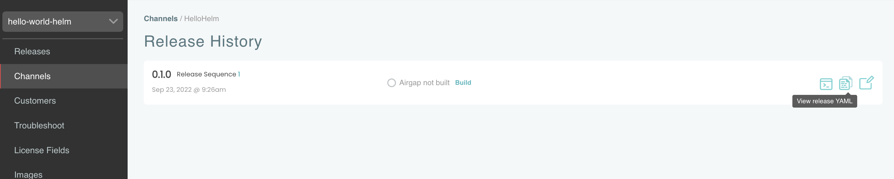
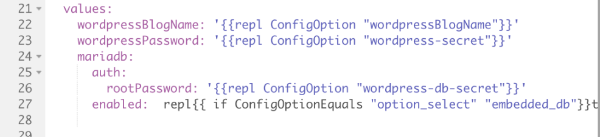

🚀 Let's start
==============

### 1. Check Your Email! ###

You should have received an invite via email to log into https://vendor.replicated.com -- you'll want to accept this invite and set your password.

**Important Note:** It is important to logout of any existing session in the Replicated vendor portal so that when clicking on the Labs Account invitation email link it takes you to a specific new registration page where you enter your name and password details.  If you get a login screen then this is probably the issue.

The email should look like this:

</img>

Once you click on the button, it should open a browser to a page similar to this:

</img>

Fill in the rest of the form and click on the **Create Account** button to get started.

Once you have created your account you should land on the Channels. Channels allow you to mange who has access to the which releases of your application.

### 2. Review the Application

The default channels are `Stable`, `Beta` and `Unstable`. For this lab we have created a new channel `HelloHelm` and you may need to scroll down to see it, depending on your screen resolution.

</img>

On that channel card, click on **Release history** to get the list of releases. Here you can see all of the releases that have been promoted to this channel.

</img>

We want to view the contents of the release, so to do that click on the icon as shown below:

</img>

You will see a file navigator similar to the one shown below. This view shows you the content of the current release. As you can see there are some files above the line and files below it. The files above are files used to configure some of the Replicated features. The files below are the ones needed to deploy the applicaiton, which in our case is Wordpress.

As you can see we are using the Wordpress Helm Chart, and in this view, the top level **Chart.yaml** and **Values.yaml** file are exposed. The **wordpress.yaml** is a file that declares how Replicated will manage the Chart. For example, you can override the default values, set up rules for optional charts and more.

**Managing Values**

When installing from a Helm Chart, there are scenarios where the default values need to be overriden or preset for a given customer. Replicated allows map the values in the **Values.yaml** file with values that the end user can enter in a config UI or can also come from a Replicated License. Below is a screenshot of the **wordpress.yaml** file with some value overrides:

</img>

Note that for some values, teh value is not a hard coded value, rather it has something like `repl{{ ConfigOption ... }}` . This templating that allows you map a field

**kots-app.yaml** This is a Replicated manifest that you can use to do things like configuring the icon, the application name, which ports to maybe exposse for the application UI, etc...

**kots-config.yaml**

