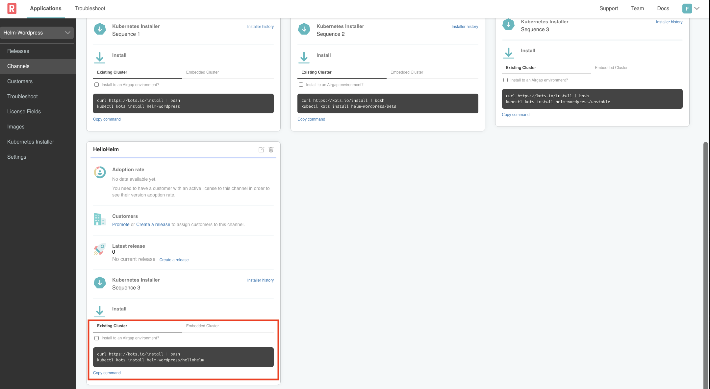
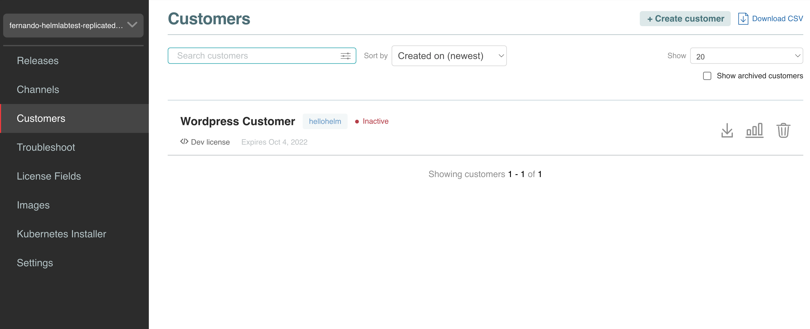
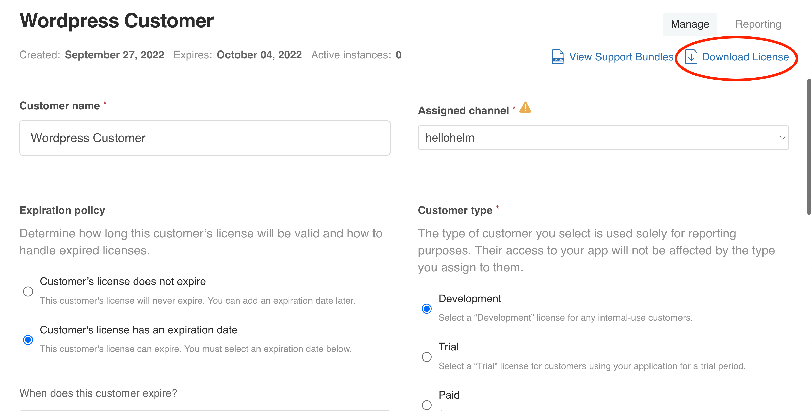

🚀 Let's start
==============

### 1. Vendor Portal login

On the **Vendor** tab, login to the Vendor Portal using the credentials below.

Username: `[[ Instruqt-Var key="USERNAME" hostname="kubernetes-vm" ]]` 
Password: `[[ Instruqt-Var key="PASSWORD" hostname="kubernetes-vm" ]]`

You will land on the Release Channels page showing the release channels for the Wordpress application. Channels allow you to manage who has access to which releases of your application.

### 2. Review the Application

The default channels are `Stable`, `Beta` and `Unstable`.

On the Stable channel card, click on **Release history** to get the list of releases. Here you can see all of the releases that have been promoted to this channel.

</img>

We want to view the contents of the latest release, so to do that click on the **View Release YAML** icon as shown below:

</img>

You will see a file navigator similar to the one shown below. This view shows you the content of the current release. As you can see there are some files above the line and files below it. The files above are files used to configure some of the Replicated features. The files below are the ones needed to deploy the application, which in our case is Wordpress.

</img>

As you can see we are using the Wordpress Helm Chart, and in this view, the top level **Chart.yaml** and **Values.yaml** file are exposed. The **wordpress.yaml** is a file that declares how Replicated will manage the Chart. For example, you can override the default values, set up rules for optional charts and more.

**Managing Values**

When installing from a Helm Chart, there are scenarios where the default values need to be overridden or preset for a given customer. With Replicated, you can map the values in the **Values.yaml** file with values that an end user can enter in a config UI or from a Replicated License file. Below is a screenshot of the **wordpress.yaml** file with some value overrides:

</img>

Note that for some values, the value is not a hard coded value, rather it has something like `repl{{ ConfigOption ... }}`. Replicated supports [templating](https://docs.replicated.com/vendor/packaging-template-functions) which is how you can dynamically assign values.

## 3. Copy Install Command

Go back to **Channels** and go to the `Stable` channel. On the bottom of the channel card, select to copy the install command for `Existing Cluster`

</img>

## 4. Download Customer File

A customer license (downloadable as a `.yaml` file) is required to install any KOTS application.
To create a customer license, go to `Customers > Wordpress Customer` by selecting the "Customers" link on the left in the Vendor Portal.

</img>

You can view the customer details by clicking the row.
For this Hello World exercise we'll use `Wordpress Customer`.
You'll notice that the customer is assigned to the the "Stable" channel on the right hand side, and the Customer Type is set to "Development".
When you've reviewed these, you can click the "Download License" link in the top right corner.

</img>

This will download the file with your customer name and a `.yaml` extension.
This is the license file a customer would need to install your application.
