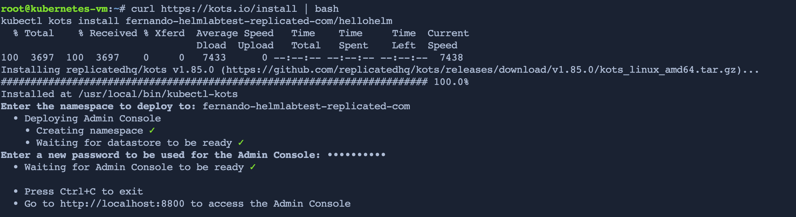

 Install kots
================

In the previous challenge you already copied the installation command for an existing cluster:

```bash
curl https://kots.io/install | bash
kubectl kots install [YOUR-APP-NAME]
```

Run this command in the `Shell` tab. When asked for the `namespace`, you can just press enter and use the one suggested.


The installation will take a couple minutes, and ask to provide a secure password. Remember it as it will be needed in the next Challenge.


Once finished you will see the following output:

<p align="center"></img></p>


Feel free to press `Ctrl+C` and press **Check** to continue to the next challenge.
