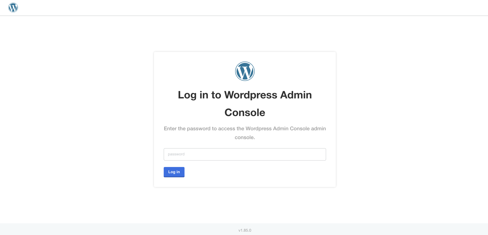
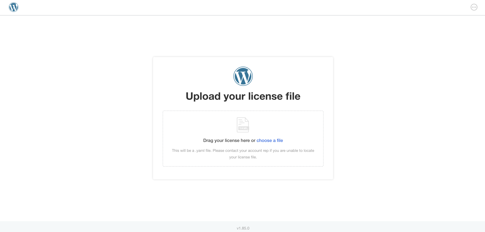
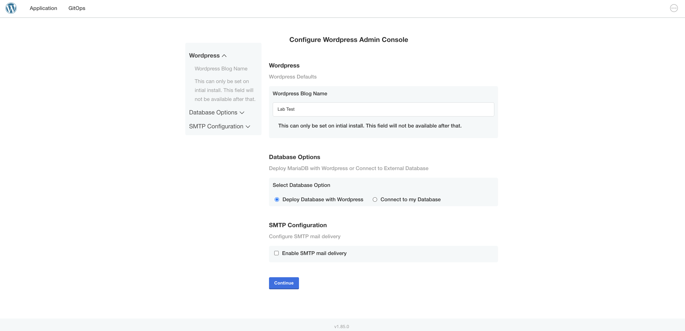
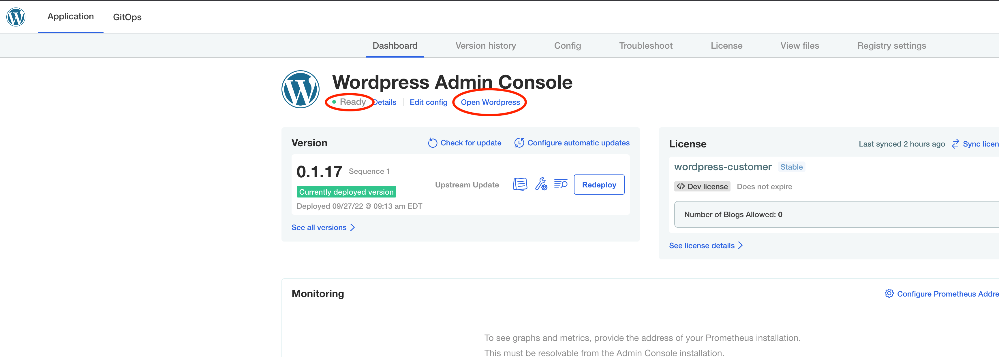
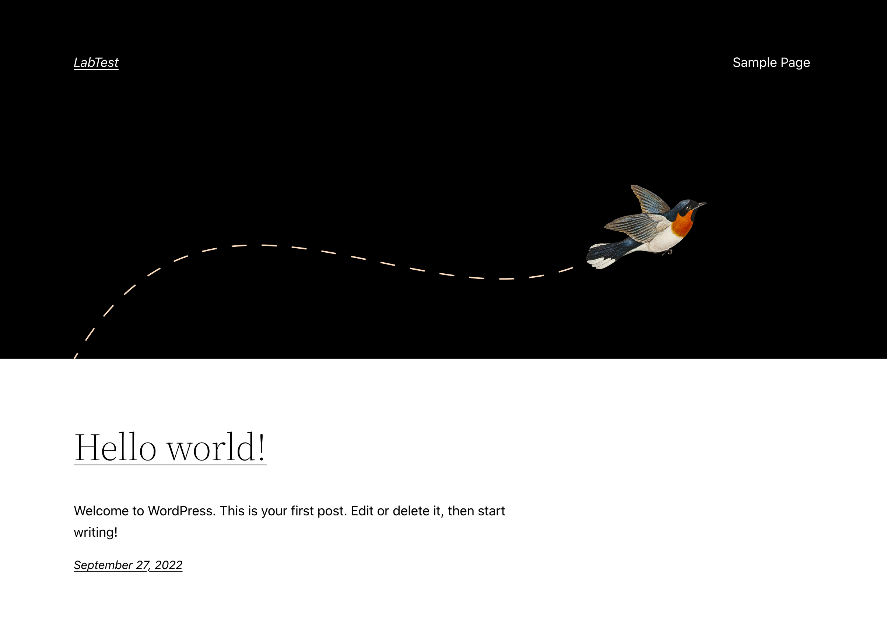

## Step 01

Go to the Application Installer tab, and login using the password you used in the previous step.

</img>

## Step 02

Upload the license for the `Helm Customer` you downloaded in Challenge #2

</im>

## Step 03

Set the initial blog name in Wordpress in the text field as shown below.

</img>

## Step 04

Once you click on `Continue`, the Application Installer will deploy the Wordpress Application.

If you want to check the Wordpress App, wait for the Status Informers to show `Ready` and then click on the `Open Wordpress` link.

</img>

It will open a new tab and you should see something similar like the screenshot below:

</img>

🏁 Finish
=========

If you've viewed the initial blog in Wordpress, congratulations! You've deployed your first application using the Replicated Application Installer. You can click **Check** to finish this track.
