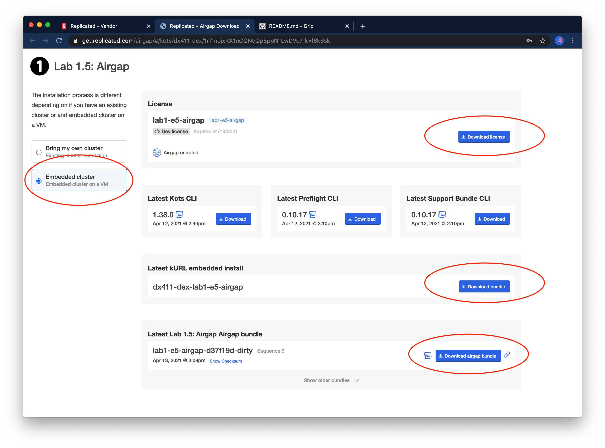

## Moving Assets into place

Our next step is to collect the assets we need for an Air Gap installation:

1. A license with the Air Gap entitlement enabled
2. An Air Gap bundle containing the kURL cluster components
3. An Air Gap bundle containing the application components

(2) and (3) are separate artifacts to cut down on bundle size during upgrade scenarios where only the application version
is changing and no changes are needed to the underlying cluster.


#### Starting the kURL Bundle Download
From your cli run the command below and record the `AIRGAP` section output.

```
replicated channel inspect lab05-airgap
```
Example Output:

```bash
❯ replicated channel inspect lab05-airgap
ID:             1wyFvAQANNcga1zkRoMIPpQpb9q
NAME:           lab05-airgap
DESCRIPTION:
RELEASE:        1
VERSION:        0.0.1
EXISTING:

    curl -fsSL https://kots.io/install | bash
    kubectl kots install lab05-airgap

EMBEDDED:

    curl -fsSL https://k8s.kurl.sh/lab05-airgap | sudo bash

AIRGAP:

    curl -fSL -o lab05-airgap.tar.gz https://k8s.kurl.sh/bundle/lab05-airgap.tar.gz
    # ... scp or sneakernet lab05-airgap.tar.gz to airgapped machine, then
    tar xvf lab05-airgap.tar.gz
    sudo bash ./install.sh airgap
```


Now, go to the JumpStation terminal and download the kurl bundle. Replace [URL] with the URL from the `AIRGAP` output that you recorded in the previous step.

```text
curl -o kurlbundle.tar.gz [URL]
```

This will take several minutes, leave this running and proceed to the next step, we'll come back in a few minutes.

#### Building an Airgap Release

By default, only the Stable and Beta channels will automatically build Air Gap bundles

- manually build
- set channel to auto build

For a production application, Air Gap releases will be built automatically on the Stable channel, so this won't
be necessary.

In this case, since we're working off the `lab05-airgap` channel, you'll want to enable Air Gap builds on that channel.

You can check the build status by navigating to the "Release History" for the channel at https://vendor.replicated.com.


You can build invividual bundles on the Release History page, but you'll likely want to edit the channel and enable "build all releases for this channel".


Now you should see all the bundles building or built on the release history page:


#### Enabling Airgap for a customer

The first step will be to enable Air Gap for the `lab5` customer:


#### Download Airgap Assets
After saving the customer, scroll to the bottom of the page to the `Download Portal` section.


Generate a new password and save it somewhere in your notes.
Next, click the link to open the download portal.
This is a link you would usually send to your customer, so from here on we'll be wearing our "end user" hat.


Navigate to the "embedded cluster" option and review the three downloadable assets.



Download the license file, but **don't download the kURL bundle** -- this is the download we already started on the server.

You'll also want to download the other bundle `Latest Lab 1.5: Airgap Bundle` to your workstation.

From your jumpbox (Instruqt browser tab), check that the download has finished, so you can copy it to the Air Gap server. If you have not started the download, see the [Starting the kURL Bundle Download](#starting-the-kurl-bundle-download) instructions in the previous step.

You can use the DNS name in this case, as described in [Instance Overview](#instance-overview).

```bash
scp kurlbundle.tar.gz airgap:/root
```

> **Note**: -- we use SCP via an SSH tunnel in this case, but the Air Gap methods in this lab also extend to
more locked down environments where e.g. physical media is required to move assets into the datacenter.

Now we'll SSH all the way to Air Gap node. If you still have a shell on your jump box, you can use the instance name.

```bash
ssh airgap
```

Once you're on the Air Gap node, untar the bundle and run the install script with the `airgap` flag.
kURL install flags are documented [in the kurl.sh docs](https://kurl.sh/docs/install-with-kurl/advanced-options).

```shell
tar xvf kurlbundle.tar.gz
sudo bash install.sh airgap
```

At the end, you should see a `Installation Complete` message as shown below. Since the instance is Air Gap, we'll need to create a port forward to access the UI via the jumpstation.


Before proceding to the next step, copy the `kotsadm` password, and put it in your notes.