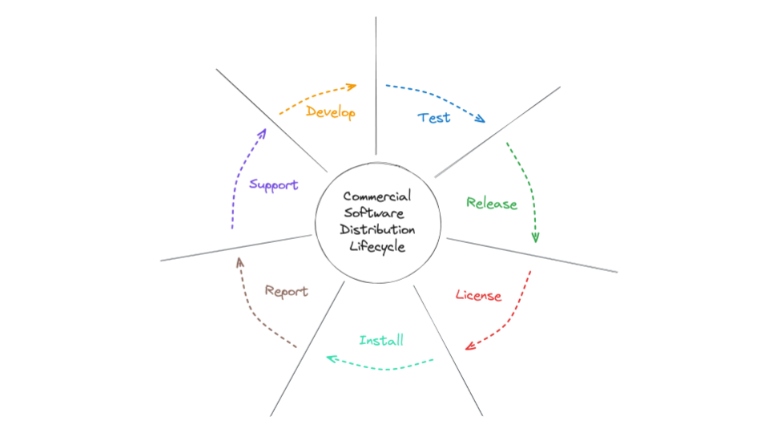
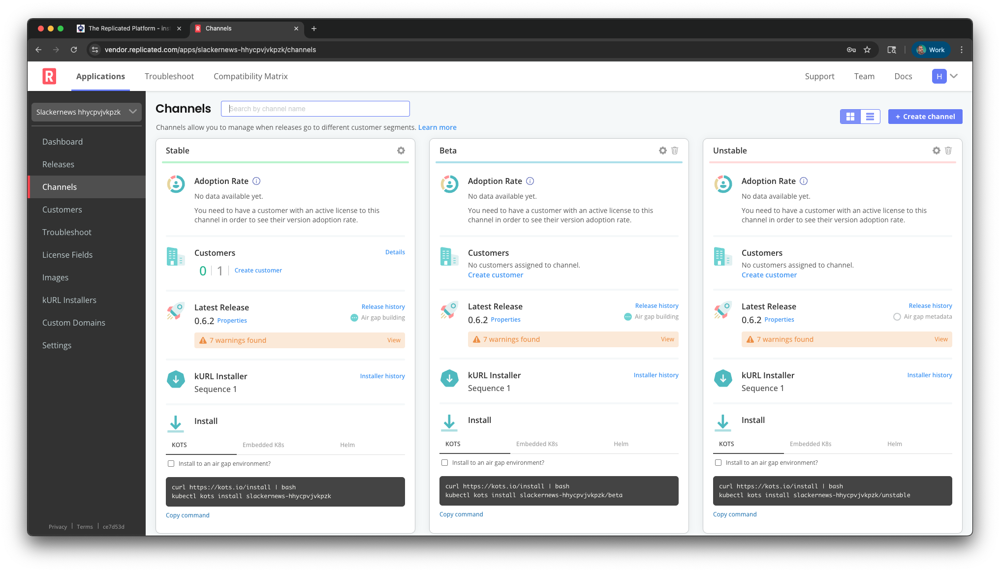
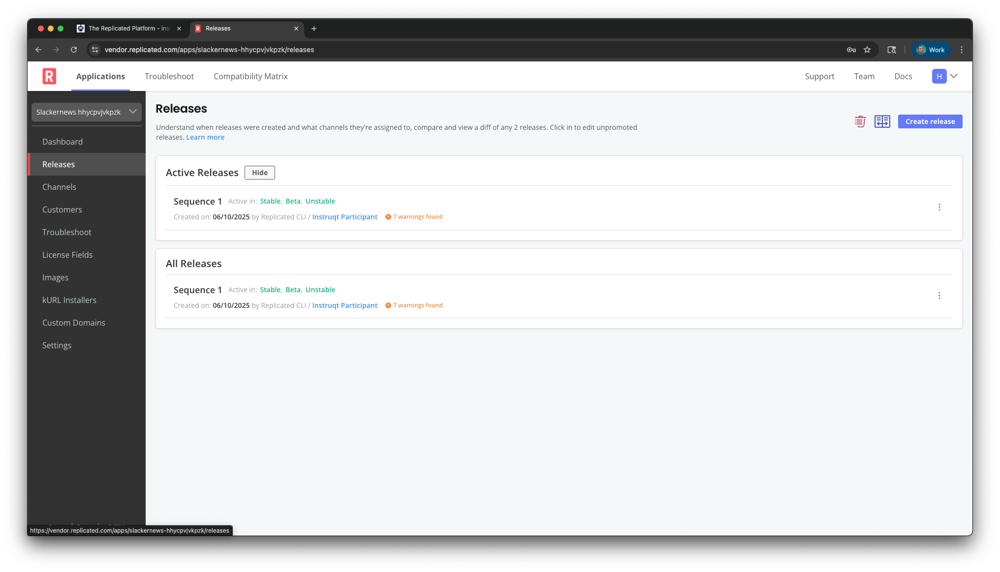
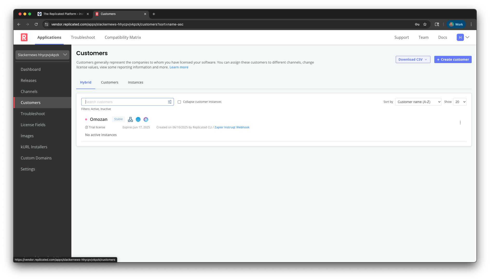
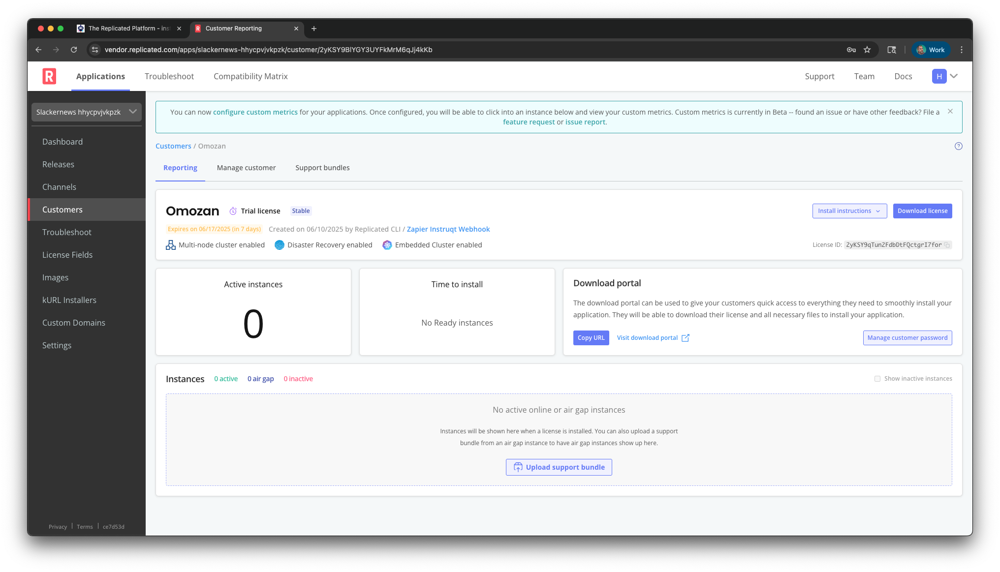
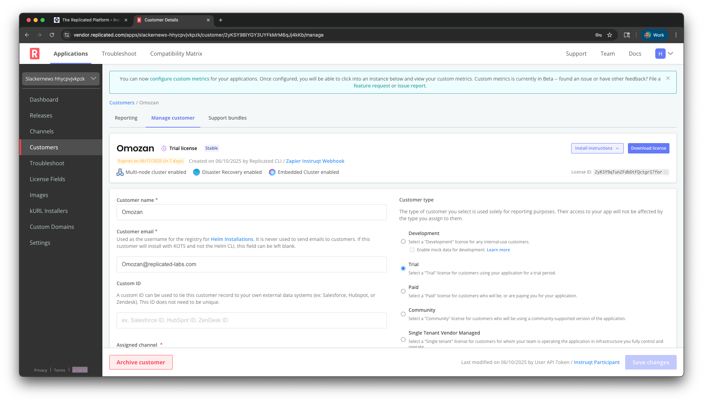

The Replicated Platform is a unified platform bringing together everything you
need to navigate your Commercial Software Distribution Lifecycle. You use the
platform to efficiently manage, test, install, support, and measure the
distribution of your app. The Replicated Vendor Portal provides the interfaces
you need to work with the Platform from the web, the command-line, and
anywhere you can invoke its APIs.

This lab will introduce you to the Replicated Platform through the Vendor
Portal. After briefly getting to know the Vendor Portal, you'll take the role of a
customer and install [SlackerNews](https://slackernews.io), an application
distributed with Replicated. From there, we'll show you how you'll work with
customers having a support issue, and how they'll install a fix.

Connecting to the Vendor Portal
===============================

Select the "Vendor Portal" tab and log in with the following credentials:

Username: `[[ Instruqt-Var key="USERNAME" hostname="shell" ]]` 
Password: `[[ Instruqt-Var key="PASSWORD" hostname="shell" ]]`

You'll land on the "Channels" page that shows the default release channels for
the Platform. Release channels connect releases of your software to the
customers who can install them. There are three default channels, though you
can create as many as you need. See the [Distributing Your Application with
Replicated](https://play.instruqt.com/replicated/tracks/distributing-with-replicated)
lab for more details.

The channels you see are for your current application. Many of the features of
the Replicated Platform are configured at the application level. Most software
vendors ship one application with Replicated, but the Platform is designed for
you to distribute multiple applications. In this lab, you only have access to
the SlackerNews application that's been configured for you.

Getting to Know the Platform
============================

Day to day, your work with the Platform will most often involve working with
customers and releases. Releases are the versions of your software that you're
distributing to customers and are promoted to channels to make them available.
Click "Releases" to see the releases for SlackerNews.

Customers are, well, customers. They're the people who will be downloading and
installing your software. Each customer is assigned to a release channel and
entitled to the stream of releases that channel provides. Customers each have
a license, and you can manage entitlements for each license when you
configure the customer.

Click into the customer "Omozan" to see more details about them. Right now
they haven't downloaded and installed SlackerNews, so there's not much
information on that page. . Later on when we do an install, you'll see
information about the instance that was created.

Click "Manage Customer" to see the various options that can be configured for
Omozan. We're not going to focus too much on those for now, but notice
that licenses can have different types, they can expire, and you can enable
different platform features. You can also add custom entitlements like the
"Team Members" entitlement for SlackerNews. You can learn more about licenses
in the [Protecting Your Assets with the Replicated](https://play.instruqt.com/replicated/tracks/protecting-your-assets) lab.

We'll learn more about the Platform and the Vendor Portal as we move through the lab.
