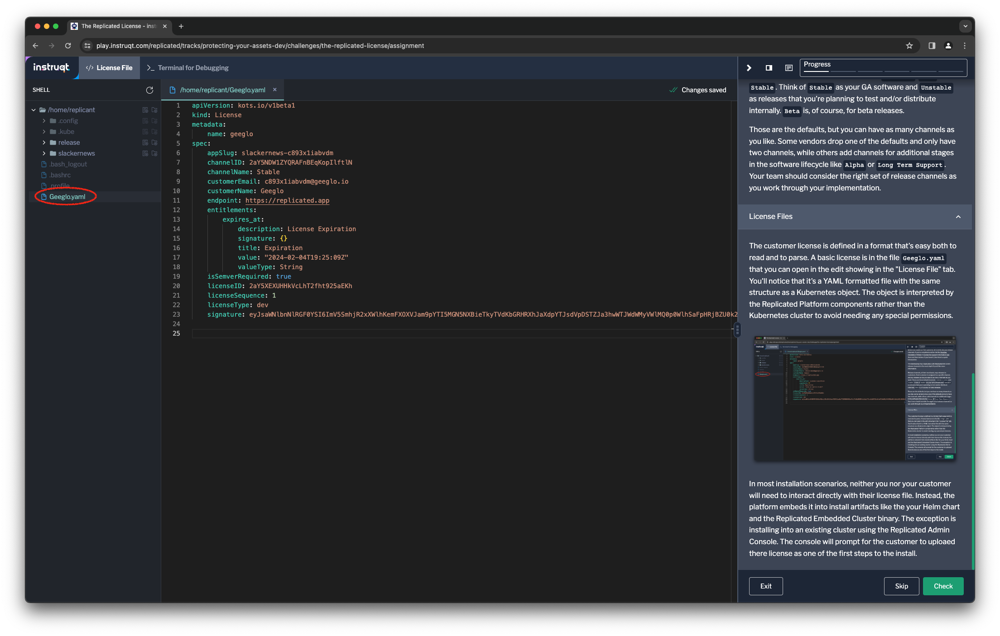

👋 Introduction
===============

The Replicated Platform provides a license that identifies each of your
customers and entitles them to install your software. These customer licenses
provide several default entitlements such as the type of licesnse and whether
(and when) it expries. Replicated provides the license file to you as a
downloadable asset and embeds it into your Helm chart when you include the
Replicated SDK. A digital signature confirms it hasn't been tampered with.

How License Work
================

Each customer you create for your application in the Replicated Vendor Portal
has a license associated with it. The main purpose of the license is to
identify which software the user is entitled to. The entitlement is determined
by two attribute of the license: the application and the release channel. The
platform knows the application the customer was created for, and you specify
the release channel when you create the customer. You can change the channel at
any time. We'll discuss release channels shortly.

The other core attribute of the license is it's type. Each customer license has
one of the following types:

* **Development:** The Development type can be used internally by the
  development team for testing and integration.
* **Trial:** The Trial type can be used for customers who are on 2-4 week
  trials of your software.
* **Paid:** The Paid type identifies the customer as a paying customer for
  which additional information can be provided.
* **Community:** The Community type is designed for a free or low cost version
  of your application. For more details about this type, see Community
  Licenses.

You can change the license type of an existing license. You'll most often do
this when a customer who has been trying your software decides to make a
purchase.

The other common features of all licenses are an expiration date and flags for
enabling several Replicated Platform features. License need not expire, and you
have full control over the expiration date that you set. Replicated features
may change over time and have sensible defaults based on your subscription.

Release Channels
================

Before we create our first customer, let's briefly discuss release channels.
If you've completed another lab like [Avoiding Installation
Pitfalls](https://play.instruqt.com/replicated/tracks/avoiding-installation-pitfalls)
or [Closing the Support Information
Gap](https://play.instruqt.com/replicated/tracks/closing-infromation-gap) then
met them before. If you haven't, then here's a quick introduction.

The [Distributing Your Application with
Replicated](https://play.instruqt.com/replicated/tracks/distributing-with-replicated)
lab covers release channels in the most depth if you'd like more information.

Release channels, at their most basic, map releases to customers. Each customer
is assigned to a specific channel, and any relasee can be provided to as many
channels as you want. There are three default channels: `Unstable`, `Beta`, and
`Stable`. Think of `Stable` as your GA software and `Unstable` as releases that
you're planning to test and/or distribute internally. `Beta` is, of course, for
beta releases.

Those are the defaults, but you can have as many channels as you like. Some
vendors drop one of the defaults and only have two channels, while others add
channels for additional stages in the software lifecycle like `Alpha` or `Long
Term Support`. Your team should consider the right set of release channels as
you work through your implementation.

License Files
=============

The customer license is defined in a format that's easy both to read and to
parse.  A basic license is in the file `Geeglo.yaml` that you can open in the
editor showing in the "License File" tab. You'll notice that it's a YAML
formatted file with the same structure as a Kubernetes object. The object is
interpreted by the Replicated Platform components rather than the Kubernetes
cluster to avoid needing any special permissions.

In most installation scenarios, neither you nor your customer will need to
interact directly with their license file. Instead, the platform embeds it into
install artifacts like the your Helm chart and the Replicated Embedded Cluster
binary. The exception is installing into an existing cluster using the
Replicated Admin Console. The console will prompt for the customer to uploaed
there license as one of the first steps to the install.
