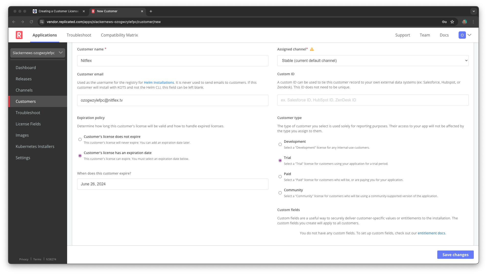

Creating a Customer License
===========================

Let's connect to the Replicated Vendor Portal and create a new customer. This
will also create their license. Click on the "Open External Window" button to
open a new browser window and access the portal. Log in with these credentials:

Username: `[[ Instruqt-Var key="USERNAME" hostname="shell" ]]` 
Password: `[[ Instruqt-Var key="PASSWORD" hostname="shell" ]]`

You'll land on the "Channels" page showing the default release channels and an
added channel for releases with long-term support.

To create a customer, select "Customers" from the menu on the left, and you'll
see your two existing customers "Omozan" and "Geeglo".

We're going to assume you're working with a new prospect named "Nitflex" and
create them in the portal. The platform also includes an
[API](https://replicated-vendor-api.readme.io/v3/reference/createapp) you can
use to automate customer creation as part of your existing onboarding workflow.
For the purpose of the lab, click the "+ Create Customer" button to create
"Nitflex" manually.

Enter the name "NitFlex" and assign them to the `Stable` channel. They've
trying your software for a year, so let's make sure we capture the expiration
date. We also need an email for them to login and install your Helm chart. Note
that we never use that email, it's your customer, not ours.

Expiration Date: `[[ Instruqt-Var key="LICENSE_EXPIRY" hostname="shell" ]]` 
Customer Email: `[[ Instruqt-Var key="CUSTOMER_EMAIL" hostname="shell" ]]`

You should also specify that they are a trial customer, so select the "Trial"
option for the customer type and save your changes. We're using a new prospect
trialing our software to set up later parts of the lab. The process will be
the same for a new paid customer with a longer expiration date and a "Paid"
license type.

Using the License
=================

The Vendor Portal generated a license for your Nitflex customer and also
configured some credentials based on it. These credentials are for:

* The Replicated registry for accessing the Slackernews Helm chart
* Our proxy registry that protects your private images

Let's use the first set of credentials to look at how the license is embedded
into your Helm chart.

Click on "Helm install instructions" and you'll see a popup with a set of
instructions for this customer to install Slackernews. The first command is the
login command for the Helm registry.

Use the "Shell" tab in the lab to log into the registry. You'll need to copy
the command from the vendor portal in order to log in. after you login, you can
view the values for the Helm chart using `helm show values`:

`helm show values oci://registry.replicated.com/[[ Instruqt-Var key="REPLICATED_APP" hostname="shell" ]]/slackernews | less`

this will show you the default vales from the Helm chart. As you scroll through
the values, you'll see license information injected in two places. The entire
license file is injected as the `license` value for the `replicated` subchart,
and a few details from it are injected under `.globals.replicated`.

One of the global fields is particularly important. The value
`global.replicated.dockerconfigjson` has the required Docker configuration to
access private images using the proxy registry. You will use this value in your
Helm chart to give the cluster access to your private images.
