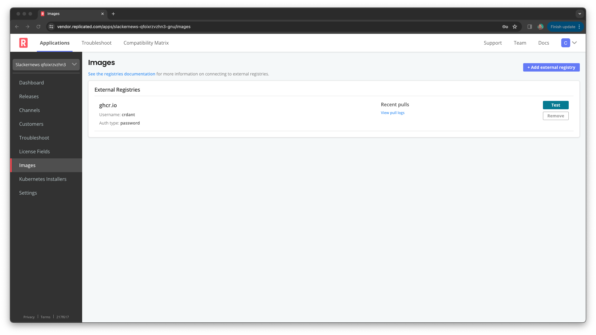
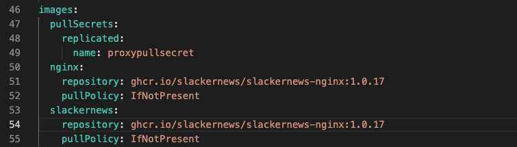
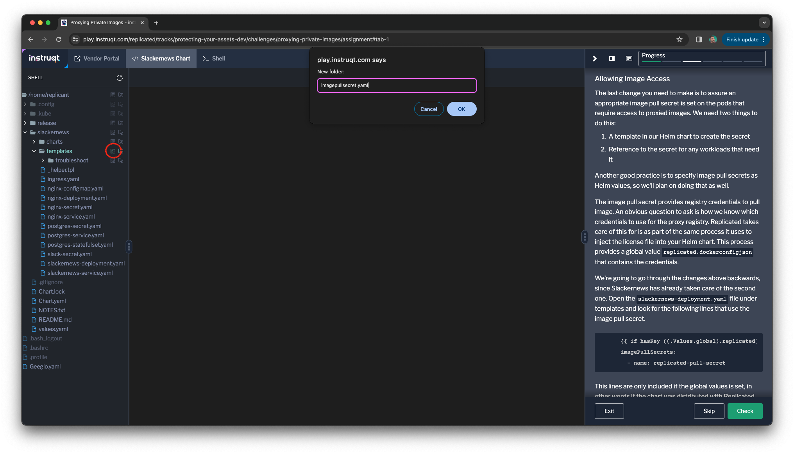

One of the core features of the Replicated Platform is it's proxy registry. The
proxy registry controls access to your images using the Replicated license
This relieves you of the burden of managing authentication and authorization
for the private images your application depends on. You provide Replicated with
access and we manage the rest.

Configuring a Private Registry
==============================

The first step in using the Replicated proxy registry is to provide access to
your private registry for the Replicated Vendor Portal. This has already been
done in the lab environment, so we're just going to review how it was set.

Log into the Vendor Portal with the following credentials:

Username: `[[ Instruqt-Var key="USERNAME" hostname="shell" ]]`<br/>
Password: `[[ Instruqt-Var key="PASSWORD" hostname="shell" ]]`

From the "Channels" page you landed on, select "Images" in the left-hand menu.
You'll land on a page that shows that the proxy is configured to pull private
images from the GitHub Container Registry.



You use the "+ Add external registry" button to add a private registry. We won't
be doing this in the lab environment since it's shared team.

Adding the Proxy to Your Chart
==============================

The next step to securing your images with the Replicated Platform is to use
the proxy to pull images. The Slackernews chart refers to its two images in
it's default values. We'll change those to refer to the Replicated proxy
registry.

Images tags in the proxy registry follow the following pattern:

```
$PROXY_REGISTRY_HOST/proxy/$APP_SLUG/$ORIGINAL_IMAGE_TAG
```

so you'll proxy the image `ghcr.io/slackernews/slackernews-web:1.0.17` as

```
proxy.replicated.com/proxy/[[ Instruqt-Var key="REPLICATED_APP" hostname="shell" ]]/ghcr.io/slackernews/slackernews-web:1.0.17
```

for your instance of Slackernews. Let's do that now.

### Updating Image References

Select the "Slackernews Chart" tab in Instruqt to edit the chart source files. Select the
file `values.yaml` and search for the image values.



Update the image values to use the proxied image for the main Slackernews
image

```
slackernews:
  repository: proxy.replicated.com/proxy/[[ Instruqt-Var key="REPLICATED_APP" hostname="shell" ]]/ghcr.io/slackernews/slackernews-web:1.0.17
```

Since we've made a change that will impact our users, let's also bump the
version number by editing `Chart.yaml` and setting a new chart version.

```
version: 0.5.0
```

The editor should have automatically saved your changes to both files.

Allowing Image Access
---------------------

The last change you need to make is to assure an appropriate image pull secret
is set on the pods that require access to proxied images. We need two things to
do this:

1. A template in our Helm chart to create the secret
2. Reference to the secret for any workloads that need it

Another good practice is to specify image pull secrets as Helm values, so we'll
plan on doing that as well.

The image pull secret provides registry credentials to pull images. An obvious
question to ask is how we know which credentials to use for the proxy registry.
Replicated takes care of this for us as part of the same process it uses to
inject the license file into your Helm chart. This process provides a global
value `replicated.dockerconfigjson` that contains the credentials.


We're going to go through the changes above backwards, since Slackernews has
already taken care of the second one. Open the `slackernews-deployment.yaml`
file under templates and look for the following lines that use the image pull
secret.

```
      {{ if hasKey ((.Values.global).replicated) "dockerconfigjson" }}
      imagePullSecrets:
        - name: replicated-pull-secret
```

This lines are only included if the global values is set, in other
words if the chart was distributed with Replicated. They reference a pull secret
named `replicated-pull-secret`. Let's create that secret.


Create a new file named `imagepullsecret.yaml` in the directory
`slackernews/templates` to include the secret in your chart.



If the new file wasn't opened automatically, click on the filename to create
it. Add the following content to the file. This template uses a guard condition
to assure it's only included if the injected credentials are available.

```
{{ if hasKey ((.Values.global).replicated) "dockerconfigjson" }}
apiVersion: v1
kind: Secret
metadata:
  name: replicated-pull-secret
type: kubernetes.io/dockerconfigjson
data:
  .dockerconfigjson: {{ .Values.global.replicated.dockerconfigjson }}
{{ end }}
```

The editor will automatically save your changes.

Distributing Your Changes
=========================

Let's release the changes so new installs will use the Replicated proxy
registry to access the Slackernews and NGINX images.

### Repackaging Your Chart

Since we changed the default values, we need to repackage our Helm chart.

```
helm package slackernews --destination ./release
```

You should now have a tarball in directory `release` in your
home directory named `slackernews-0.5.0.tgz`.

### Creating a New Replicated Release

To make the changes available, we need to release them on the Replicated
Platform. You'll need to be authenticated to the Replicated Platform to create
the new release. The simplest way to do that is by specifying an API token in
your shell environment. The lab setup has created a token for you.

```
export REPLICATED_API_TOKEN="[[ Instruqt-Var key="REPLICATED_API_TOKEN" hostname="shell" ]]"
```

The `replicated` command also needs to know which application to work with. You
can set it with a command flag or with an environment variable. Let's set the
variable to save some typing.

```
export REPLICATED_APP="[[ Instruqt-Var key="REPLICATED_APP" hostname="shell" ]]"
```

To create a new release, run the following command.

```
replicated release create --promote Unstable --chart ./release/slackernews-0.5.0.tgz --version 0.5.0  \
  --release-notes "Uses the Replicated proxy registry to pull images"
```

This will not only create the release but push it to the `Unstable` release
channel on the platform. It will also output a sequence number, which should be
`5` (if it's not, use the number in the output for the upcoming commands).
We're going to release our changes on three different release channels in this
lab:

* `Unstable`: use for internal releases that aren't ready for customers
* `Beta`: for releases that are ready for beta testing
* `Stable`: the general availability channel for all releases

These are the default three channels on the Replicated Platform. To learn more
about release channels, take a look at the [Distributing Your Application with
Replicated](https://play.instruqt.com/replicated/tracks/distributing-your-application-with-replicated)
lab.

### Promoting the Release

To make your release available to Beta and GA customers, promote it to those
channels.

```
replicated release promote 5 Beta --version 0.5.0 \
  --release-notes "Uses the Replicated proxy registry to pull images"
```

and then

```
replicated release promote 5 Stable --version 0.5.0 \
  --release-notes "Uses the Replicated proxy registry to pull images"
```

List your releases again to see that the release has been promoted.

```
replicated release ls
```

Your list of releases will now show four releases with the most recent release
available on the `Unstable`, `Beta`, and `Unstable` channels.

```
SEQUENCE    CREATED                 EDITED                  ACTIVE_CHANNELS
5           2024-04-22T17:19:17Z    0001-01-01T00:00:00Z    Stable,Beta,Unstable
4           2024-04-22T16:23:39Z    0001-01-01T00:00:00Z
3           2024-04-22T16:23:34Z    0001-01-01T00:00:00Z
2           2024-04-22T16:23:28Z    0001-01-01T00:00:00Z
1           2024-04-22T16:23:22Z    0001-01-01T00:00:00Z
```
