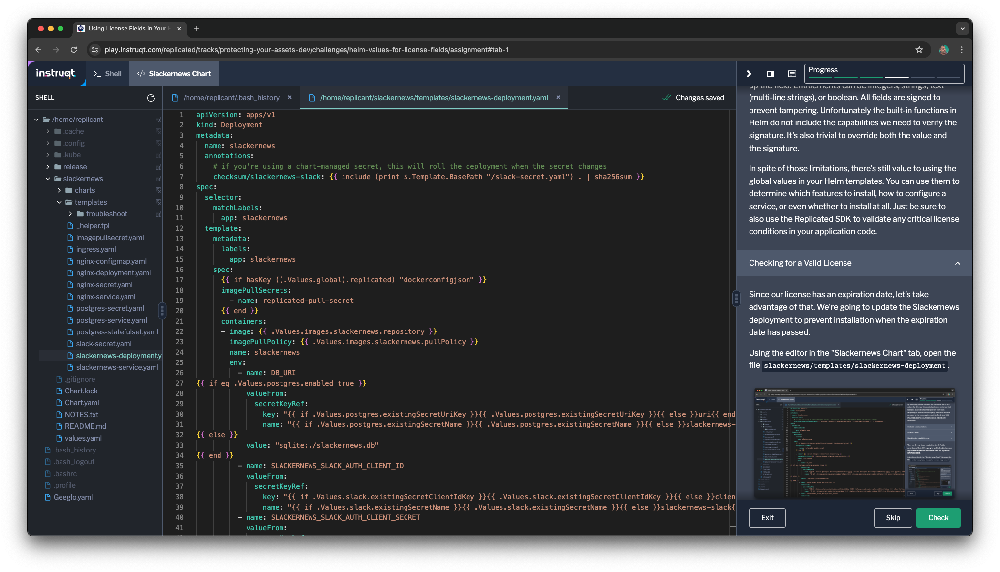

When you distribute your software with Replicated, Replicated injects the
license into your Helm chart in two ways:

1. As a value provided to the Replicated SDK to access via an in-cluster API
2. As global values that you can use in other components, including directly in
   your Helm templates.

We're going to take advantage of the second option to update the Slackernews
chart to block installation if the license is expired.

### A Word of Caution

The approach we're demonstrating here is easily defeated by overriding a Helm
value on the command-line or in a values file. It's meant to remind an honest
customer their license is expired rather than prevent them from tampering in
order to install anyway. Additional features provided by the proxy registry and
the Replicated SDK should be used to assure compliance and prevent tampering.

Available License Values
========================

The global values provided by the Replicated registry are the most valuable to
use within your Helm chart. Let's take a look at our Slackernews license to see
what other information about the license is available. Log in to the Replicated
registry as your Nitflex customer.

```
helm registry login [[ Instruqt-Var key="REGISTRY_HOST" hostname="shell" ]]  --username [[ Instruqt-Var key="REGISTRY_USERNAME" hostname="shell" ]]  --password [[ Instruqt-Var key="REGISTRY_PASSWORD" hostname="shell" ]]
```

You can then view the values using the `helm show values` command. The command
below will get the values and isolate the globals. For Slackernews, this
will only include the values injected by the Registry.

```
helm show values oci://[[ Instruqt-Var key="REGISTRY_HOST" hostname="shell"]]/[[ Instruqt-Var key="REPLICATED_APP" hostname="shell" ]]/slackernews | yq -P .global
```

You'll see something like the following (the encoded fields and expiration will probably be
different).

```
replicated:
  channelName: Unstable
  customerEmail: [[ Instruqt-Var key="CUSTOMER_EMAIL" hostname="shell" ]]
  customerName: Nitflex
  dockerconfigjson: eyJhdXRocyI6eyJpbWFnZXMuc2hvcnRyaWIuaW8iOnsiYXV0aCI6Ik1tWlhSMVEzZDBGck0yOVVTbGhWY25GVWFrWlFUV0k1ZVV4dE9qSm1WMGRVTjNkQmF6TnZWRXBZVlhKeFZHcEdVRTFpT1hsTWJRPT0ifSwicmVnaXN0cnkuc2hvcnRyaWIuaW8iOnsiYXV0aCI6Ik1tWlhSMVEzZDBGck0yOVVTbGhWY25GVWFrWlFUV0k1ZVV4dE9qSm1WMGRVTjNkQmF6TnZWRXBZVlhKeFZHcEdVRTFpT1hsTWJRPT0ifX19
  licenseFields:
    expires_at:
      name: expires_at
      title: Expiration
      description: License Expiration
      value: "2025-05-31T00:00:00Z"
      valueType: String
      signature:
        v1: UwI4/IL6JR4K5Tw7gapvfW6+zkirfMulbAxaQqkVIAZazip+pehegNRVhHEhbM9V9EibONGBbOazipb8aQeWO2hYoN0mcQOelUxVmK7U2GFP862tyorwAPwxMg+ZbAunUsoKP4/GT+Up5bhC8UN+NgyfZFzmCo3G6TK+2tbtI/tHXN0IwFacY3TyvryAfB+6qRGpsb0efb/Wl4DNmzuo/z9qE/1HbdG/TGUdq3SEmaH4iGBSeUZMHrHmW7/fHM8DDAABi7NW8v7HGEKI467yufKPcohzim8roLl2mdLsnLq2o3J5ovsAImgXUK3ac7ymHBLdT9WRg5cuBtAWNI5oaQ==
  licenseID: 2fWGT7wAk3oTJXUrqTjFPMb9yLm
  licenseType: prod
```

There are a few useful things in there:

* Which customer this license is for, including name, a unique license ID, and
  their email.
* The customer's credentials for the Replicated registry and proxy (we used
  this earlier).
* The type of license: `prod` (representing a paid license), `dev`, `trial`, or
  `community`.
* A set of fields representing license entitlements. We'll talk about those in
  the next section.

You can use this information to customize the user experience, guard components
(e.g. don't allow persistence with trials), and tailor the install to the
license entitlements.

License Fields
==============

The license has several fields that represent specific entitlements of this
license. In Helm, they're available as a dictionary
`global.replicated.licenseFields`. Each license field is represented as a YAML
dictionary. You can add your own fields to represent your unique entitlements.
We'll do that in the next part of the lab.

Every application will have at least one field in this dictionary for the license
expiration date. If the license does not expire, the value will be blank.

```
expires_at:
  name: expires_at
  title: Expiration
  description: License Expiration
  value: "2024-06-31T00:00:00Z"
  valueType: String
  signature:
    v1: UwI4/IL6JR4K5Tw7gapvfW6+zkirfMulbAxaQqkVIAZazip+pehegNRVhHEhbM9V9EibONGBbOazipb8aQeWO2hYoN0mcQOelUxVmK7U2GFP862tyorwAPwxMg+ZbAunUsoKP4/GT+Up5bhC8UN+NgyfZFzmCo3G6TK+2tbtI/tHXN0IwFacY3TyvryAfB+6qRGpsb0efb/Wl4DNmzuo/z9qE/1HbdG/TGUdq3SEmaH4iGBSeUZMHrHmW7/fHM8DDAABi7NW8v7HGEKI467yufKPcohzim8roLl2mdLsnLq2o3J5ovsAImgXUK3ac7ymHBLdT9WRg5cuBtAWNI5oaQ==
```

Other license fields will be displayed in the same format. The name,
title, description, and type are set when you set up the field. Entitlements
can be integers, strings, text (multi-line strings), or boolean. All fields are
signed to prevent tampering. Unfortunately the built-in functions in Helm do
not include the capabilities we need to verify the signature. It's also trivial
to override the value. Even if we had the functions, it's also easy to override
the signature.

In spite of those limitations, there's still value to using the global values
in your Helm templates. You can use them to determine which features to
install, how to configure a service, or even whether to install at all. Just be
sure to also use the Replicated SDK to validate any critical license conditions
in your application code.

Limiting a Trial License
========================

One of the values we have available is the type of license that we're using for
the install. Let's use that value to limit the functionality of a Slackernews
trial.

Using the editor in the "Slackernews Chart" tab, open the file
`slackernews/templates/slackernews-deployment.yaml`.



We're going to put a guard condition around the environment variables that
configure the database so that customers using a trial license can not use a
Postgres database for long-term persistence. There's already a check to see if
Postgres is enabled, so let's modify that using a helper template.

Find the line that says `{{ if eq .Values.postgres.enabled true }}` and
replace it with the following line

```
{{ if eq ( include "slackernews.persistence.enabled" .) "true" }}
```

The template we're including isn't defined, so let's add it to the
`_helpers.tpl` file with other helper templates. Open that file (also under
`slackernews/templates` and add the definition at the end.

```
{{- define "slackernews.persistence.enabled" -}}
{{- $licenseType := "prod" -}}
{{- $postgresEnabled := .Values.postgres.enabled -}}
{{- if hasKey .Values "global" -}}
  {{- if hasKey .Values.global "replicated" -}}
    {{- if hasKey .Values.global.replicated "licenseType" -}}
      {{- $licenseType = .Values.global.replicated.licenseType -}}
    {{- end -}}
  {{- end -}}
{{- end -}}
{{- and (ne $licenseType "trial") $postgresEnabled -}}
{{- end }}
```

With these additions, the template will not allow the use of the Postgres
database if the license is a trial license.

Trying it Out
=============

We've already configured Nitflex with a trial license, so let's try out our
changes. First we'll have to release them, then we'll try an install and see
what happens.

### Releasing the Updates Chart

First bump the version of the Helm chart. You can do it in the editor by
updating `Chart.yaml`, or use the following command.

```
yq -i '.version = "0.5.1"' slackernews/Chart.yaml
```

Package up the new version and release it to the three default release
channels.

```
helm package -u slackernews -d release
replicated release create --promote Unstable --chart release/slackernews-0.5.1.tgz --version 0.5.1  \
  --release-notes "Prevents persistence with trial licenses"
replicated release promote 6 Beta --version 0.5.1 \
  --release-notes "Prevents persistence with trial licenses"
replicated release promote 6 Stable --version 0.5.1 \
  --release-notes "Prevents persistence with trial licenses"
```

### Installing

Let's install the latest release as Nitflex, then check to see whether
persistence with Postgres was enabled. Since it's a good practice, let's make
sure we run our preflight checks before installing.

```
helm template oci://registry.replicated.com/[[ Instruqt-Var key="REPLICATED_APP" hostname="shell" ]]/slackernews \
  | kubectl preflight -
```

Your preflight checks should pass, so let's install. Postgres is enabled by the
default values in the chart, so we don't have to explicitly specify it on the
command line.

```
helm install --namespace slackernews --create-namespace  \
  slackernews \
  oci://registry.replicated.com/[[Instruqt-Var key="REPLICATED_APP" hostname="shell" ]]/slackernews \
  --set slackernews.domain=[[ Instruqt-Var key="SLACKERNEWS_DOMAIN" hostname="cluster" ]] \
  --set service.type=NodePort
```

Now let's check two things:

1. Did postgres get deployed?
2. Is Slackernews using it?

Let's run two commands to check this out.

```
# is postgres running
kubectl get pod -n slackernews -l app=postgres
```

You'll see that a postgres pod _is_ running. That's probably not what we
wanted, but it is what we did. The default behavior for the Slackernews chart
is to deploy Postgres and we didn't change that behavior.

What's important, though, is whether Slackernews is using it. This is where we
put our guard condition.

```
# is slackernews using it
kubectl get pod -n slackernews -l app=slackernews -o yaml | grep -A 1 DB_URI
```

You'll see output that show the DB_URI environment variable defined for the
Slackernews pod. Notice that it's using SQLlite and not Postgres.

```
- name: DB_URI
  value: sqlite:./slackernews.db
```

In a real application, you'd wouldn't want to consume resources running a
database that isn't being used. There are three manifests for Postgres in the
Slackernews chart you would want to update with the same check for whether
persistence is enabled. Let's skip that for now and move on to our own
entitlements.
