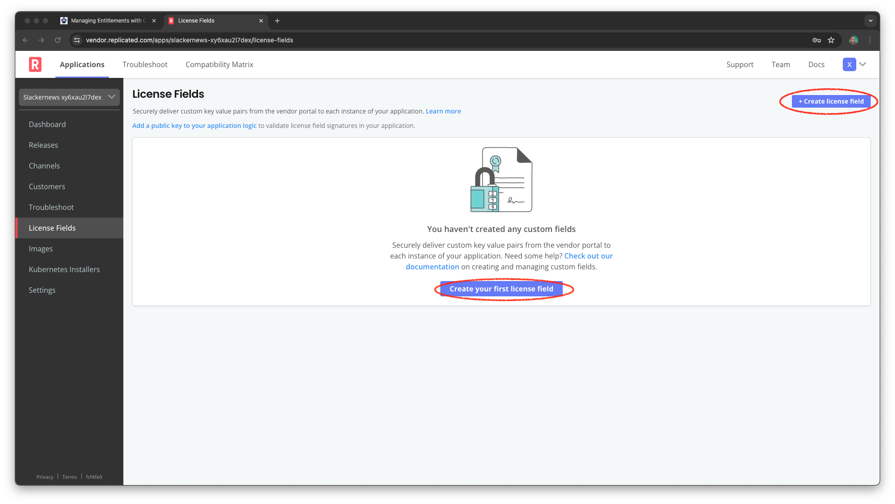
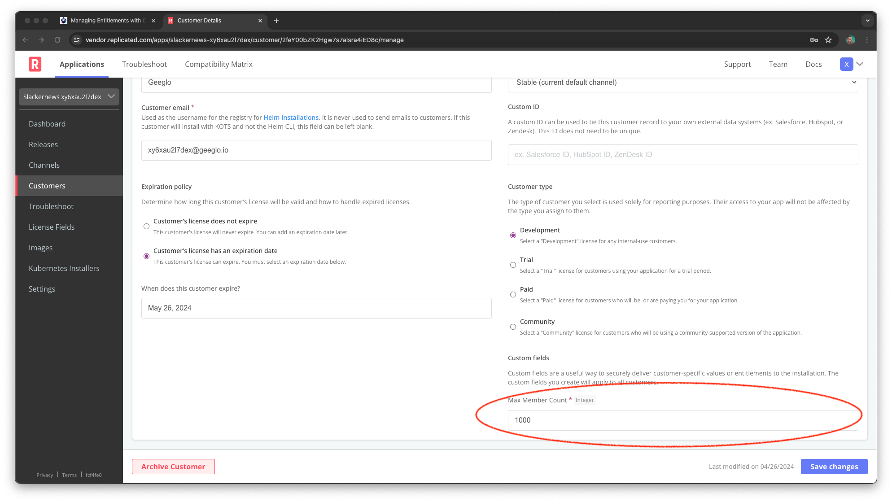

Each customer license has a set of attributes that supports common licensing
requirements. You can also define additional attributes that fit the needs of
your product. Let's add some fields to the Slackernews license to support
different commercial terms.

Entitlements and License Fields
===============================

The entitlements in your license are the ways you differentiate what each
customer can do with your product. Your product may be metered in certain ways,
or have different editions, or license different services it provides
independently. To capture these in the Replicated Platform we add them as new
fields on the license. In other words, license fields are the mechanism for
implementing your entitlements on the Replicated platform. Since the field
represents the entitlement, you may see the terms used almost interchangeably.

We learned a little bit about license fields in the previous sections of this
lab. We know they can be one of a handful of types and that they are included
in the Helm values the Replicated registry injects. We also know that they are
digitally signed to identify tampering. Let's learn a bit more about them
before we create new fields for the Slackernews license.

### License Fields

When you create a license field you set the following attributes:

<table>
  <thead>
    <tr>
      <th>Field</th>
      <th>Description</th>
    </tr>
  </thead>

  <tbody>
    <tr>
      <td>Field</td>
      <td>The name used to reference the field. This value cannot
      be changed.</td>
    </tr>
    <tr>
      <td>Title</td>
      <td>The display name for the field. This is how the field
      appears in the vendor portal and the admin console. You can
      change the title in the vendor portal.</td>
    </tr>
    <tr>
      <td>Type</td>
      <td>The field type. Supported formats include integer,
      string, text (multi-line string), and boolean values. This
      value cannot be changed.</td>
    </tr>
    <tr>
      <td>Default</td>
      <td>The default value for the field for both existing and
      new customers. It is a best practice to provide a default
      value when possible.</td>
    </tr>
    <tr>
      <td>Required</td>
      <td>If checked, this prevents the creation of customers
      unless this field is explicitly defined with a value.</td>
    </tr>
    <tr>
      <td>Hidden</td>
      <td>If checked, the field is not visible to your customer
      in the Replicated admin console. The field is still visible
      to you in the vendor portal. <strong>Note</strong>: The
      Hidden field is displayed only for vendors with access to
      the Replicated KOTS installer.</td>
    </tr>
  </tbody>
</table>

The type field allows you to capture different types of entitlements:

<table>
  <thead>
    <tr>
      <th>Type</th>
      <th>Example Uses</th>
    </tr>
  </thead>
  <tbody>
    <tr>
      <td>integer</td>
      <td>
        Use this type to track specific limits in your license. If your
        customer is charged by quantities or sizes you can create an integer
        field to match that entitlement.
      </td>
    </tr>
    <tr>
      <td>string</td>
      <td>
         A string type can be used to describe more qualitative entitlements
         such as an edition. It can also be used to provide short configuration
         values that are set by your company and unique to the customer.
      </td>
    </tr>
    <tr>
      <td> text</td>
      <td>
         Text types also capture qualitative information, but in a longer form.
         These are great longer configuration values that you set specifically
         for the customer. We'll look at an interesting example below.
      </td>
    </tr>
    <tr>
      <td>boolean</td>
      <td>
        Since each boolean value represents whether an entitlement is true or
        false, it's great for identifying capabilities that are turned on or
        off in your application based in license terms. They can also be used
        in a more structured way to represent a pricing model based in edition
        by having specific boolean fields for each edition.
      </td>
    </tr>
  </tbody>
</table>

### Another Use for License Fields

One interesting topic that often comes up is what to do when you already have a
licensing model in place. The Replicated Platform license is required for the
platform to function, but your existing license is required for your code to
work. This is another great use for Replicated license fields. You can use a
text field to provide your existing license key and use the resulting field to
provide the license to your code.

Adding Your Own Entitlements
============================

Slackernews is tightly integrated to a customer's Slack team. It becomes more
valuable with more Slack activity, and focuses on the links the team is
sharing. Those three things suggest a few different measures that Slackernews
might use to define its license entitlements.

* Members of the Slack team
* Total volume of Slack messaging
* Number of links the application is handling

Defining a good business model for Slackernews is beyond the scope of this
lab. Let's assume that members of the Slack team is the choice that Slackernews
and its stakeholders have decided on.

### Adding the License Field

You may still be logged into the Vendor Portal, if not log in again.

Username: `[[ Instruqt-Var key="USERNAME" hostname="shell" ]]` 
Password: `[[ Instruqt-Var key="PASSWORD" hostname="shell" ]]`

Pick "License Fields" from the menu on the left, then click either "+ Create
license field" or "Create your first license field" to add a field.

Fill in the form with the following details and click "Create".

Field: `member_count_max`
Title: `Member Count`
Type: `Integer`
Default: `100`
Required: checked

This adds our Slack team member count entitlement to the license and makes it
required on all licenses. Providing a default simplifies setup if the
entitlement has a default value in your contracts. The default will also be
used for your existing customers.

### Setting the Entitlement Value

We have three customers defined for Slackernews. Right now they all have the
default value set for the new field. But Geeglo's contract is for 1000 members
in its team. Let's update their license.

Click on "Customers" then "Geeglo" to bring up Geeglo. Bring up "Manage
Customer" to edit their license details, including your new field. The custom
fields are at the bottom, so you may need to scroll.

